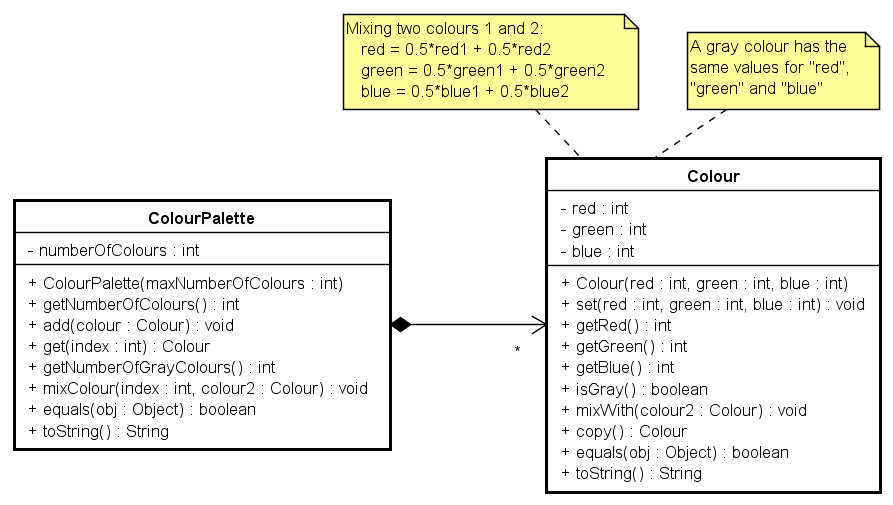
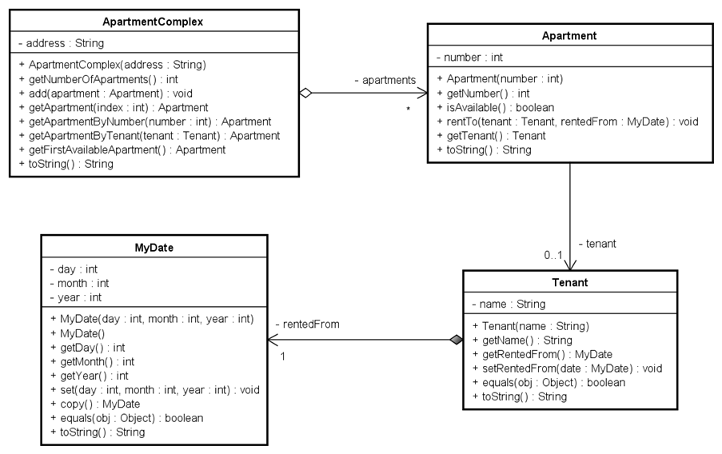
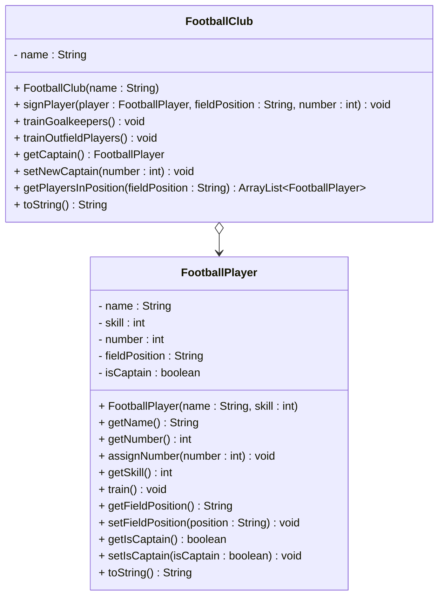
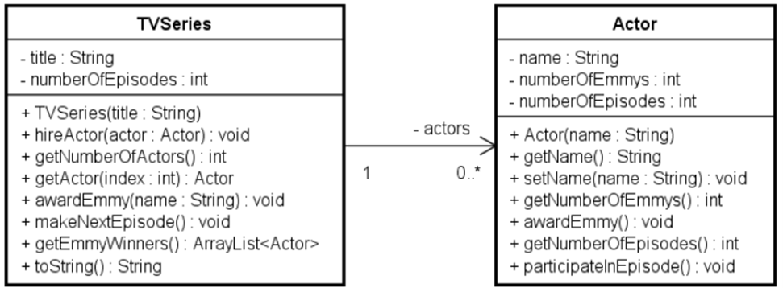

# Exercises

These exercises are borrowed from a colleague, he uses them for a midterm exam.

## Exercise 1 - Colour Palette

Implement the following UML class diagram in Java.

Also, include a class with a main method, to test the functionality.

## Exercise 2 - Apartment Complex

I am not entirely sure, the relationships here are correct. But, I will leave it as is. Or let you decide how to interpret it.

## Exercise 3 - Football Club

Implement the following UML class diagram in Java.

Also, include a class with a main method to test the functionality.

## Exercise 4 - Tv Series

Implement the following UML class diagram in Java.

