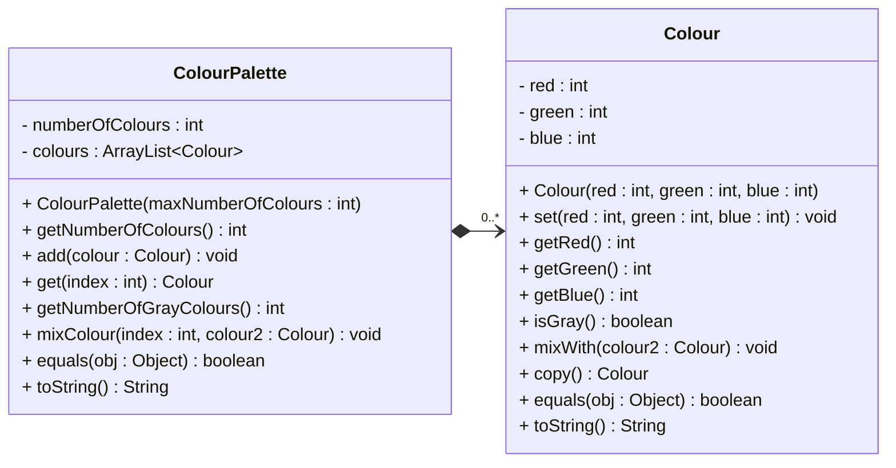
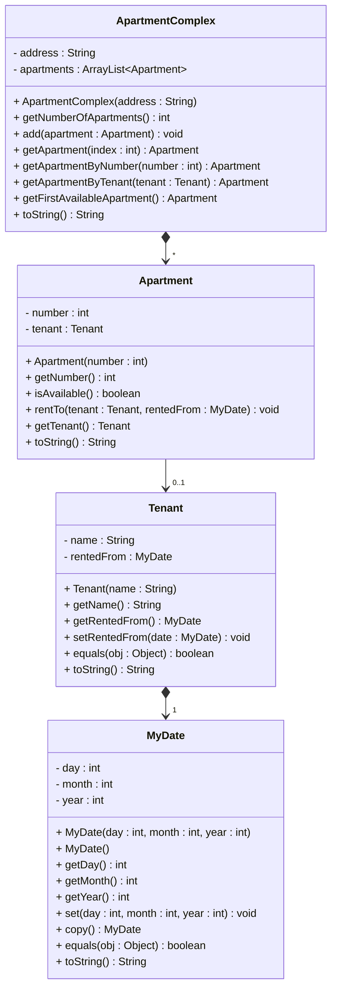
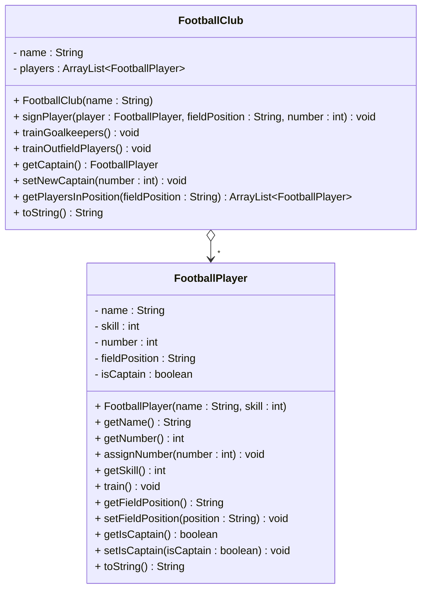
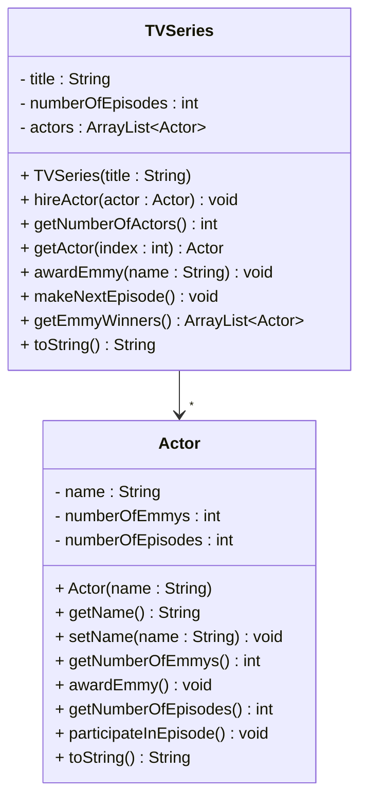

# Exercises

These exercises are borrowed from a colleague, he uses them for a midterm exam.


## Exercise 1 - Colour Palette

Implement the following UML class diagram in Java.



**Note:** A gray colour has the same values for "red", "green", and "blue". The higher values will produce a lighter grey, lower values will produce a darker grey.

**Mixing two colours 1 and 2:**
- red = 0.5*red1 + 0.5*red2
- green = 0.5*green1 + 0.5*green2
- blue = 0.5*blue1 + 0.5*blue2

Include a class with a main method to test the functionality. See below for an example.


### Example Main Method

```java
public class ColourPaletteTest {
    public static void main(String[] args) {
        // Create a colour palette with max 5 colours
        ColourPalette palette = new ColourPalette(5);
        
        // Create some colours
        Colour red = new Colour(255, 0, 0);
        Colour blue = new Colour(0, 0, 255);
        Colour gray = new Colour(128, 128, 128);
        Colour white = new Colour(255, 255, 255);
        
        // Add colours to palette
        palette.add(red);
        palette.add(blue);
        palette.add(gray);
        palette.add(white);
        
        // Display palette
        System.out.println("Palette: " + palette);
        System.out.println("Number of colours: " + palette.getNumberOfColours());
        System.out.println("Number of gray colours: " + palette.getNumberOfGrayColours());
        
        // Test colour mixing
        System.out.println("\nBefore mixing:");
        System.out.println("Red: " + red);
        
        red.mixWith(blue);
        System.out.println("\nAfter mixing red with blue:");
        System.out.println("Red (now purple): " + red);
        
        // Test palette mixing
        System.out.println("\nMixing palette colour at index 0 with white:");
        palette.mixColour(0, white);
        System.out.println("Colour at index 0: " + palette.get(0));
        
        // Test color copy
        Colour blueCopy = blue.copy();
        System.out.println("\nOriginal blue: " + blue);
        System.out.println("Copy of blue: " + blueCopy);
        System.out.println("Are they equal? " + blue.equals(blueCopy));
        
        // Test gray detection
        System.out.println("\nIs gray a gray colour? " + gray.isGray());
        System.out.println("Is red a gray colour? " + red.isGray());
    }
}
```

### Expected Output

```
Palette: [Colour(255, 0, 0), Colour(0, 0, 255), Colour(128, 128, 128), Colour(255, 255, 255)]
Number of colours: 4
Number of gray colours: 2

Before mixing:
Red: Colour(255, 0, 0)

After mixing red with blue:
Red (now purple): Colour(127, 0, 127)

Mixing palette colour at index 0 with white:
Colour at index 0: Colour(191, 127, 191)

Original blue: Colour(0, 0, 255)
Copy of blue: Colour(0, 0, 255)
Are they equal? true

Is gray a gray colour? true
Is red a gray colour? false
```


## Exercise 2 - Apartment Complex

Implement the following UML class diagram in Java.



**Note:** An apartment is available if it has no tenant. The `rentedFrom` date indicates when the tenant moved in.

Note that the relationships between _Apartment and Tenant_ is association. There is then no need to do copies of Tenants, when an Apartment is returned by the `getApartment()`, or similar methods. 

Include a class with a main method to test the functionality. See below for an example.

### Example Main Method

```java
public class ApartmentComplexTest {
    public static void main(String[] args) {
        // Create an apartment complex
        ApartmentComplex complex = new ApartmentComplex("123 Main Street");
        
        // Create apartments
        Apartment apt101 = new Apartment(101);
        Apartment apt102 = new Apartment(102);
        Apartment apt103 = new Apartment(103);
        Apartment apt104 = new Apartment(104);
        
        // Add apartments to complex
        complex.add(apt101);
        complex.add(apt102);
        complex.add(apt103);
        complex.add(apt104);
        
        System.out.println("Apartment Complex: " + complex);
        System.out.println("Number of apartments: " + complex.getNumberOfApartments());
        
        // Create tenants
        Tenant john = new Tenant("John Smith");
        Tenant sarah = new Tenant("Sarah Johnson");
        
        // Create rental dates
        MyDate date1 = new MyDate(1, 3, 2024);
        MyDate date2 = new MyDate(15, 3, 2024);
        
        // Rent apartments
        System.out.println("\n--- Renting Apartments ---");
        apt101.rentTo(john, date1);
        System.out.println("Apartment 101 rented to: " + apt101.getTenant());
        
        apt103.rentTo(sarah, date2);
        System.out.println("Apartment 103 rented to: " + apt103.getTenant());
        
        // Check availability
        System.out.println("\n--- Checking Availability ---");
        System.out.println("Apartment 101 available? " + apt101.isAvailable());
        System.out.println("Apartment 102 available? " + apt102.isAvailable());
        System.out.println("Apartment 103 available? " + apt103.isAvailable());
        System.out.println("Apartment 104 available? " + apt104.isAvailable());
        
        // Get first available apartment
        Apartment available = complex.getFirstAvailableApartment();
        System.out.println("\nFirst available apartment: " + available);
        
        // Find apartment by number
        System.out.println("\n--- Finding Apartments ---");
        Apartment foundByNumber = complex.getApartmentByNumber(103);
        System.out.println("Apartment 103: " + foundByNumber);
        
        // Find apartment by tenant
        Apartment foundByTenant = complex.getApartmentByTenant(john);
        System.out.println("Apartment rented by John Smith: " + foundByTenant);
        
        // Display all apartments
        System.out.println("\n--- All Apartments ---");
        for (int i = 0; i < complex.getNumberOfApartments(); i++) {
            Apartment apt = complex.getApartment(i);
            System.out.println(apt);
        }
    }
}
```

### Expected Output

```
Apartment Complex: ApartmentComplex(123 Main Street, 4 apartments)
Number of apartments: 4

--- Renting Apartments ---
Apartment 101 rented to: Tenant(John Smith, rented from: 01/03/2024)
Apartment 103 rented to: Tenant(Sarah Johnson, rented from: 15/03/2024)

--- Checking Availability ---
Apartment 101 available? false
Apartment 102 available? true
Apartment 103 available? false
Apartment 104 available? true

First available apartment: Apartment(102, Available)

--- Finding Apartments ---
Apartment 103: Apartment(103, Tenant: Sarah Johnson)
Apartment rented by John Smith: Apartment(101, Tenant: John Smith)

--- All Apartments ---
Apartment(101, Tenant: John Smith, rented from: 01/03/2024)
Apartment(102, Available)
Apartment(103, Tenant: Sarah Johnson, rented from: 15/03/2024)
Apartment(104, Available)
```

## Exercise 3 - Football Club

Implement the following UML class diagram in Java.



**Note:** 
- When a player is signed, they are assigned a field position (e.g., "Goalkeeper", "Defender", "Midfielder", "Forward") and a jersey number. This assignment is done in the `signPlayer()` method.
- Training increases a player's skill level by 1.
- Only goalkeepers train when `trainGoalkeepers()` is called, and only outfield players train when `trainOutfieldPlayers()` is called.

Include a class with a main method to test the functionality. See below for an example.

### Example Main Method

```java
public class FootballClubTest {
    public static void main(String[] args) {
        // Create a football club
        FootballClub club = new FootballClub("Manchester Tigers");
        
        // Create players
        FootballPlayer goalkeeper = new FootballPlayer("David Martinez", 85);
        FootballPlayer defender1 = new FootballPlayer("Sarah Thompson", 78);
        FootballPlayer defender2 = new FootballPlayer("John Wilson", 80);
        FootballPlayer midfielder1 = new FootballPlayer("Emma Rodriguez", 82);
        FootballPlayer midfielder2 = new FootballPlayer("Lucas Chen", 79);
        FootballPlayer forward1 = new FootballPlayer("Aisha Patel", 88);
        FootballPlayer forward2 = new FootballPlayer("Marco Silva", 85);
        
        // Sign players to the club
        System.out.println("=== Signing Players ===");
        club.signPlayer(goalkeeper, "Goalkeeper", 1);
        club.signPlayer(defender1, "Defender", 4);
        club.signPlayer(defender2, "Defender", 5);
        club.signPlayer(midfielder1, "Midfielder", 8);
        club.signPlayer(midfielder2, "Midfielder", 10);
        club.signPlayer(forward1, "Forward", 9);
        club.signPlayer(forward2, "Forward", 11);
        
        System.out.println(club);
        
        // Set captain
        System.out.println("\n=== Setting Captain ===");
        club.setNewCaptain(10);
        FootballPlayer captain = club.getCaptain();
        System.out.println("Team captain: " + captain);
        
        // Get players by position
        System.out.println("\n=== Players by Position ===");
        System.out.println("Defenders: " + club.getPlayersInPosition("Defender"));
        System.out.println("Midfielders: " + club.getPlayersInPosition("Midfielder"));
        System.out.println("Forwards: " + club.getPlayersInPosition("Forward"));
        
        // Training session - before
        System.out.println("\n=== Skill Levels Before Training ===");
        System.out.println("Goalkeeper skill: " + goalkeeper.getSkill());
        System.out.println("Midfielder 1 skill: " + midfielder1.getSkill());
        System.out.println("Forward 1 skill: " + forward1.getSkill());
        
        // Train different groups
        System.out.println("\n=== Training Sessions ===");
        club.trainGoalkeepers();
        System.out.println("Goalkeepers trained!");
        
        club.trainOutfieldPlayers();
        System.out.println("Outfield players trained!");
        
        // Training session - after
        System.out.println("\n=== Skill Levels After Training ===");
        System.out.println("Goalkeeper skill: " + goalkeeper.getSkill());
        System.out.println("Midfielder 1 skill: " + midfielder1.getSkill());
        System.out.println("Forward 1 skill: " + forward1.getSkill());
        
        // Final squad overview
        System.out.println("\n=== Final Squad ===");
        System.out.println(club);
    }
}
```

### Expected Output

```
=== Signing Players ===
FootballClub(Manchester Tigers, 7 players)

=== Setting Captain ===
Team captain: FootballPlayer(#10 Lucas Chen, Midfielder, Skill: 79, Captain)

=== Players by Position ===
Defenders: [FootballPlayer(#4 Sarah Thompson, Defender, Skill: 78), FootballPlayer(#5 John Wilson, Defender, Skill: 80)]
Midfielders: [FootballPlayer(#8 Emma Rodriguez, Midfielder, Skill: 82, Captain), FootballPlayer(#10 Lucas Chen, Midfielder, Skill: 79)]
Forwards: [FootballPlayer(#9 Aisha Patel, Forward, Skill: 88), FootballPlayer(#11 Marco Silva, Forward, Skill: 85)]

=== Skill Levels Before Training ===
Goalkeeper skill: 85
Midfielder 1 skill: 82
Forward 1 skill: 88

=== Training Sessions ===
Goalkeepers trained!
Outfield players trained!

=== Skill Levels After Training ===
Goalkeeper skill: 86
Midfielder 1 skill: 83
Forward 1 skill: 89

=== Final Squad ===
FootballClub(Manchester Tigers, 7 players)
  #1 David Martinez (Goalkeeper) - Skill: 86
  #4 Sarah Thompson (Defender) - Skill: 79
  #5 John Wilson (Defender) - Skill: 81
  #8 Emma Rodriguez (Midfielder) - Skill: 83
  #10 Lucas Chen (Midfielder, Captain) - Skill: 80
  #9 Aisha Patel (Forward) - Skill: 89
  #11 Marco Silva (Forward) - Skill: 86
```

## Exercise 4 - TV Series

Implement the following UML class diagram in Java.



**Note:** 
- When an actor is hired, they are added to the TV series cast.
- When `makeNextEpisode()` is called, all actors participate in the episode (their episode count increases by 1), and the series' total episode count increases by 1.
- When an actor wins an Emmy, their Emmy count increases by 1.
- The `awardEmmy(name)` method on TVSeries finds the actor by name and awards them an Emmy.

Include a class with a main method to test the functionality. See below for an example.

### Example Main Method

```java
public class TVSeriesTest {
    public static void main(String[] args) {
        // Create a TV series
        TVSeries series = new TVSeries("Stranger Things");
        
        // Create actors
        Actor actor1 = new Actor("Millie Bobby Brown");
        Actor actor2 = new Actor("Finn Wolfhard");
        Actor actor3 = new Actor("Gaten Matarazzo");
        Actor actor4 = new Actor("Caleb McLaughlin");
        Actor actor5 = new Actor("Noah Schnapp");
        
        // Hire actors
        System.out.println("=== Hiring Actors ===");
        series.hireActor(actor1);
        series.hireActor(actor2);
        series.hireActor(actor3);
        series.hireActor(actor4);
        series.hireActor(actor5);
        
        System.out.println(series);
        System.out.println("Number of actors: " + series.getNumberOfActors());
        
        // Make some episodes
        System.out.println("\n=== Filming Season 1 ===");
        for (int i = 1; i <= 8; i++) {
            series.makeNextEpisode();
            System.out.println("Episode " + i + " completed!");
        }
        
        System.out.println("\n" + series);
        
        // Check actor participation
        System.out.println("\n=== Actor Episode Counts ===");
        for (int i = 0; i < series.getNumberOfActors(); i++) {
            Actor actor = series.getActor(i);
            System.out.println(actor.getName() + " has appeared in " + 
                             actor.getNumberOfEpisodes() + " episodes");
        }
        
        // Award some Emmys
        System.out.println("\n=== Emmy Awards Ceremony ===");
        series.awardEmmy("Millie Bobby Brown");
        System.out.println("Emmy awarded to Millie Bobby Brown!");
        
        series.awardEmmy("Millie Bobby Brown");
        System.out.println("Another Emmy awarded to Millie Bobby Brown!");
        
        series.awardEmmy("Gaten Matarazzo");
        System.out.println("Emmy awarded to Gaten Matarazzo!");
        
        // Display Emmy winners
        System.out.println("\n=== Emmy Winners ===");
        ArrayList<Actor> emmyWinners = series.getEmmyWinners();
        for (Actor winner : emmyWinners) {
            System.out.println(winner);
        }
        
        // Make more episodes
        System.out.println("\n=== Filming Season 2 ===");
        for (int i = 1; i <= 9; i++) {
            series.makeNextEpisode();
        }
        System.out.println("Season 2 completed with 9 episodes!");
        
        // Final series overview
        System.out.println("\n=== Final Series Overview ===");
        System.out.println(series);
        
        System.out.println("\nAll Actors:");
        for (int i = 0; i < series.getNumberOfActors(); i++) {
            System.out.println("  " + series.getActor(i));
        }
    }
}
```

### Expected Output

```
=== Hiring Actors ===
TVSeries(Stranger Things, 0 episodes, 5 actors)
Number of actors: 5

=== Filming Season 1 ===
Episode 1 completed!
Episode 2 completed!
Episode 3 completed!
Episode 4 completed!
Episode 5 completed!
Episode 6 completed!
Episode 7 completed!
Episode 8 completed!

TVSeries(Stranger Things, 8 episodes, 5 actors)

=== Actor Episode Counts ===
Millie Bobby Brown has appeared in 8 episodes
Finn Wolfhard has appeared in 8 episodes
Gaten Matarazzo has appeared in 8 episodes
Caleb McLaughlin has appeared in 8 episodes
Noah Schnapp has appeared in 8 episodes

=== Emmy Awards Ceremony ===
Emmy awarded to Millie Bobby Brown!
Another Emmy awarded to Millie Bobby Brown!
Emmy awarded to Gaten Matarazzo!

=== Emmy Winners ===
Actor(Millie Bobby Brown, 2 Emmys, 8 episodes)
Actor(Gaten Matarazzo, 1 Emmy, 8 episodes)

=== Filming Season 2 ===
Season 2 completed with 9 episodes!

=== Final Series Overview ===
TVSeries(Stranger Things, 17 episodes, 5 actors)

All Actors:
  Actor(Millie Bobby Brown, 2 Emmys, 17 episodes)
  Actor(Finn Wolfhard, 0 Emmys, 17 episodes)
  Actor(Gaten Matarazzo, 1 Emmy, 17 episodes)
  Actor(Caleb McLaughlin, 0 Emmys, 17 episodes)
  Actor(Noah Schnapp, 0 Emmys, 17 episodes)
```