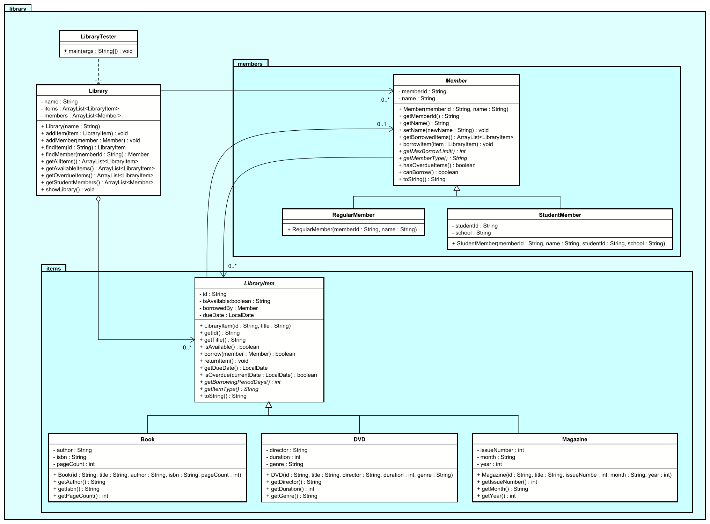

# Exercise: Library Management System

## Description

Create a library management system that models different types of library items and library members. The system should handle borrowing and returning items, track due dates, and manage different member types with varying borrowing privileges.

This exercise focuses on:
- Creating an abstract base class for library items
- Implementing inheritance for different item types and member types
- Modeling real-world entities as objects
- Managing relationships between objects (members borrowing items)
- Calculating due dates and overdue status

## Class Diagram

Please note the packages, and nested packages. You can right click the image, and "open in new tab" to view it better.



## Hint: Working with LocalDate

For this exercise, you'll need to work with dates to track due dates and overdue items. Java provides the `LocalDate` class for this purpose.

**Import statement:**
```java
import java.time.LocalDate;
```

**Common operations:**
```java
// Get today's date
LocalDate today = LocalDate.now();

// Add days to a date (for calculating due dates)
LocalDate dueDate = today.plusDays(21);  // 21 days from now

// Compare dates (check if overdue)
boolean isOverdue = today.isAfter(dueDate);

// Calculate days between dates
long daysBetween = ChronoUnit.DAYS.between(startDate, endDate);
```

**Example in context:**
```java
public void borrow(Member member) {
    this.dueDate = LocalDate.now().plusDays(getBorrowingPeriodDays());
    // other code...
}

public boolean isOverdue() {
    if (dueDate == null) {
        return false;
    }
    return LocalDate.now().isAfter(dueDate);
}
```

## Class Descriptions

### Abstract Class: LibraryItem

The base class for all library items.

**Fields:**
- `id` - Unique identifier for the item, how will you generate this?
- `title` - Title of the item
- `isAvailable` - Whether the item is currently available
- `borrowedBy` - The member who currently has the item (null if available)
- `dueDate` - The date when the item is due to be returned (null if not borrowed)

**Methods:**
- `LibraryItem(id, title)` - Constructor to initialize basic item information
- `getId()` - Returns the item ID
- `getTitle()` - Returns the item title
- `isAvailable()` - Returns true if the item is available for borrowing
- `borrow(member)` - Borrows the item to the given member, sets due date, returns success status. Remember to update the Member as well.
- `returnItem()` - Returns the item, making it available again
- `getDueDate()` - Returns the due date (or null if not borrowed)
- `isOverdue()` - Returns true if the item is overdue (current date is after due date)
- `getBorrowingPeriodDays()` - Abstract method that returns the borrowing period in days (implemented by subclasses, different types of items have different borrowing periods)
- `getItemType()` - Abstract method that returns the type of item (implemented by subclasses)
- `toString()` - Returns a string representation of the item

### Class: Book extends LibraryItem

Represents a book in the library.

**Fields:**
- `author` - Author of the book
- `isbn` - ISBN number
- `pageCount` - Number of pages

**Methods:**
- `Book(id, title, author, isbn, pageCount)` - Constructor
- `getAuthor()` - Returns the author
- `getIsbn()` - Returns the ISBN
- `getPageCount()` - Returns the page count
- `getBorrowingPeriodDays()` - Returns 21 days (3 weeks)
- `getItemType()` - Returns "Book"
- `toString()` - Returns formatted string with book details

### Class: DVD extends LibraryItem

Represents a DVD in the library.

**Fields:**
- `director` - Director of the DVD
- `duration` - Duration in minutes
- `genre` - Genre of the DVD

**Methods:**
- `DVD(id, title, director, duration, genre)` - Constructor
- `getDirector()` - Returns the director
- `getDuration()` - Returns the duration
- `getGenre()` - Returns the genre
- `getBorrowingPeriodDays()` - Returns 7 days (1 week)
- `getItemType()` - Returns "DVD"
- `toString()` - Returns formatted string with DVD details

### Class: Magazine extends LibraryItem

Represents a magazine in the library.

**Fields:**
- `issueNumber` - Issue number of the magazine
- `month` - Month of publication
- `year` - Year of publication

**Methods:**
- `Magazine(id, title, issueNumber, month, year)` - Constructor
- `getIssueNumber()` - Returns the issue number
- `getMonth()` - Returns the month
- `getYear()` - Returns the year
- `getBorrowingPeriodDays()` - Returns 14 days (2 weeks)
- `getItemType()` - Returns "Magazine"
- `toString()` - Returns formatted string with magazine details

### Abstract Class: Member

The base class for all library members.

**Fields:**
- `memberId` - Unique member identifier
- `name` - Member's name
- `borrowedItems` - List of currently borrowed items

**Methods:**
- `Member(memberId, name)` - Constructor
- `getMemberId()` - Returns the member ID
- `getName()` - Returns the member name
- `setName(name)` - Sets the member name
- `getBorrowedItems()` - Returns the list of borrowed items
- `borrowItem(item)` - Borrows an item if allowed, returns success status
- `returnItem(item)` - Returns a borrowed item
- `getMaxBorrowLimit()` - Abstract method that returns the maximum number of items this member can borrow
- `getMemberType()` - Abstract method that returns the member type
- `hasOverdueItems()` - Returns true if the member has any overdue items, i.e. in their `borrowedItems` list.
- `canBorrow()` - Returns true if the member can borrow more items (hasn't reached limit and has no overdue items)
- `toString()` - Returns formatted string with member details

### Class: RegularMember extends Member

Represents a regular library member.

**Methods:**
- `RegularMember(memberId, name)` - Constructor
- `getMaxBorrowLimit()` - Returns 3 (regular members can borrow up to 3 items)
- `getMemberType()` - Returns "Regular"

### Class: StudentMember extends Member

Represents a student library member.

**Fields:**
- `studentId` - Student ID number
- `school` - Name of the school

**Methods:**
- `StudentMember(memberId, name, studentId, school)` - Constructor
- `getStudentId()` - Returns the student ID
- `getSchool()` - Returns the school name
- `getMaxBorrowLimit()` - Returns 5 (student members can borrow up to 5 items)
- `getMemberType()` - Returns "Student"

### Class: Library

Manages all library items and members.

**Fields:**
- `name` - Name of the library
- `items` - List of all library items
- `members` - List of all library members

**Methods:**
- `Library(name)` - Constructor
- `addItem(item)` - Adds a new item to the library
- `addMember(member)` - Adds a new member to the library
- `findItem(id)` - Finds and returns an item by ID (returns null if not found)
- `findMember(memberId)` - Finds and returns a member by ID (returns null if not found)
- `getAllItems()` - Returns all items in the library
- `getAvailableItems()` - Returns only available items
- `getOverdueItems()` - Returns items that are currently overdue
- `getStudentMembers()` - Returns all student members
- `showLibraryStatus()` - Prints a summary of the library status (total items, available items, total members, overdue items, etc)

### Class: LibraryTester

Main testing class to demonstrate the library system, by creating and interacting with various objects.

**Methods:**
- `main(args)` - Creates library, items, members, performs various operations (borrowing, returning, checking status), and displays results

## Testing Requirements

The `LibraryTester` class should demonstrate:
1. Creating a library with a name
2. Creating various types of library items (books, DVDs, magazines)
3. Adding items to the library
4. Creating different types of members (regular, student)
5. Adding members to the library
6. Borrowing items (successful and unsuccessful attempts)
7. Checking item availability
8. Returning items
9. Testing borrowing limits
10. Testing overdue item detection
11. Displaying library status


## Optional: CLI Application

You may expand this exercise by adding a command line application, i.e. print some menus, and let the user interactict with the sysstem to add books, remove, borrow, return, etc.