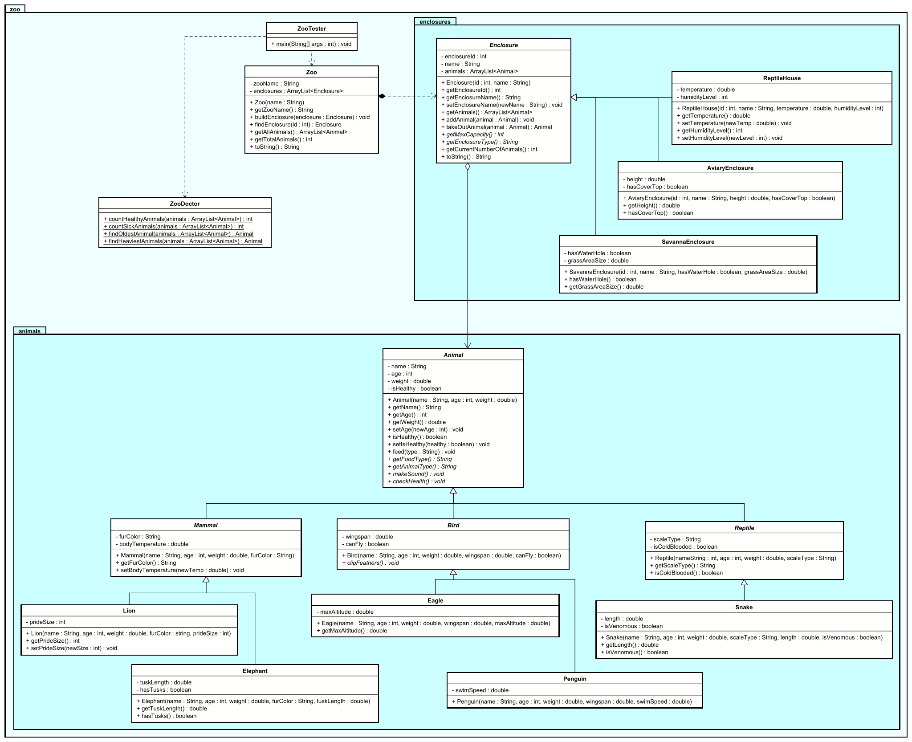

# Exercise: Zoo Animal Management

## Description

Create a zoo management system that models different types of animals and their enclosures. The system should handle animal feeding, health tracking, and enclosure management. Different animal categories have unique characteristics, and different enclosure types have specific requirements.

This exercise focuses on:
- Creating abstract base classes for animals and enclosures
- Implementing multiple levels of inheritance (e.g. Animal → Mammal → Lion)
- Modeling real-world entities with appropriate attributes
- Managing relationships between animals and their enclosures

## Class Diagram

You can right click the image, and "open in new tab" to view it better.

## Class Descriptions

### Abstract Class: Animal

The base class for all animals in the zoo.

**Fields:**
- `name` - Name of the animal
- `age` - Age in years
- `weight` - Weight in kilograms
- `isHealthy` - Health status of the animal

**Methods:**
- `Animal(name, age, weight)` - Constructor
- `getName()` - Returns the animal's name
- `getAge()` - Returns the age
- `getWeight()` - Returns the weight
- `isHealthy()` - Returns health status
- `setHealthy(healthy)` - Sets the health status
- `assignToEnclosure(enclosure)` - Assigns the animal to an enclosure, i.e. adds it to the `animals` list of the enclosure. 
  - Should check that the enclosure is not full
  - That the animal is not already in an enclosure
  - That the animal can live in the type of enclosure
- `feed()` - Feeds the animal (prints message with food type and amount)
- _`getFoodType()`_ - Abstract method returning the type of food
- _`getAnimalType()`_ - Abstract method returning the animal type
- _`makeSound()`_ - Abstract method that prints the animal's sound
- `toString()` - Returns formatted string with animal details

### Abstract Class: Mammal extends Animal

Represents mammals with fur and body temperature.

**Fields:**
- `furColor` - Color of the fur
- `bodyTemperature` - Current body temperature in Celsius

**Methods:**
- `Mammal(name, age, weight, furColor)` - Constructor (sets body temp to 37.0)
- `getFurColor()` - Returns the fur color
- `getBodyTemperature()` - Returns body temperature
- `setBodyTemperature(temp)` - Sets body temperature
- `checkHealth()` - Checks if body temperature is in healthy range (36-38°C), updates health status. Set the `isHealthy` field variable to true or false, based on the body temperature.

### Class: Lion extends Mammal

Represents a lion.

**Fields:**
- `prideSize` - Size of the pride this lion belongs to

**Methods:**
- `Lion(name, age, weight, furColor, prideSize)` - Constructor
- `getPrideSize()` - Returns pride size
- `setPrideSize(size)` - Sets pride size
- `getFoodType()` - Returns "Meat"
- `getAnimalType()` - Returns "Lion"
- `makeSound()` - Prints "Roaaar!"
- `toString()` - Returns formatted string with lion details

### Class: Elephant extends Mammal

Represents an elephant.

**Fields:**
- `tuskLength` - Length of tusks in centimeters
- `hasTusk` - Whether the elephant has tusks, this can be inferred from the `tuskLength` field variable.

**Methods:**
- `Elephant(name, age, weight, furColor, tuskLength)` - Constructor
- `getTuskLength()` - Returns tusk length
- `getFoodType()` - Returns "Vegetation"
- `getAnimalType()` - Returns "Elephant"
- `makeSound()` - Prints "Trumpet!"
- `toString()` - Returns formatted string with elephant details

### Abstract Class: Bird extends Animal

Represents birds with wings.

**Fields:**
- `wingspan` - Wingspan in meters
- `canFly` - Whether the bird can fly

**Methods:**
- `Bird(name, age, weight, wingspan, canFly)` - Constructor
- `getWingspan()` - Returns wingspan
- `canFly()` - Returns true if bird can fly
- `checkHealth()` - Checks if weight is appropriate for wingspan, updates health status. I.e. if the ratio of weight to wingspan is higher than 1.0, set the `isHealthy` field variable to false. (Just try something simple out here.)
- `clipFeathers()` - Clips the feathers of the bird, so that it cannot fly. We don't want the birds to escape.	

### Class: Eagle extends Bird

Represents an eagle.

**Fields:**
- `maxAltitude` - Maximum flying altitude in meters

**Methods:**
- `Eagle(name, age, weight, wingspan, maxAltitude)` - Constructor (canFly = true)
- `getMaxAltitude()` - Returns max altitude
- `getFoodType()` - Returns "Fish"
- `getAnimalType()` - Returns "Eagle"
- `makeSound()` - Prints "Screech!"
- `toString()` - Returns formatted string with eagle details

### Class: Penguin extends Bird

Represents a penguin.

**Fields:**
- `swimSpeed` - Swimming speed in km/h

**Methods:**
- `Penguin(name, age, weight, wingspan, swimSpeed)` - Constructor (canFly = false)
- `getSwimSpeed()` - Returns swim speed
- `getFoodType()` - Returns "Fish"
- `getAnimalType()` - Returns "Penguin"
- `makeSound()` - Prints "Squawk!"
- `toString()` - Returns formatted string with penguin details

### Abstract Class: Reptile extends Animal

Represents reptiles with scales.

**Fields:**
- `scaleType` - Type of scales
- `isColdBlooded` - Whether the reptile is cold-blooded (there are few warm-blooded reptiles)

**Methods:**
- `Reptile(name, age, weight, scaleType, isColdBlooded)` - Constructor 
- `getScaleType()` - Returns scale type
- `isColdBlooded()` - Returns true if cold-blooded
- `checkHealth()` - Simple health check, prints status message. 
  - If the isColdBlooded field variable is true, the Reptile is healthy if its age is below 10 years.
  - If the isColdBlooded field variable is false, the Reptile is healthy if its age is below 20 years.
  

### Class: Snake extends Reptile

Represents a snake.

**Fields:**
- `length` - Length in meters
- `isVenomous` - Whether the snake is venomous

**Methods:**
- `Snake(name, age, weight, scaleType, length, isVenomous)` - Constructor
- `getLength()` - Returns length
- `isVenomous()` - Returns true if venomous
- `getFoodType()` - Returns "Rodents"
- `getAnimalType()` - Returns "Snake"
- `makeSound()` - Prints "Hisss!"
- `toString()` - Returns formatted string with snake details

### Abstract Class: Enclosure

The base class for all enclosures.

**Fields:**
- `enclosureId` - Unique identifier
- `name` - Name of the enclosure
- `animals` - List of animals in this enclosure

**Methods:**
- `Enclosure(enclosureId, name)` - Constructor
- `getEnclosureId()` - Returns the ID
- `getName()` - Returns the name
- `getAnimals()` - Returns list of animals
- `addAnimal(animal)` - Adds animal to enclosure if not full, assigns enclosure to animal, returns success.
  - Should check that the enclosure is not full
  - That the animal is not already in an enclosure
  - That the animal can live in the type of enclosure
- `removeAnimal(animal)` - Removes animal from enclosure
- `getMaxCapacity()` - Abstract method returning maximum capacity
- _`getEnclosureType()`_ - Abstract method returning enclosure type
- `getCurrentNumberOfAnimals()` - Returns current number of animals
- `showEnclosureInfo()` - Prints enclosure information including animals

### Class: SavannaEnclosure extends Enclosure

Enclosure for savanna animals.

**Fields:**
- `hasWaterHole` - Whether there's a water hole
- `grassAreaSize` - Size of grass area in square meters

**Methods:**
- `SavannaEnclosure(enclosureId, name, hasWaterHole, grassAreaSize)` - Constructor
- `hasWaterHole()` - Returns true if has water hole
- `getGrassAreaSize()` - Returns grass area size
- `getMaxCapacity()` - Returns 10
- `getEnclosureType()` - Returns "Savanna"

### Class: AviaryEnclosure extends Enclosure

Enclosure for birds.

**Fields:**
- `height` - Height in meters
- `hasCoverTop` - Whether the top is covered

**Methods:**
- `AviaryEnclosure(enclosureId, name, height, hasCoverTop)` - Constructor
- `getHeight()` - Returns height
- `hasCoverTop()` - Returns true if covered
- `getMaxCapacity()` - Returns 20
- `getEnclosureType()` - Returns "Aviary"

### Class: ReptileHouse extends Enclosure

Enclosure for reptiles with climate control.

**Fields:**
- `temperature` - Temperature in Celsius
- `humidityLevel` - Humidity percentage

**Methods:**
- `ReptileHouse(enclosureId, name, temperature, humidityLevel)` - Constructor
- `getTemperature()` - Returns temperature
- `setTemperature(temp)` - Sets temperature
- `getHumidityLevel()` - Returns humidity level
- `setHumidityLevel(humidity)` - Sets humidity level
- `getMaxCapacity()` - Returns 15
- `getEnclosureType()` - Returns "Reptile House"

### Class: Zoo

Manages all enclosures in the zoo.

**Fields:**
- `zooName` - Name of the zoo
- `enclosures` - List of all enclosures

**Methods:**
- `Zoo(zooName)` - Constructor
- `getZooName()` - Returns zoo name
- `buildEnclosure(enclosure)` - Adds an enclosure to the zoo
- `findEnclosure(enclosureId)` - Finds enclosure by ID
- `getAllAnimals()` - Returns list of all animals across all enclosures
- `getTotalAnimals()` - Returns total count of animals
- `toString()` - Returns formatted string with zoo details

### Class: ZooTester

Main testing class to demonstrate the zoo system.

### Class ZooDoctor

This is a helper class, with four static methods. Each method takes analyzes the animals in some way.
