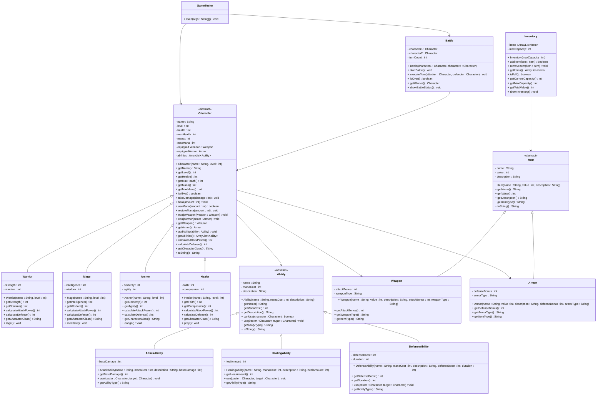

# Exercise: Game Character Battle System

## Description

Create a fantasy game battle system with different character classes, abilities, items, and a turn-based combat system. Characters can use abilities, equip items, and battle against each other. Different character types have unique attributes and abilities.

This exercise focuses on:
- Creating abstract base classes for characters, abilities, and items
- Implementing inheritance for different character classes and ability types
- Modeling game mechanics with appropriate attributes and methods
- Managing character inventories and equipped items
- Implementing a turn-based battle system

## Class Diagram

## Class Descriptions

### Abstract Class: Character

The base class for all game characters.

**Fields:**
- `name` - Character's name
- `level` - Character's level
- `health` - Current health points
- `maxHealth` - Maximum health points
- `mana` - Current mana points
- `maxMana` - Maximum mana points
- `equippedWeapon` - Currently equipped weapon (can be null)
- `equippedArmor` - Currently equipped armor (can be null)
- `abilities` - List of available abilities

**Methods:**
- `Character(name, level)` - Constructor (initializes health and mana based on level)
- `getName()` - Returns character name
- `getLevel()` - Returns level
- `getHealth()` - Returns current health
- `getMaxHealth()` - Returns max health
- `getMana()` - Returns current mana
- `getMaxMana()` - Returns max mana
- `isAlive()` - Returns true if health > 0
- `takeDamage(damage)` - Reduces health by damage amount (minimum 0)
- `heal(amount)` - Increases health by amount (maximum maxHealth)
- `useMana(amount)` - Attempts to use mana, returns true if successful
- `restoreMana(amount)` - Restores mana (maximum maxMana)
- `equipWeapon(weapon)` - Equips a weapon
- `equipArmor(armor)` - Equips armor
- `getWeapon()` - Returns equipped weapon
- `getArmor()` - Returns equipped armor
- `addAbility(ability)` - Adds an ability to the character
- `getAbilities()` - Returns list of abilities
- `calculateAttackPower()` - Abstract method to calculate total attack power
- `calculateDefense()` - Abstract method to calculate total defense
- `getCharacterClass()` - Abstract method returning character class name
- `toString()` - Returns formatted string with character stats

### Class: Warrior extends Character

A melee combat specialist with high strength and stamina.

**Fields:**
- `strength` - Strength attribute (affects attack power)
- `stamina` - Stamina attribute (affects health)

**Methods:**
- `Warrior(name, level)` - Constructor (sets strength = 15 + level * 2, stamina = 12 + level * 2)
- `getStrength()` - Returns strength
- `getStamina()` - Returns stamina
- `calculateAttackPower()` - Returns strength + (weapon bonus if equipped)
- `calculateDefense()` - Returns stamina / 2 + (armor bonus if equipped)
- `getCharacterClass()` - Returns "Warrior"
- `rage()` - Special ability that temporarily boosts attack (prints message)

### Class: Mage extends Character

A magic user with high intelligence and wisdom.

**Fields:**
- `intelligence` - Intelligence attribute (affects spell power)
- `wisdom` - Wisdom attribute (affects mana)

**Methods:**
- `Mage(name, level)` - Constructor (sets intelligence = 18 + level * 3, wisdom = 14 + level * 2)
- `getIntelligence()` - Returns intelligence
- `getWisdom()` - Returns wisdom
- `calculateAttackPower()` - Returns intelligence + (weapon bonus if equipped)
- `calculateDefense()` - Returns wisdom / 3 + (armor bonus if equipped)
- `getCharacterClass()` - Returns "Mage"
- `meditate()` - Restores 20 mana points (prints message)

### Class: Archer extends Character

A ranged specialist with high dexterity and agility.

**Fields:**
- `dexterity` - Dexterity attribute (affects ranged attack)
- `agility` - Agility attribute (affects defense)

**Methods:**
- `Archer(name, level)` - Constructor (sets dexterity = 16 + level * 2, agility = 14 + level * 2)
- `getDexterity()` - Returns dexterity
- `getAgility()` - Returns agility
- `calculateAttackPower()` - Returns dexterity + (weapon bonus if equipped)
- `calculateDefense()` - Returns agility / 2 + (armor bonus if equipped)
- `getCharacterClass()` - Returns "Archer"
- `dodge()` - Special ability that increases evasion (prints message)

### Class: Healer extends Character

A support character with healing abilities.

**Fields:**
- `faith` - Faith attribute (affects healing power)
- `compassion` - Compassion attribute (affects mana and healing)

**Methods:**
- `Healer(name, level)` - Constructor (sets faith = 16 + level * 2, compassion = 15 + level * 2)
- `getFaith()` - Returns faith
- `getCompassion()` - Returns compassion
- `calculateAttackPower()` - Returns faith / 2 + (weapon bonus if equipped)
- `calculateDefense()` - Returns compassion / 2 + (armor bonus if equipped)
- `getCharacterClass()` - Returns "Healer"
- `pray()` - Restores health to nearby allies (prints message)

### Abstract Class: Ability

The base class for all character abilities.

**Fields:**
- `name` - Ability name
- `manaCost` - Mana cost to use the ability
- `description` - Description of what the ability does

**Methods:**
- `Ability(name, manaCost, description)` - Constructor
- `getName()` - Returns ability name
- `getManaCost()` - Returns mana cost
- `getDescription()` - Returns description
- `canUse(character)` - Returns true if character has enough mana
- `use(caster, target)` - Abstract method to use the ability on target
- `getAbilityType()` - Abstract method returning ability type
- `toString()` - Returns formatted string with ability details

### Class: AttackAbility extends Ability

An offensive ability that deals damage.

**Fields:**
- `baseDamage` - Base damage of the ability

**Methods:**
- `AttackAbility(name, manaCost, description, baseDamage)` - Constructor
- `getBaseDamage()` - Returns base damage
- `use(caster, target)` - Uses mana, calculates damage (baseDamage + caster's attack power / 4), applies to target
- `getAbilityType()` - Returns "Attack"

### Class: HealingAbility extends Ability

A support ability that heals the target.

**Fields:**
- `healAmount` - Amount of health restored

**Methods:**
- `HealingAbility(name, manaCost, description, healAmount)` - Constructor
- `getHealAmount()` - Returns heal amount
- `use(caster, target)` - Uses mana, heals target by healAmount
- `getAbilityType()` - Returns "Healing"

### Class: DefenseAbility extends Ability

A buff ability that increases defense.

**Fields:**
- `defenseBoost` - Amount of defense increase
- `duration` - Duration in turns

**Methods:**
- `DefenseAbility(name, manaCost, description, defenseBoost, duration)` - Constructor
- `getDefenseBoost()` - Returns defense boost
- `getDuration()` - Returns duration
- `use(caster, target)` - Uses mana, prints message about defense boost
- `getAbilityType()` - Returns "Defense"

### Abstract Class: Item

The base class for all items.

**Fields:**
- `name` - Item name
- `value` - Gold value of the item
- `description` - Item description

**Methods:**
- `Item(name, value, description)` - Constructor
- `getName()` - Returns item name
- `getValue()` - Returns value
- `getDescription()` - Returns description
- `getItemType()` - Abstract method returning item type
- `toString()` - Returns formatted string with item details

### Class: Weapon extends Item

An item that increases attack power.

**Fields:**
- `attackBonus` - Attack bonus provided
- `weaponType` - Type of weapon (sword, staff, bow, etc.)

**Methods:**
- `Weapon(name, value, description, attackBonus, weaponType)` - Constructor
- `getAttackBonus()` - Returns attack bonus
- `getWeaponType()` - Returns weapon type
- `getItemType()` - Returns "Weapon"

### Class: Armor extends Item

An item that increases defense.

**Fields:**
- `defenseBonus` - Defense bonus provided
- `armorType` - Type of armor (heavy, light, robes, etc.)

**Methods:**
- `Armor(name, value, description, defenseBonus, armorType)` - Constructor
- `getDefenseBonus()` - Returns defense bonus
- `getArmorType()` - Returns armor type
- `getItemType()` - Returns "Armor"

### Class: Inventory

Manages a collection of items.

**Fields:**
- `items` - List of items
- `maxCapacity` - Maximum number of items

**Methods:**
- `Inventory(maxCapacity)` - Constructor
- `addItem(item)` - Adds item if not full, returns success
- `removeItem(item)` - Removes item from inventory
- `getItems()` - Returns list of items
- `isFull()` - Returns true if at capacity
- `getCurrentCapacity()` - Returns current item count
- `getMaxCapacity()` - Returns max capacity
- `getTotalValue()` - Returns sum of all item values
- `showInventory()` - Prints all items in inventory

### Class: Battle

Manages a turn-based battle between two characters.

**Fields:**
- `character1` - First character
- `character2` - Second character
- `turnCount` - Current turn number

**Methods:**
- `Battle(character1, character2)` - Constructor
- `startBattle()` - Starts the battle loop until one character is defeated
- `executeTurn(attacker, defender)` - Executes one turn of combat
- `isOver()` - Returns true if either character is defeated
- `getWinner()` - Returns the winning character (or null if battle not over)
- `showBattleStatus()` - Prints current status of both characters

### Class: GameTester

Main testing class to demonstrate the game system.

**Methods:**
- `main(args)` - Creates characters, equips items, adds abilities, runs battles, displays results

## Testing Requirements

The `GameTester` class should demonstrate:
1. Creating different character types
2. Creating and equipping weapons and armor
3. Creating and adding abilities to characters
4. Using abilities
5. Managing character health and mana
6. Creating a battle between two characters
7. Executing turns and showing battle progression
8. Determining the winner

This exercise provides comprehensive practice with inheritance, abstract classes, and complex game mechanics!
