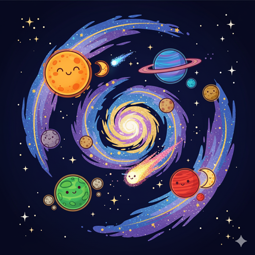
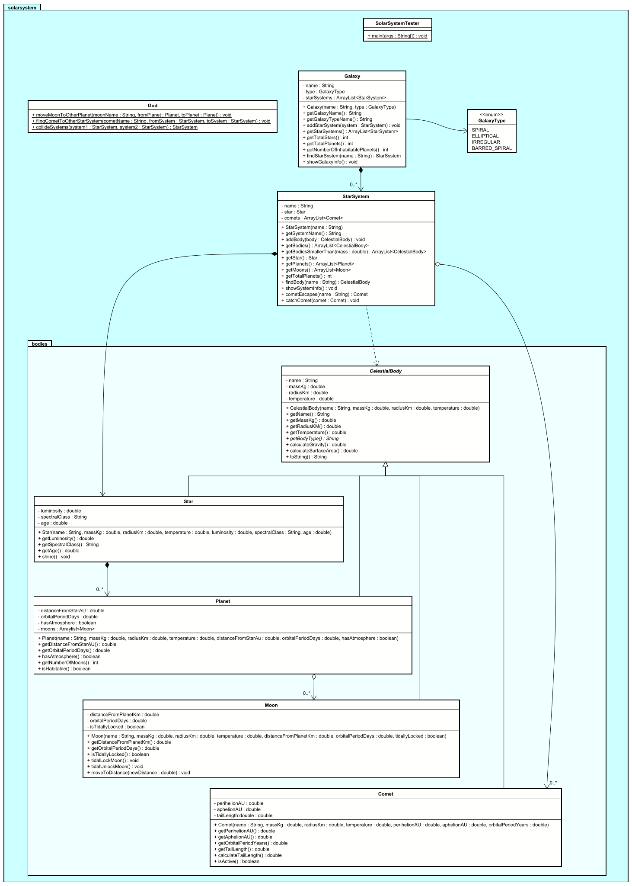
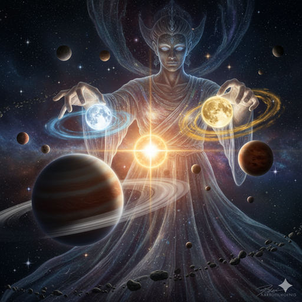

# Exercise: Solar System Exploration Mission



## Description

Create a program to model galaxies, star systems, planets, moons, and comets. The system should handle different types of celestial bodies with unique characteristics, orbital relationships, and physical properties. This models a simplified astronomical system with hierarchies and relationships.

This exercise focuses on:
- Creating abstract base classes for celestial bodies
- Implementing inheritance for different body types (stars, planets, moons)
- Modeling orbital relationships and hierarchies
- Managing relationships between galaxies, star systems, and celestial bodies
- Calculating orbital periods, distances, and physical properties


You may need to add further methods to the classes to complete parts of the exercise.

## Class Diagram

You can right click the image, and "open in new tab" to view it better.

Not all dependencies are shown. Some are implicit.



## Class Descriptions

### Abstract Class: CelestialBody

The base class for all celestial bodies.

**Fields:**
- `name` - Name of the celestial body
- `massKg` - Mass in kilograms
- `radiusKm` - Radius in kilometers
- `temperature` - Surface temperature in Celsius

**Methods:**
- `CelestialBody(name, massKg, radiusKm, temperature)` - Constructor
- various getters
- `calculateGravity()` - Calculates surface gravity using the formula: G * mass / radius², where G is the gravitational constant: 6.67430 × 10^-11, also known as the gravitational constant of universal gravitation. In decimal notation, this is 0.0000000000667430.
- `calculateSurfaceArea()` - Calculates surface area: 4 * π * radius²
- `toString()` - Returns formatted string with body details
- _`getBodyType()`_ - Returns the type of celestial body, implemented by the subclasses.

### Class: Star extends CelestialBody

Represents a star.

**Fields:**
- `luminosity` - Luminosity (brightness) relative to the Sun, e.g. 1.0 for the Sun.
- `spectralClass` - Spectral classification (O, B, A, F, G, K, M), more or less a classification of the star's color.
- `age` - Age in billions of years, e.g. 4.6 billion years for the Sun.
- `temperature` - Surface temperature in Celsius, e.g. 5505 for the Sun.

**Methods:**
- `Star(name, massKg, radiusKm, temperature, luminosity, spectralClass, age)` - Constructor
  - based on the spectral class, generate a random temperature. See chart below.
- various getters
- `getBodyType()` - Returns "Star"
- `shine()` - Returns message about the star shining based on its spectral class, e.g. "The star shines brightly in the sky." Or, "The star shines dimly in the sky." The classifications are:
  - O: Blue-white
  - B: Blue
  - A: White-blue
  - F: White
  - G: Yellow-white
  - K: Yellow
  - M: Red
- `toString()` - Returns formatted string with star details

Spectral inspiration:


### Class: Planet extends CelestialBody

Represents a planet.

**Fields:**
- `distanceFromStarAU` - Distance from star in Astronomical Units, e.g. 1.0 for the Earth.
- `orbitalPeriodDays` - Orbital period in Earth days, e.g. 365.25 for the Earth.
- `hasAtmosphere` - Whether the planet has an atmosphere

**Methods:**
- `Planet(name, massKg, radiusKm, temperature, orbitingStar, distanceFromStarAU, orbitalPeriodDays, hasAtmosphere)` - Constructor 
- various getters
- `hasAtmosphere()` - Returns true if has atmosphere, e.g. Earth has an atmosphere.
- `getBodyType()` - Returns "Planet"
- `isHabitable()` - Returns true if temperature is between -50 and 50°C and has atmosphere, e.g. Earth is habitable. Habitability is calculated based on the temperature (is between -50 and 50°C) and the presence of an atmosphere.
- `toString()` - Returns formatted string with planet details

### Class: Moon extends CelestialBody

Represents a moon orbiting a planet.

**Fields:**
- `distanceFromPlanetKm` - Distance from planet in kilometers, e.g. 384400 for the Moon.
- `orbitalPeriodDays` - Orbital period around planet in days, e.g. 27.3 for the Moon.
- `tidallyLocked` - Whether the moon is tidally locked (same side always faces planet)

**Methods:**
- `Moon(name, massKg, radiusKm, temperature, orbitingPlanet, distanceFromPlanetKm, orbitalPeriodDays, tidallyLocked)` - Constructor
- various getters
- `isTidallyLocked()` - Returns true if tidally locked, e.g. the Moon is tidally locked.
- `getBodyType()` - Returns "Moon"
- `tidalLockMoon()` - Tidally locks the moon, i.e. sets the `tidallyLocked` field variable to true.
- `tidalUnlockMoon()` - Tidally unlocks the moon, i.e. sets the `tidallyLocked` field variable to false.
- `moveToDistance(distance)` - Moves the moon to a new distance from the planet, i.e. sets the `distanceFromPlanetKm` field variable to the new distance.
- `toString()` - Returns formatted string with moon details

### Class: Comet extends CelestialBody

Represents a comet.

**Fields:**
- `perihelionAU` - Closest distance to star in AU
- `aphelionAU` - Farthest distance from star in AU
- `orbitalPeriodYears` - Orbital period in years, e.g. 35.1 for Halley's Comet.
- `tailLength` - Length of tail in millions of kilometers, e.g. 76 for Halley's Comet.

**Methods:**
- `Comet(name, massKg, radiusKm, temperature, orbitingStar, perihelionAU, aphelionAU, orbitalPeriodYears)` - Constructor (calculates initial tail length)
- various getters
- `getBodyType()` - Returns "Comet"
- `calculateTailLength()` - Calculates tail length based on distance from star (longer tail when closer), i.e. sets the `tailLength` field variable to the new length. Calculation formula is: (aphelionAU - perihelionAU) * 1000000.
- `isActive()` - Returns true if tail length > 0 (comet is active)
- `toString()` - Returns formatted string with comet details

### Class: StarSystem

Represents a star system containing celestial bodies.

**Fields:**
- `systemName` - Name of the star system
- `star` - The star in the system, e.g. the Sun. As composition.
- `comets` - List of comets in the system. As aggregation.

**Methods:**
- `StarSystem(systemName)` - Constructor
- `getSystemName()` - Returns system name
- `addBody(body)` - Adds any celestial body to the system.
  - If the body is a star, it should be set as the `star` field variable.
  - If the body is a comet, it should be added to the `comets` list.
  - If the body is a planet, it should be added to the star object.
  - If the body is a moon, it should be added to a planet object. You decide how this is done. Maybe randomly? Or randomly based on the masses of the planets?
- `getBodies()` - Returns list of all bodies
- `getBodiesSmallerThan(mass)` - Filters and returns all bodies with mass smaller than the given mass. This includes stars, planets, moons, and comets.
- `getStar()` - return the star object.
- `getPlanets()` - returns all Planets from the bodies list
- `getMoons()` - returns all moons. You will have to get them from the planets.
- `getTotalPlanets()` - Returns the count of planets
- `findBody(name)` - Finds and returns a celestial body by name
- `showSystemInfo()` - Prints system information including all celestial bodies
- `cometEscapes()` - Removes a comet from the system. The comet is returned to the caller.
  - This should also set the `aphelionAU` and `perihelionAU` fields to 0, and, thus, the tail length to 0, on the escaped comet.
- `catchComet(comet)` - Adds a comet to the system. 

### Class: Galaxy

Represents a galaxy containing multiple star systems.

**Fields:**
- `name` - Name of the galaxy
- `type` - Type of galaxy (Spiral, Elliptical, Irregular, Barred Spiral. These are enums)
- `starSystems` - List of star systems in the galaxy. As composition.

**Methods:**
- `Galaxy(galaxyName, galaxyType)` - Constructor
- various getters
- `addStarSystem(system)` - Adds a star system to the galaxy
- `getStarSystems()` - returns all star systems.
- `getTotalStars()` - Returns total number of stars across all systems.
- `getTotalPlanets()` - Returns total number of planets across all systems.
- `getNumberOfInhabitablePlanets()` - Returns the number of planets that are habitable.
- `findStarSystem(name)` - Finds and returns a star system by name
- `showGalaxyInfo()` - Prints galaxy information including all star systems


### Class: God



The `God` class represents a powerful entity capable of performing significant operations within a celestial system. It is designed to encapsulate high-level, system-wide functionalities. You are very welcome to add further methods to this class.

**Methods:**

The `God` class contains the following public methods (likely intended as static methods, given their nature):
  - These methods are all static, so you can call them without creating an instance of the `God` class.
  - They all return `void`, so they do not return anything.


1.  `moveMoonToOtherPlanet(moonName, fromPlanet, toPlanet)`
    *   **Purpose:** Moves a moon from one planet to another.
    *   **Parameters:**
        *   `moonName`: The name of the moon (String).
        *   `fromPlanet`: The moon's current planet (Planet object).
        *   `toPlanet`: The target planet for the moon (Planet object).
    *   You may consider also altering some of the moon's data, like the distance from the planet, or the orbital period.

2.  `flingCometToOtherStarSystem(cometName, fromSystem, toSystem)`
    *   **Purpose:** Moves a comet from its current star system to a different one.
    *   **Parameters:**
        *   `cometName`: The name of the comet (String).
        *   `fromSystem`: The comet's current star system (StarSystem object).
        *   `toSystem`: The target star system (StarSystem object).
    *   You may consider also altering some of the comet's data, like the perihelion and aphelion, or the orbital period.
    *   
3.  `collideSystems(system1, system2)`
    *   **Purpose:** Simulates a collision between two star systems.
    *   **Parameters:**
        *   `system1`: The first star system involved (StarSystem object).
        *   `system2`: The second star system involved (StarSystem object).
    *   For the collision, you end up with a new star system. This new star system is returned.
        *   Consider providing a new name for the new star system.
        *   The star of the new system is a combination of the stars of the two systems:
            *   The mass of the new star is the sum of the masses of the two stars.
            *   The radius of the new star is the radius of the larger, plus 20% of the radius of the smaller.
            *   The temperature of the new star is the average of the temperatures of the two stars.
            *   The luminosity of the new star is the average of the luminosities of the two stars.
            *   The spectral class of the new star is determined from the temperature. See chart above.
            *   The age of the new star is 0.
        *   All planets and moons are added to the new system.
        *   All comets are added to the new system.
        *   The new system is returned.
        *   You may need to remove the system from the galaxy, and add the new system to the galaxy.

These methods demonstrate how a single class can encapsulate powerful, system-wide operations within the Solar System exercise.

### Class: SolarSystemTester

Main testing class to demonstrate the solar system.

**Methods:**
- `main(args)` - Creates galaxy, star systems, stars, planets, moons, comets, and displays information

## Testing Requirements

The `SolarSystemTester` class should demonstrate:
1. Creating a galaxy
2. Creating a star system with a star
3. Creating planets with different properties
4. Creating moons orbiting planets
5. Creating comets with elliptical orbits
6. Adding planets and comets to star systems
7. Adding star systems to the galaxy
8. Calculating gravitational properties
9. Checking habitability of planets
10. Displaying complete galaxy information
11. Moving moons to other planets
12. Flinging comets to other star systems
13. Colliding star systems
14. Displaying complete galaxy information
15. Displaying complete star system information
16. Displaying complete planet information
17. Displaying complete moon information
18. Displaying complete comet information
19. Various God operations.

Instead of one massive main method, I suggest you create a bunch of smaller methods, which tests something specific. Your main method could look something like this:

```java
public class SolarSystemTester {
    public static void main(String[] args) {
        // Create a galaxy, with star systems, stars, planets, etc
        Galaxy galaxy = createNewGalaxy();
        
        // Test gravity
        testGravity(galaxy);
        
        // Test habitability
        testHabitability(galaxy);
        
        // Test God operations
        testGodOperations(galaxy);
    }
    
    public static void testGravity(Galaxy galaxy) {
        // Test gravity
    }
    
    public static void testHabitability(Galaxy galaxy) {
        // Test habitability
    }
    
    public static void testGodOperations(Galaxy galaxy) {
        // Test God operations
    }


    // and more tests...
}
```