# Exercise: Real Estate Property Management

## Description

Create a real estate management system that models different types of properties, people involved in transactions, and property listings. The system should handle property valuations, buyer-seller matching, and transaction processing with different pricing calculations for various property types.

This exercise focuses on:
- Creating abstract base classes for properties and people
- Implementing inheritance for different property types and person roles
- Modeling real-world business entities and relationships
- Calculating property values and agent commissions
- Managing property listings and transactions

## Class Diagram

```mermaid
classDiagram
    class _Property_ {
        <<abstract>>
        - propertyId : String
        - address : String
        - squareMeters : double
        - yearBuilt : int
        - basePrice : double
        - isAvailable : boolean
        + Property(propertyId : String, address : String, squareMeters : double, yearBuilt : int, basePrice : double)
        + getPropertyId() String
        + getAddress() String
        + getSquareMeters() double
        + getYearBuilt() int
        + getBasePrice() double
        + isAvailable() boolean
        + setAvailable(available : boolean) void
        + calculateMarketValue()* double
        + calculatePropertyTax() double
        + getPropertyType()* String
        + getAge() int
        + toString() String
    }
    
    class Apartment {
        - floor : int
        - hasElevator : boolean
        - numberOfRooms : int
        + Apartment(propertyId : String, address : String, squareMeters : double, yearBuilt : int, basePrice : double, floor : int, hasElevator : boolean, numberOfRooms : int)
        + getFloor() int
        + hasElevator() boolean
        + getNumberOfRooms() int
        + calculateMarketValue() double
        + getPropertyType() String
        + toString() String
    }
    
    class House {
        - lotSize : double
        - numberOfFloors : int
        - hasGarage : boolean
        - hasGarden : boolean
        + House(propertyId : String, address : String, squareMeters : double, yearBuilt : int, basePrice : double, lotSize : double, numberOfFloors : int, hasGarage : boolean, hasGarden : boolean)
        + getLotSize() double
        + getNumberOfFloors() int
        + hasGarage() boolean
        + hasGarden() boolean
        + calculateMarketValue() double
        + getPropertyType() String
        + toString() String
    }
    
    class CommercialProperty {
        - businessType : String
        - parkingSpaces : int
        - hasLoadingDock : boolean
        + CommercialProperty(propertyId : String, address : String, squareMeters : double, yearBuilt : int, basePrice : double, businessType : String, parkingSpaces : int, hasLoadingDock : boolean)
        + getBusinessType() String
        + getParkingSpaces() int
        + hasLoadingDock() boolean
        + calculateMarketValue() double
        + getPropertyType() String
        + toString() String
    }
    
    class Land {
        - isZoned : boolean
        - zoneType : String
        - hasUtilities : boolean
        + Land(propertyId : String, address : String, squareMeters : double, yearBuilt : int, basePrice : double, isZoned : boolean, zoneType : String, hasUtilities : boolean)
        + isZoned() boolean
        + getZoneType() String
        + hasUtilities() boolean
        + calculateMarketValue() double
        + getPropertyType() String
        + toString() String
    }
    
    class _Person_ {
        <<abstract>>
        - personId : String
        - name : String
        - phoneNumber : String
        - email : String
        + Person(personId : String, name : String, phoneNumber : String, email : String)
        + getPersonId() String
        + getName() String
        + getPhoneNumber() String
        + getEmail() String
        + getPersonType()* String
        + toString() String
    }
    
    class Buyer {
        - budget : double
        - preferredPropertyType : String
        - interestedProperties : ArrayList~Property~
        + Buyer(personId : String, name : String, phoneNumber : String, email : String, budget : double, preferredPropertyType : String)
        + getBudget() double
        + getPreferredPropertyType() String
        + addInterest(property : Property) void
        + getInterestedProperties() ArrayList~Property~
        + canAfford(property : Property) boolean
        + getPersonType() String
        + toString() String
    }
    
    class Seller {
        - ownedProperties : ArrayList~Property~
        + Seller(personId : String, name : String, phoneNumber : String, email : String)
        + addProperty(property : Property) void
        + removeProperty(property : Property) void
        + getOwnedProperties() ArrayList~Property~
        + getTotalPropertyValue() double
        + getPersonType() String
        + toString() String
    }
    
    class Agent {
        - licenseNumber : String
        - commissionRate : double
        - soldProperties : ArrayList~Transaction~
        + Agent(personId : String, name : String, phoneNumber : String, email : String, licenseNumber : String, commissionRate : double)
        + getLicenseNumber() String
        + getCommissionRate() double
        + addTransaction(transaction : Transaction) void
        + getSoldProperties() ArrayList~Transaction~
        + calculateTotalCommission() double
        + getPersonType() String
        + toString() String
    }
    
    class PropertyListing {
        - listingId : String
        - property : Property
        - seller : Seller
        - agent : Agent
        - listingPrice : double
        - listingDate : LocalDate
        - isSold : boolean
        + PropertyListing(listingId : String, property : Property, seller : Seller, agent : Agent, listingPrice : double, listingDate : LocalDate)
        + getListingId() String
        + getProperty() Property
        + getSeller() Seller
        + getAgent() Agent
        + getListingPrice() double
        + getListingDate() LocalDate
        + isSold() boolean
        + markAsSold() void
        + getDaysOnMarket() int
        + toString() String
    }
    
    class Transaction {
        - transactionId : String
        - property : Property
        - buyer : Buyer
        - seller : Seller
        - agent : Agent
        - salePrice : double
        - transactionDate : LocalDate
        + Transaction(transactionId : String, property : Property, buyer : Buyer, seller : Seller, agent : Agent, salePrice : double, transactionDate : LocalDate)
        + getTransactionId() String
        + getProperty() Property
        + getBuyer() Buyer
        + getSeller() Seller
        + getAgent() Agent
        + getSalePrice() double
        + getTransactionDate() LocalDate
        + calculateAgentCommission() double
        + calculateTransferTax() double
        + calculateTotalCost() double
        + toString() String
    }
    
    class RealEstateAgency {
        - agencyName : String
        - properties : ArrayList~PropertyListing~
        - agents : ArrayList~Agent~
        + RealEstateAgency(agencyName : String)
        + getAgencyName() String
        + addListing(listing : PropertyListing) void
        + addAgent(agent : Agent) void
        + getProperties() ArrayList~PropertyListing~
        + getAgents() ArrayList~Agent~
        + getAvailableProperties() ArrayList~PropertyListing~
        + findPropertiesInBudget(maxBudget : double) ArrayList~PropertyListing~
        + findPropertiesByType(propertyType : String) ArrayList~PropertyListing~
        + getTotalListingValue() double
        + showAgencyStatus() void
    }
    
    class RealEstateTester {
        + main(args : String[]) void
    }
    
    _Property_ <|-- Apartment
    _Property_ <|-- House
    _Property_ <|-- CommercialProperty
    _Property_ <|-- Land
    _Person_ <|-- Buyer
    _Person_ <|-- Seller
    _Person_ <|-- Agent
    PropertyListing --> _Property_
    PropertyListing --> Seller
    PropertyListing --> Agent
    Transaction --> _Property_
    Transaction --> Buyer
    Transaction --> Seller
    Transaction --> Agent
    Buyer --> _Property_
    Seller --> _Property_
    Agent --> Transaction
    RealEstateAgency --> PropertyListing
    RealEstateAgency --> Agent
    RealEstateTester --> RealEstateAgency
```

## Class Descriptions

### Abstract Class: Property

The base class for all property types.

**Fields:**
- `propertyId` - Unique property identifier
- `address` - Property address
- `squareMeters` - Size in square meters
- `yearBuilt` - Year the property was built
- `basePrice` - Base price of the property
- `isAvailable` - Whether the property is available for sale

**Methods:**
- `Property(propertyId, address, squareMeters, yearBuilt, basePrice)` - Constructor
- `getPropertyId()` - Returns property ID
- `getAddress()` - Returns address
- `getSquareMeters()` - Returns size
- `getYearBuilt()` - Returns year built
- `getBasePrice()` - Returns base price
- `isAvailable()` - Returns availability status
- `setAvailable(available)` - Sets availability
- `calculateMarketValue()` - Abstract method to calculate current market value
- `calculatePropertyTax()` - Calculates annual property tax (2% of market value)
- `getPropertyType()` - Abstract method returning property type
- `getAge()` - Calculates property age (current year - year built)
- `toString()` - Returns formatted property information

### Class: Apartment extends Property

Represents an apartment unit.

**Fields:**
- `floor` - Floor number
- `hasElevator` - Whether building has elevator
- `numberOfRooms` - Number of rooms

**Methods:**
- `Apartment(...)` - Constructor
- `getFloor()` - Returns floor number
- `hasElevator()` - Returns true if has elevator
- `getNumberOfRooms()` - Returns room count
- `calculateMarketValue()` - Calculates value: basePrice * (1 - age * 0.01) + (hasElevator ? 5000 : 0) + (numberOfRooms * 2000)
- `getPropertyType()` - Returns "Apartment"
- `toString()` - Returns formatted apartment details

### Class: House extends Property

Represents a house.

**Fields:**
- `lotSize` - Size of the lot in square meters
- `numberOfFloors` - Number of floors
- `hasGarage` - Whether has garage
- `hasGarden` - Whether has garden

**Methods:**
- `House(...)` - Constructor
- `getLotSize()` - Returns lot size
- `getNumberOfFloors()` - Returns floor count
- `hasGarage()` - Returns true if has garage
- `hasGarden()` - Returns true if has garden
- `calculateMarketValue()` - Calculates value: basePrice * (1 - age * 0.008) + (lotSize * 50) + (hasGarage ? 10000 : 0) + (hasGarden ? 8000 : 0)
- `getPropertyType()` - Returns "House"
- `toString()` - Returns formatted house details

### Class: CommercialProperty extends Property

Represents commercial real estate.

**Fields:**
- `businessType` - Type of business (office, retail, warehouse)
- `parkingSpaces` - Number of parking spaces
- `hasLoadingDock` - Whether has loading dock

**Methods:**
- `CommercialProperty(...)` - Constructor
- `getBusinessType()` - Returns business type
- `getParkingSpaces()` - Returns parking space count
- `hasLoadingDock()` - Returns true if has loading dock
- `calculateMarketValue()` - Calculates value: basePrice * (1 - age * 0.005) + (parkingSpaces * 1000) + (hasLoadingDock ? 15000 : 0)
- `getPropertyType()` - Returns "Commercial"
- `toString()` - Returns formatted commercial property details

### Class: Land extends Property

Represents undeveloped land.

**Fields:**
- `isZoned` - Whether land is zoned
- `zoneType` - Type of zoning (residential, commercial, agricultural)
- `hasUtilities` - Whether utilities are available

**Methods:**
- `Land(...)` - Constructor
- `isZoned()` - Returns true if zoned
- `getZoneType()` - Returns zone type
- `hasUtilities()` - Returns true if has utilities
- `calculateMarketValue()` - Calculates value: basePrice + (squareMeters * 20) + (isZoned ? 20000 : 0) + (hasUtilities ? 15000 : 0)
- `getPropertyType()` - Returns "Land"
- `toString()` - Returns formatted land details

### Abstract Class: Person

The base class for all people in the system.

**Fields:**
- `personId` - Unique person identifier
- `name` - Person's name
- `phoneNumber` - Phone number
- `email` - Email address

**Methods:**
- `Person(personId, name, phoneNumber, email)` - Constructor
- `getPersonId()` - Returns person ID
- `getName()` - Returns name
- `getPhoneNumber()` - Returns phone
- `getEmail()` - Returns email
- `getPersonType()` - Abstract method returning person type
- `toString()` - Returns formatted person information

### Class: Buyer extends Person

Represents a property buyer.

**Fields:**
- `budget` - Maximum budget
- `preferredPropertyType` - Preferred type of property
- `interestedProperties` - List of properties buyer is interested in

**Methods:**
- `Buyer(personId, name, phoneNumber, email, budget, preferredPropertyType)` - Constructor
- `getBudget()` - Returns budget
- `getPreferredPropertyType()` - Returns preferred type
- `addInterest(property)` - Adds property to interest list
- `getInterestedProperties()` - Returns interested properties
- `canAfford(property)` - Returns true if property's market value is within budget
- `getPersonType()` - Returns "Buyer"
- `toString()` - Returns formatted buyer details

### Class: Seller extends Person

Represents a property seller.

**Fields:**
- `ownedProperties` - List of properties owned by seller

**Methods:**
- `Seller(personId, name, phoneNumber, email)` - Constructor
- `addProperty(property)` - Adds property to owned list
- `removeProperty(property)` - Removes property from owned list
- `getOwnedProperties()` - Returns owned properties
- `getTotalPropertyValue()` - Calculates sum of all property market values
- `getPersonType()` - Returns "Seller"
- `toString()` - Returns formatted seller details

### Class: Agent extends Person

Represents a real estate agent.

**Fields:**
- `licenseNumber` - Agent's license number
- `commissionRate` - Commission rate (e.g., 0.03 for 3%)
- `soldProperties` - List of completed transactions

**Methods:**
- `Agent(personId, name, phoneNumber, email, licenseNumber, commissionRate)` - Constructor
- `getLicenseNumber()` - Returns license number
- `getCommissionRate()` - Returns commission rate
- `addTransaction(transaction)` - Adds transaction to sold list
- `getSoldProperties()` - Returns sold properties
- `calculateTotalCommission()` - Calculates sum of all commissions earned
- `getPersonType()` - Returns "Agent"
- `toString()` - Returns formatted agent details

### Class: PropertyListing

Represents a property listing.

**Fields:**
- `listingId` - Unique listing identifier
- `property` - The property being listed
- `seller` - The seller
- `agent` - The listing agent
- `listingPrice` - Asking price
- `listingDate` - Date listed
- `isSold` - Whether property has been sold

**Methods:**
- `PropertyListing(listingId, property, seller, agent, listingPrice, listingDate)` - Constructor
- `getListingId()` - Returns listing ID
- `getProperty()` - Returns property
- `getSeller()` - Returns seller
- `getAgent()` - Returns agent
- `getListingPrice()` - Returns listing price
- `getListingDate()` - Returns listing date
- `isSold()` - Returns sold status
- `markAsSold()` - Marks listing as sold
- `getDaysOnMarket()` - Calculates days between listing date and today
- `toString()` - Returns formatted listing details

### Class: Transaction

Represents a completed property transaction.

**Fields:**
- `transactionId` - Unique transaction identifier
- `property` - The property sold
- `buyer` - The buyer
- `seller` - The seller
- `agent` - The agent
- `salePrice` - Final sale price
- `transactionDate` - Date of transaction

**Methods:**
- `Transaction(transactionId, property, buyer, seller, agent, salePrice, transactionDate)` - Constructor
- `getTransactionId()` - Returns transaction ID
- `getProperty()` - Returns property
- `getBuyer()` - Returns buyer
- `getSeller()` - Returns seller
- `getAgent()` - Returns agent
- `getSalePrice()` - Returns sale price
- `getTransactionDate()` - Returns transaction date
- `calculateAgentCommission()` - Calculates commission (salePrice * agent's commission rate)
- `calculateTransferTax()` - Calculates transfer tax (1.5% of sale price)
- `calculateTotalCost()` - Calculates total cost for buyer (sale price + transfer tax)
- `toString()` - Returns formatted transaction details

### Class: RealEstateAgency

Manages property listings and agents.

**Fields:**
- `agencyName` - Name of the agency
- `properties` - List of property listings
- `agents` - List of agents working for the agency

**Methods:**
- `RealEstateAgency(agencyName)` - Constructor
- `getAgencyName()` - Returns agency name
- `addListing(listing)` - Adds a property listing
- `addAgent(agent)` - Adds an agent
- `getProperties()` - Returns all listings
- `getAgents()` - Returns all agents
- `getAvailableProperties()` - Returns unsold listings
- `findPropertiesInBudget(maxBudget)` - Returns listings within budget
- `findPropertiesByType(propertyType)` - Returns listings of specific type
- `getTotalListingValue()` - Calculates sum of all listing prices
- `showAgencyStatus()` - Prints agency summary (total listings, available, total agents)

### Class: RealEstateTester

Main testing class to demonstrate the real estate system.

**Methods:**
- `main(args)` - Creates agency, properties, people, listings, transactions, and displays results

## Testing Requirements

The `RealEstateTester` class should demonstrate:
1. Creating a real estate agency
2. Creating different types of properties
3. Creating buyers, sellers, and agents
4. Creating property listings
5. Buyers expressing interest in properties
6. Checking affordability
7. Creating transactions
8. Calculating commissions and taxes
9. Displaying agency status
10. Finding properties by budget and type

This exercise provides comprehensive practice with inheritance, abstract classes, and complex business relationships!
