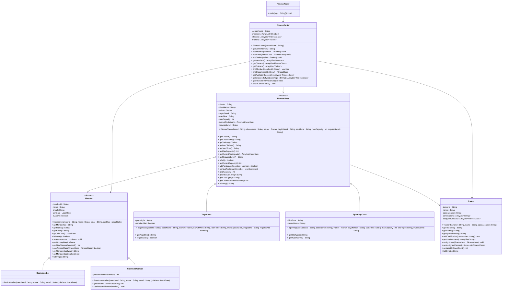

# Exercise: Fitness Center Management

## Description

Create a fitness center management system that models different types of members, fitness classes, trainers, and bookings. The system should handle membership levels with varying access privileges, class scheduling with capacity limits, and booking management.

This exercise focuses on:
- Creating abstract base classes for members and classes
- Implementing inheritance for different membership levels and class types
- Modeling real-world gym operations and schedules
- Managing relationships between members, trainers, and classes
- Calculating membership fees and class availability

## Class Diagram

## Class Descriptions

### Abstract Class: Member

The base class for all fitness center members.

**Fields:**
- `memberId` - Unique member identifier
- `name` - Member's name
- `email` - Email address
- `joinDate` - Date member joined
- `isActive` - Whether membership is active

**Methods:**
- `Member(memberId, name, email, joinDate)` - Constructor (sets isActive to true)
- `getMemberId()` - Returns member ID
- `getName()` - Returns name
- `getEmail()` - Returns email
- `getJoinDate()` - Returns join date
- `isActive()` - Returns active status
- `setActive(active)` - Sets active status
- `getMonthlyFee()` - Abstract method returning monthly membership fee
- `getMaxClassesPerWeek()` - Abstract method returning max classes allowed per week
- `canAccessClass(fitnessClass)` - Abstract method checking if member can access specific class
- `getMembershipType()` - Abstract method returning membership type
- `getMembershipDuration()` - Calculates months since joining
- `toString()` - Returns formatted member information

### Class: BasicMember extends Member

Entry-level membership with limited access.

**Methods:**
- `BasicMember(memberId, name, email, joinDate)` - Constructor
- `getMonthlyFee()` - Returns 29.99
- `getMaxClassesPerWeek()` - Returns 3
- `canAccessClass(fitnessClass)` - Returns true only for Yoga and Swimming classes (basic access)
- `getMembershipType()` - Returns "Basic"

### Class: PremiumMember extends Member

Mid-tier membership with additional benefits.

**Fields:**
- `personalTrainerSessions` - Number of free PT sessions remaining (starts at 2 per month)

**Methods:**
- `PremiumMember(memberId, name, email, joinDate)` - Constructor
- `getPersonalTrainerSessions()` - Returns remaining sessions
- `usePersonalTrainerSession()` - Decrements session count
- `getMonthlyFee()` - Returns 59.99
- `getMaxClassesPerWeek()` - Returns 7
- `canAccessClass(fitnessClass)` - Returns true for all class types except CrossFit
- `getMembershipType()` - Returns "Premium"

### Abstract Class: FitnessClass

The base class for all fitness classes.

**Fields:**
- `classId` - Unique class identifier
- `className` - Name of the class
- `trainer` - Assigned trainer
- `schedule` - Class schedule
- `maxCapacity` - Maximum number of participants
- `currentParticipants` - List of enrolled members
- `requiredLevel` - Required membership level (Basic, Premium, VIP)

**Methods:**
- `FitnessClass(classId, className, trainer, schedule, maxCapacity, requiredLevel)` - Constructor
- `getClassId()` - Returns class ID
- `getClassName()` - Returns class name
- `getTrainer()` - Returns trainer
- `getSchedule()` - Returns schedule
- `getMaxCapacity()` - Returns max capacity
- `getCurrentParticipants()` - Returns list of participants
- `getRequiredLevel()` - Returns required level
- `isFull()` - Returns true if at capacity
- `getCurrentCapacity()` - Returns current participant count
- `addParticipant(member)` - Adds member if not full and member has access, returns success
- `removeParticipant(member)` - Removes member from class
- `getDuration()` - Abstract method returning class duration in minutes
- `getIntensityLevel()` - Abstract method returning intensity (Low, Medium, High, Extreme)
- `getClassType()` - Abstract method returning class type
- `getCaloriesBurnedEstimate()` - Abstract method estimating calories burned
- `toString()` - Returns formatted class information

### Class: YogaClass extends FitnessClass

Yoga and meditation class.

**Fields:**
- `yogaStyle` - Style of yoga (Hatha, Vinyasa, Bikram, etc.)
- `requiresMat` - Whether students need to bring mats

**Methods:**
- `YogaClass(...)` - Constructor
- `getYogaStyle()` - Returns yoga style
- `requiresMat()` - Returns true if mat required
- `getDuration()` - Returns 60
- `getIntensityLevel()` - Returns "Low"
- `getClassType()` - Returns "Yoga"
- `getCaloriesBurnedEstimate()` - Returns 200

### Class: SpinningClass extends FitnessClass

Indoor cycling class.

**Fields:**
- `bikeType` - Type of bike (standard, racing, hybrid)
- `musicGenre` - Music played during class

**Methods:**
- `SpinningClass(...)` - Constructor
- `getBikeType()` - Returns bike type
- `getMusicGenre()` - Returns music genre
- `getDuration()` - Returns 45
- `getIntensityLevel()` - Returns "High"
- `getClassType()` - Returns "Spinning"
- `getCaloriesBurnedEstimate()` - Returns 500

### Class: Trainer

Represents a fitness trainer.

**Fields:**
- `trainerId` - Unique trainer identifier
- `name` - Trainer's name
- `specialization` - Area of specialization
- `certifications` - List of certifications
- `assignedClasses` - List of classes trainer teaches

**Methods:**
- `Trainer(trainerId, name, specialization)` - Constructor
- `getTrainerId()` - Returns trainer ID
- `getName()` - Returns name
- `getSpecialization()` - Returns specialization
- `addCertification(certification)` - Adds a certification
- `getCertifications()` - Returns list of certifications
- `assignClass(fitnessClass)` - Assigns a class to trainer
- `getAssignedClasses()` - Returns assigned classes
- `getWeeklyClassCount()` - Returns total number of classes taught per week
- `toString()` - Returns formatted trainer information

### Class: FitnessCenter

Manages the entire fitness center.

**Fields:**
- `centerName` - Name of the fitness center
- `members` - List of all members
- `classes` - List of all classes
- `trainers` - List of all trainers
- `bookings` - List of all bookings

**Methods:**
- `FitnessCenter(centerName)` - Constructor
- `getCenterName()` - Returns center name
- `addMember(member)` - Adds a member
- `addClass(fitnessClass)` - Adds a class
- `addTrainer(trainer)` - Adds a trainer
- `addBooking(booking)` - Adds a booking
- `getMembers()` - Returns all members
- `getClasses()` - Returns all classes
- `getTrainers()` - Returns all trainers
- `findMember(memberId)` - Finds member by ID
- `findClass(classId)` - Finds class by ID
- `getAvailableClasses()` - Returns classes that aren't full
- `getClassesByType(classType)` - Returns classes of specific type
- `getTotalMonthlyRevenue()` - Calculates total revenue from all active members
- `showCenterStatus()` - Prints center summary (members, classes, revenue)

### Class: FitnessTester

Main testing class to demonstrate the fitness center system.

**Methods:**
- `main(args)` - Creates center, members, trainers, classes, bookings, and displays results

## Testing Requirements

The `FitnessTester` class should demonstrate:
1. Creating a fitness center
2. Creating different membership types
3. Adding members to center
4. Creating trainers with specializations
5. Creating different class types
6. Scheduling classes
7. Members booking classes
8. Checking access restrictions
9. Calculating monthly revenue
10. Displaying center status

This exercise provides comprehensive practice with inheritance, abstract classes, and fitness center management!
