# Exercise: Deep Sea Diving Championship

## Description

Create a freediving competition system that models different types of divers, dive disciplines, competition events, and judges. The system should handle depth achievements, time underwater, safety protocols, and scoring based on performance and style.

This exercise focuses on:
- Creating abstract base classes for divers and dive disciplines
- Implementing inheritance for different diver skill levels and dive types
- Modeling competitive scoring systems and safety protocols
- Managing relationships between divers, dives, and judges
- Calculating scores based on depth, time, and performance quality

## Class Diagram

```mermaid
classDiagram
    class _Diver_ {
        <<abstract>>
        - diverId : String
        - name : String
        - age : int
        - nationality : String
        - personalBest : double
        - totalDives : int
        + Diver(diverId : String, name : String, age : int, nationality : String)
        + getDiverId() String
        + getName() String
        + getAge() int
        + getNationality() String
        + getPersonalBest() double
        + setPersonalBest(depth : double) void
        + getTotalDives() int
        + incrementDiveCount() void
        + getMaxDepth()* double
        + getLungCapacity()* int
        + getExperienceLevel()* String
        + getDiverCategory()* String
        + toString() String
    }
    
    class RecreationalDiver {
        - certificationLevel : String
        + RecreationalDiver(diverId : String, name : String, age : int, nationality : String, certificationLevel : String)
        + getCertificationLevel() String
        + getMaxDepth() double
        + getLungCapacity() int
        + getExperienceLevel() String
        + getDiverCategory() String
    }
    
    class ProfessionalDiver {
        - yearsExperience : int
        - sponsorships : ArrayList~String~
        + ProfessionalDiver(diverId : String, name : String, age : int, nationality : String, yearsExperience : int)
        + getYearsExperience() int
        + addSponsorship(sponsor : String) void
        + getSponsorships() ArrayList~String~
        + getMaxDepth() double
        + getLungCapacity() int
        + getExperienceLevel() String
        + getDiverCategory() String
    }
    
    class EliteDiver {
        - worldRanking : int
        - records : ArrayList~String~
        - mentalTraining : int
        + EliteDiver(diverId : String, name : String, age : int, nationality : String, worldRanking : int, mentalTraining : int)
        + getWorldRanking() int
        + setWorldRanking(ranking : int) void
        + addRecord(record : String) void
        + getRecords() ArrayList~String~
        + getMentalTraining() int
        + getMaxDepth() double
        + getLungCapacity() int
        + getExperienceLevel() String
        + getDiverCategory() String
    }
    
    class _Dive_ {
        <<abstract>>
        - diveId : String
        - diver : Diver
        - depthReached : double
        - timeUnderwater : int
        - surfaceTime : int
        - safetyViolation : boolean
        + Dive(diveId : String, diver : Diver, depthReached : double, timeUnderwater : int, surfaceTime : int)
        + getDiveId() String
        + getDiver() Diver
        + getDepthReached() double
        + getTimeUnderwater() int
        + getSurfaceTime() int
        + hasSafetyViolation() boolean
        + setSafetyViolation(violation : boolean) void
        + getDiscipline()* String
        + getBaseDifficulty()* double
        + calculateScore() double
        + isValidDive() boolean
        + toString() String
    }
    
    class ConstantWeight {
        - weightUsed : double
        - finType : String
        + ConstantWeight(diveId : String, diver : Diver, depthReached : double, timeUnderwater : int, surfaceTime : int, weightUsed : double, finType : String)
        + getWeightUsed() double
        + getFinType() String
        + getDiscipline() String
        + getBaseDifficulty() double
        + calculateScore() double
    }
    
    class FreeImmersion {
        - ropeUsed : boolean
        - techniqueScore : double
        + FreeImmersion(diveId : String, diver : Diver, depthReached : double, timeUnderwater : int, surfaceTime : int, techniqueScore : double)
        + isRopeUsed() boolean
        + getTechniqueScore() double
        + getDiscipline() String
        + getBaseDifficulty() double
        + calculateScore() double
    }
    
    class NoLimits {
        - descentDevice : String
        - ascentDevice : String
        - maxSpeed : double
        + NoLimits(diveId : String, diver : Diver, depthReached : double, timeUnderwater : int, surfaceTime : int, descentDevice : String, ascentDevice : String, maxSpeed : double)
        + getDescentDevice() String
        + getAscentDevice() String
        + getMaxSpeed() double
        + getDiscipline() String
        + getBaseDifficulty() double
        + calculateScore() double
    }
    
    class StaticApnea {
        - poolDepth : double
        - heartRateBefore : int
        - heartRateAfter : int
        + StaticApnea(diveId : String, diver : Diver, timeUnderwater : int, poolDepth : double, heartRateBefore : int, heartRateAfter : int)
        + getPoolDepth() double
        + getHeartRateBefore() int
        + getHeartRateAfter() int
        + getHeartRateRecovery() int
        + getDiscipline() String
        + getBaseDifficulty() double
        + calculateScore() double
    }
    
    class Judge {
        - judgeId : String
        - name : String
        - certification : String
        - experience : int
        + Judge(judgeId : String, name : String, certification : String, experience : int)
        + getJudgeId() String
        + getName() String
        + getCertification() String
        + getExperience() int
        + scorePerformance(dive : Dive) double
        + checkSafety(dive : Dive) boolean
        + toString() String
    }
    
    class DiveSession {
        - sessionId : String
        - diver : Diver
        - dives : ArrayList~Dive~
        - sessionDate : LocalDate
        - waterTemperature : double
        - visibility : int
        + DiveSession(sessionId : String, diver : Diver, sessionDate : LocalDate, waterTemperature : double, visibility : int)
        + getSessionId() String
        + getDiver() Diver
        + addDive(dive : Dive) void
        + getDives() ArrayList~Dive~
        + getSessionDate() LocalDate
        + getWaterTemperature() double
        + getVisibility() int
        + getBestDive() Dive
        + getAverageDepth() double
        + getTotalTime() int
        + toString() String
    }
    
    class Competition {
        - competitionId : String
        - name : String
        - location : String
        - startDate : LocalDate
        - endDate : LocalDate
        - participants : ArrayList~Diver~
        - sessions : ArrayList~DiveSession~
        - judges : ArrayList~Judge~
        + Competition(competitionId : String, name : String, location : String, startDate : LocalDate, endDate : LocalDate)
        + getCompetitionId() String
        + getName() String
        + getLocation() String
        + getStartDate() LocalDate
        + getEndDate() LocalDate
        + addParticipant(diver : Diver) void
        + addSession(session : DiveSession) void
        + addJudge(judge : Judge) void
        + getParticipants() ArrayList~Diver~
        + getSessions() ArrayList~DiveSession~
        + getJudges() ArrayList~Judge~
        + getLeaderboard() ArrayList~Diver~
        + getWinner() Diver
        + showCompetitionStatus() void
    }
    
    class DivingTester {
        + main(args : String[]) void
    }
    
    _Diver_ <|-- RecreationalDiver
    _Diver_ <|-- ProfessionalDiver
    _Diver_ <|-- EliteDiver
    _Dive_ <|-- ConstantWeight
    _Dive_ <|-- FreeImmersion
    _Dive_ <|-- NoLimits
    _Dive_ <|-- StaticApnea
    _Dive_ --> _Diver_
    DiveSession --> _Diver_
    DiveSession --> _Dive_
    Competition --> _Diver_
    Competition --> DiveSession
    Competition --> Judge
    DivingTester --> Competition
```

## Class Descriptions

### Abstract Class: Diver

The base class for all divers.

**Fields:**
- `diverId` - Unique diver identifier
- `name` - Diver's name
- `age` - Age in years
- `nationality` - Country of origin
- `personalBest` - Personal best depth in meters
- `totalDives` - Total number of dives completed

**Methods:**
- `Diver(diverId, name, age, nationality)` - Constructor (sets personalBest to 0, totalDives to 0)
- `getDiverId()` - Returns diver ID
- `getName()` - Returns name
- `getAge()` - Returns age
- `getNationality()` - Returns nationality
- `getPersonalBest()` - Returns personal best depth
- `setPersonalBest(depth)` - Updates personal best if new depth is greater
- `getTotalDives()` - Returns total dives
- `incrementDiveCount()` - Increments dive count
- `getMaxDepth()` - Abstract method returning maximum safe diving depth for this diver category
- `getLungCapacity()` - Abstract method returning lung capacity in seconds
- `getExperienceLevel()` - Abstract method returning experience level description
- `getDiverCategory()` - Abstract method returning diver category
- `toString()` - Returns formatted diver information

### Class: RecreationalDiver extends Diver

Entry-level diver with basic certification.

**Fields:**
- `certificationLevel` - Certification level (Open Water, Advanced, etc.)

**Methods:**
- `RecreationalDiver(diverId, name, age, nationality, certificationLevel)` - Constructor
- `getCertificationLevel()` - Returns certification level
- `getMaxDepth()` - Returns 20.0 meters
- `getLungCapacity()` - Returns 90 seconds
- `getExperienceLevel()` - Returns "Beginner"
- `getDiverCategory()` - Returns "Recreational"

### Class: ProfessionalDiver extends Diver

Experienced diver competing professionally.

**Fields:**
- `yearsExperience` - Years of diving experience
- `sponsorships` - List of sponsors

**Methods:**
- `ProfessionalDiver(diverId, name, age, nationality, yearsExperience)` - Constructor
- `getYearsExperience()` - Returns years of experience
- `addSponsorship(sponsor)` - Adds a sponsor to the list
- `getSponsorships()` - Returns list of sponsors
- `getMaxDepth()` - Returns 60.0 meters
- `getLungCapacity()` - Returns 180 seconds (3 minutes)
- `getExperienceLevel()` - Returns "Professional"
- `getDiverCategory()` - Returns "Professional"

### Class: EliteDiver extends Diver

World-class diver with records and rankings.

**Fields:**
- `worldRanking` - Current world ranking position
- `records` - List of world records held
- `mentalTraining` - Hours of mental training per week

**Methods:**
- `EliteDiver(diverId, name, age, nationality, worldRanking, mentalTraining)` - Constructor
- `getWorldRanking()` - Returns world ranking
- `setWorldRanking(ranking)` - Updates world ranking
- `addRecord(record)` - Adds a record to the list
- `getRecords()` - Returns list of records
- `getMentalTraining()` - Returns mental training hours
- `getMaxDepth()` - Returns 130.0 meters
- `getLungCapacity()` - Returns 300 seconds (5 minutes)
- `getExperienceLevel()` - Returns "Elite"
- `getDiverCategory()` - Returns "Elite"

### Abstract Class: Dive

The base class for all dive types.

**Fields:**
- `diveId` - Unique dive identifier
- `diver` - The diver performing the dive
- `depthReached` - Maximum depth reached in meters
- `timeUnderwater` - Time spent underwater in seconds
- `surfaceTime` - Time taken to surface in seconds
- `safetyViolation` - Whether any safety protocols were violated

**Methods:**
- `Dive(diveId, diver, depthReached, timeUnderwater, surfaceTime)` - Constructor
- `getDiveId()` - Returns dive ID
- `getDiver()` - Returns diver
- `getDepthReached()` - Returns depth reached
- `getTimeUnderwater()` - Returns time underwater
- `getSurfaceTime()` - Returns surface time
- `hasSafetyViolation()` - Returns true if safety was violated
- `setSafetyViolation(violation)` - Sets safety violation flag
- `getDiscipline()` - Abstract method returning dive discipline name
- `getBaseDifficulty()` - Abstract method returning difficulty multiplier
- `calculateScore()` - Calculates score: (depthReached * baseDifficulty) - (safetyViolation ? 50 : 0)
- `isValidDive()` - Returns true if depth doesn't exceed diver's max depth and no safety violations
- `toString()` - Returns formatted dive information

### Class: ConstantWeight extends Dive

Diving with constant weight, using fins.

**Fields:**
- `weightUsed` - Weight used in kilograms
- `finType` - Type of fins (monofin, bifin, no fins)

**Methods:**
- `ConstantWeight(diveId, diver, depthReached, timeUnderwater, surfaceTime, weightUsed, finType)` - Constructor
- `getWeightUsed()` - Returns weight used
- `getFinType()` - Returns fin type
- `getDiscipline()` - Returns "Constant Weight"
- `getBaseDifficulty()` - Returns 1.0 (baseline difficulty)
- `calculateScore()` - Calls parent calculateScore()

### Class: FreeImmersion extends Dive

Diving by pulling on a rope.

**Fields:**
- `ropeUsed` - Whether rope was used (always true for this discipline)
- `techniqueScore` - Judge score for technique (0-10)

**Methods:**
- `FreeImmersion(diveId, diver, depthReached, timeUnderwater, surfaceTime, techniqueScore)` - Constructor
- `isRopeUsed()` - Returns true
- `getTechniqueScore()` - Returns technique score
- `getDiscipline()` - Returns "Free Immersion"
- `getBaseDifficulty()` - Returns 1.2
- `calculateScore()` - Returns (depthReached * 1.2 + techniqueScore * 5) - (safetyViolation ? 50 : 0)

### Class: NoLimits extends Dive

Extreme diving with mechanical assistance.

**Fields:**
- `descentDevice` - Device used for descent (weighted sled)
- `ascentDevice` - Device used for ascent (lift bag, balloon)
- `maxSpeed` - Maximum descent/ascent speed in m/s

**Methods:**
- `NoLimits(diveId, diver, depthReached, timeUnderwater, surfaceTime, descentDevice, ascentDevice, maxSpeed)` - Constructor
- `getDescentDevice()` - Returns descent device
- `getAscentDevice()` - Returns ascent device
- `getMaxSpeed()` - Returns max speed
- `getDiscipline()` - Returns "No Limits"
- `getBaseDifficulty()` - Returns 2.0 (highest difficulty)
- `calculateScore()` - Returns (depthReached * 2.0) - (safetyViolation ? 100 : 0)

### Class: StaticApnea extends Dive

Holding breath underwater without movement.

**Fields:**
- `poolDepth` - Depth of the pool in meters
- `heartRateBefore` - Heart rate before dive (bpm)
- `heartRateAfter` - Heart rate after dive (bpm)

**Methods:**
- `StaticApnea(diveId, diver, timeUnderwater, poolDepth, heartRateBefore, heartRateAfter)` - Constructor (depth is set to poolDepth)
- `getPoolDepth()` - Returns pool depth
- `getHeartRateBefore()` - Returns heart rate before
- `getHeartRateAfter()` - Returns heart rate after
- `getHeartRateRecovery()` - Returns difference (heartRateAfter - heartRateBefore)
- `getDiscipline()` - Returns "Static Apnea"
- `getBaseDifficulty()` - Returns 0.5 (time-based, not depth-based)
- `calculateScore()` - Returns (timeUnderwater * 0.5) - (heartRateRecovery > 40 ? 20 : 0)

### Class: Judge

Represents a competition judge.

**Fields:**
- `judgeId` - Unique judge identifier
- `name` - Judge's name
- `certification` - Judging certification level
- `experience` - Years of judging experience

**Methods:**
- `Judge(judgeId, name, certification, experience)` - Constructor
- `getJudgeId()` - Returns judge ID
- `getName()` - Returns name
- `getCertification()` - Returns certification
- `getExperience()` - Returns experience
- `scorePerformance(dive)` - Evaluates dive performance, returns score 0-10 based on depth vs diver's max
- `checkSafety(dive)` - Checks if dive meets safety requirements, sets violation flag if not
- `toString()` - Returns formatted judge information

### Class: DiveSession

Represents a diving session for one diver.

**Fields:**
- `sessionId` - Unique session identifier
- `diver` - The diver
- `dives` - List of dives in this session
- `sessionDate` - Date of the session
- `waterTemperature` - Water temperature in Celsius
- `visibility` - Underwater visibility in meters

**Methods:**
- `DiveSession(sessionId, diver, sessionDate, waterTemperature, visibility)` - Constructor
- `getSessionId()` - Returns session ID
- `getDiver()` - Returns diver
- `addDive(dive)` - Adds a dive to the session
- `getDives()` - Returns list of dives
- `getSessionDate()` - Returns session date
- `getWaterTemperature()` - Returns water temperature
- `getVisibility()` - Returns visibility
- `getBestDive()` - Returns the dive with highest score
- `getAverageDepth()` - Calculates average depth of all dives
- `getTotalTime()` - Calculates total time underwater for all dives
- `toString()` - Returns formatted session information

### Class: Competition

Manages a diving competition.

**Fields:**
- `competitionId` - Unique competition identifier
- `name` - Competition name
- `location` - Location of competition
- `startDate` - Start date
- `endDate` - End date
- `participants` - List of participating divers
- `sessions` - List of all dive sessions
- `judges` - List of competition judges

**Methods:**
- `Competition(competitionId, name, location, startDate, endDate)` - Constructor
- `getCompetitionId()` - Returns competition ID
- `getName()` - Returns name
- `getLocation()` - Returns location
- `getStartDate()` - Returns start date
- `getEndDate()` - Returns end date
- `addParticipant(diver)` - Adds a diver to competition
- `addSession(session)` - Adds a dive session
- `addJudge(judge)` - Adds a judge
- `getParticipants()` - Returns list of participants
- `getSessions()` - Returns list of sessions
- `getJudges()` - Returns list of judges
- `getLeaderboard()` - Returns divers sorted by their best dive scores
- `getWinner()` - Returns the diver with the highest score
- `showCompetitionStatus()` - Prints competition summary

### Class: DivingTester

Main testing class to demonstrate the diving competition system.

**Methods:**
- `main(args)` - Creates competition, divers, judges, sessions, dives, and displays results

## Testing Requirements

The `DivingTester` class should demonstrate:
1. Creating a competition with location and dates
2. Creating different types of divers (recreational, professional, elite)
3. Adding judges to the competition
4. Creating dive sessions for divers
5. Recording different types of dives with varying depths and times
6. Judges scoring performances and checking safety
7. Calculating dive scores
8. Determining competition winner
9. Displaying leaderboard
10. Showing safety violations

This exercise provides comprehensive practice with inheritance, abstract classes, and competitive scoring systems!
