# Exercise: Mining Corporation Management

## Description

Create a deep space mining corporation system that models different types of minerals, miners with varying skill levels, mining equipment, and mining operations. The system should handle resource extraction, equipment management, miner safety, and profit calculations.

This exercise focuses on:
- Creating abstract base classes for minerals and equipment
- Implementing inheritance for different miner types and mineral classifications
- Modeling mining operations with depth, danger, and efficiency
- Managing relationships between miners, equipment, and mining claims
- Calculating yields, costs, and profitability

## Class Diagram

```mermaid
classDiagram
    class _Mineral_ {
        <<abstract>>
        - mineralId : String
        - name : String
        - quantity : double
        - purity : double
        - depth : double
        + Mineral(mineralId : String, name : String, quantity : double, purity : double, depth : double)
        + getMineralId() String
        + getName() String
        + getQuantity() double
        + getPurity() double
        + getDepth() double
        + getMarketValue()* double
        + getExtractionDifficulty()* double
        + getMineralType()* String
        + getRarity()* String
        + calculateValue() double
        + toString() String
    }
    
    class IronOre {
        - ironContent : double
        + IronOre(mineralId : String, quantity : double, purity : double, depth : double, ironContent : double)
        + getIronContent() double
        + getMarketValue() double
        + getExtractionDifficulty() double
        + getMineralType() String
        + getRarity() String
    }
    
    class GoldDeposit {
        - caratPurity : int
        + GoldDeposit(mineralId : String, quantity : double, purity : double, depth : double, caratPurity : int)
        + getCaratPurity() int
        + getMarketValue() double
        + getExtractionDifficulty() double
        + getMineralType() String
        + getRarity() String
    }
    
    class GemstoneVein {
        - gemType : String
        - clarity : String
        + GemstoneVein(mineralId : String, quantity : double, purity : double, depth : double, gemType : String, clarity : String)
        + getGemType() String
        + getClarity() String
        + getMarketValue() double
        + getExtractionDifficulty() double
        + getMineralType() String
        + getRarity() String
    }
    
    class RadioactiveMaterial {
        - halfLife : int
        - radiationLevel : double
        - requiresShielding : boolean
        + RadioactiveMaterial(mineralId : String, quantity : double, purity : double, depth : double, halfLife : int, radiationLevel : double)
        + getHalfLife() int
        + getRadiationLevel() double
        + requiresShielding() boolean
        + getMarketValue() double
        + getExtractionDifficulty() double
        + getMineralType() String
        + getRarity() String
    }
    
    class _Miner_ {
        <<abstract>>
        - minerId : String
        - name : String
        - age : int
        - experienceYears : int
        - health : int
        - currentShaft : MiningShaft
        + Miner(minerId : String, name : String, age : int, experienceYears : int)
        + getMinerId() String
        + getName() String
        + getAge() int
        + getExperienceYears() int
        + getHealth() int
        + setHealth(health : int) void
        + isHealthy() boolean
        + getCurrentShaft() MiningShaft
        + assignToShaft(shaft : MiningShaft) void
        + getEfficiencyRate()* double
        + getSafetyRating()* int
        + getMinerType()* String
        + getMaxDepth()* double
        + mine(mineral : Mineral) double
        + rest() void
        + toString() String
    }
    
    class RookieMiner {
        - trainingSessions : int
        + RookieMiner(minerId : String, name : String, age : int, experienceYears : int, trainingSessions : int)
        + getTrainingSessions() int
        + completeTraining() void
        + getEfficiencyRate() double
        + getSafetyRating() int
        + getMinerType() String
        + getMaxDepth() double
    }
    
    class VeteranMiner {
        - successfulOperations : int
        - mentorScore : int
        + VeteranMiner(minerId : String, name : String, age : int, experienceYears : int, successfulOperations : int)
        + getSuccessfulOperations() int
        + incrementSuccessful() void
        + getMentorScore() int
        + getEfficiencyRate() double
        + getSafetyRating() int
        + getMinerType() String
        + getMaxDepth() double
    }
    
    class SpecialistMiner {
        - specialization : String
        - certifications : ArrayList~String~
        - bonusRate : double
        + SpecialistMiner(minerId : String, name : String, age : int, experienceYears : int, specialization : String, bonusRate : double)
        + getSpecialization() String
        + addCertification(cert : String) void
        + getCertifications() ArrayList~String~
        + getBonusRate() double
        + getEfficiencyRate() double
        + getSafetyRating() int
        + getMinerType() String
        + getMaxDepth() double
    }
    
    class _Equipment_ {
        <<abstract>>
        - equipmentId : String
        - name : String
        - durability : int
        - maxDurability : int
        - maintenanceCost : double
        + Equipment(equipmentId : String, name : String, maxDurability : int, maintenanceCost : double)
        + getEquipmentId() String
        + getName() String
        + getDurability() int
        + getMaxDurability() int
        + getMaintenanceCost() double
        + use() void
        + repair() void
        + isBroken() boolean
        + getEfficiency() double
        + getEquipmentType()* String
        + getOperatingCost()* double
        + toString() String
    }
    
    class Drill {
        - drillPower : int
        - drillSpeed : double
        + Drill(equipmentId : String, name : String, maxDurability : int, maintenanceCost : double, drillPower : int, drillSpeed : double)
        + getDrillPower() int
        + getDrillSpeed() double
        + getEquipmentType() String
        + getOperatingCost() double
    }
    
    class Scanner {
        - scanRange : double
        - accuracy : int
        + Scanner(equipmentId : String, name : String, maxDurability : int, maintenanceCost : double, scanRange : double, accuracy : int)
        + getScanRange() double
        + getAccuracy() int
        + scanForMinerals() String
        + getEquipmentType() String
        + getOperatingCost() double
    }
    
    class Explosives {
        - blastRadius : double
        - detonationType : String
        - safetyLevel : int
        + Explosives(equipmentId : String, name : String, maxDurability : int, maintenanceCost : double, blastRadius : double, detonationType : String)
        + getBlastRadius() double
        + getDetonationType() String
        + getSafetyLevel() int
        + detonate() String
        + getEquipmentType() String
        + getOperatingCost() double
    }
    
    class MiningShaft {
        - shaftId : String
        - location : String
        - currentDepth : double
        - maxDepth : double
        - dangerRating : int
        - minerals : ArrayList~Mineral~
        - assignedMiners : ArrayList~Miner~
        - equipment : ArrayList~Equipment~
        + MiningShaft(shaftId : String, location : String, maxDepth : double, dangerRating : int)
        + getShaftId() String
        + getLocation() String
        + getCurrentDepth() double
        + setCurrentDepth(depth : double) void
        + getMaxDepth() double
        + getDangerRating() int
        + addMineral(mineral : Mineral) void
        + getMinerals() ArrayList~Mineral~
        + assignMiner(miner : Miner) void
        + getAssignedMiners() ArrayList~Miner~
        + addEquipment(equipment : Equipment) void
        + getEquipment() ArrayList~Equipment~
        + getTotalMineralValue() double
        + isSafe() boolean
        + toString() String
    }
    
    class MiningClaim {
        - claimId : String
        - claimant : String
        - shaft : MiningShaft
        - purchaseDate : LocalDate
        - purchasePrice : double
        - totalExtracted : double
        - active : boolean
        + MiningClaim(claimId : String, claimant : String, shaft : MiningShaft, purchaseDate : LocalDate, purchasePrice : double)
        + getClaimId() String
        + getClaimant() String
        + getShaft() MiningShaft
        + getPurchaseDate() LocalDate
        + getPurchasePrice() double
        + getTotalExtracted() double
        + addExtraction(amount : double) void
        + isActive() boolean
        + setActive(active : boolean) void
        + getProfit() double
        + getDaysActive() int
        + toString() String
    }
    
    class MiningCorporation {
        - corpName : String
        - shafts : ArrayList~MiningShaft~
        - miners : ArrayList~Miner~
        - claims : ArrayList~MiningClaim~
        - equipment : ArrayList~Equipment~
        + MiningCorporation(corpName : String)
        + getCorpName() String
        + addShaft(shaft : MiningShaft) void
        + addMiner(miner : Miner) void
        + addClaim(claim : MiningClaim) void
        + addEquipment(equipment : Equipment) void
        + getShafts() ArrayList~MiningShaft~
        + getMiners() ArrayList~Miner~
        + getClaims() ArrayList~MiningClaim~
        + getEquipment() ArrayList~Equipment~
        + getTotalAssetValue() double
        + getTotalRevenue() double
        + getTotalOperatingCost() double
        + getNetProfit() double
        + showCorporationStatus() void
    }
    
    class MiningTester {
        + main(args : String[]) void
    }
    
    _Mineral_ <|-- IronOre
    _Mineral_ <|-- GoldDeposit
    _Mineral_ <|-- GemstoneVein
    _Mineral_ <|-- RadioactiveMaterial
    _Miner_ <|-- RookieMiner
    _Miner_ <|-- VeteranMiner
    _Miner_ <|-- SpecialistMiner
    _Equipment_ <|-- Drill
    _Equipment_ <|-- Scanner
    _Equipment_ <|-- Explosives
    MiningShaft --> _Mineral_
    MiningShaft --> _Miner_
    MiningShaft --> _Equipment_
    _Miner_ --> MiningShaft
    MiningClaim --> MiningShaft
    MiningCorporation --> MiningShaft
    MiningCorporation --> _Miner_
    MiningCorporation --> MiningClaim
    MiningCorporation --> _Equipment_
    MiningTester --> MiningCorporation
```

## Class Descriptions

### Abstract Class: Mineral

The base class for all mineral types.

**Fields:**
- `mineralId` - Unique mineral identifier
- `name` - Mineral name
- `quantity` - Amount in tons
- `purity` - Purity percentage (0-100)
- `depth` - Depth where found in meters

**Methods:**
- `Mineral(mineralId, name, quantity, purity, depth)` - Constructor
- `getMineralId()` - Returns mineral ID
- `getName()` - Returns name
- `getQuantity()` - Returns quantity
- `getPurity()` - Returns purity
- `getDepth()` - Returns depth
- `getMarketValue()` - Abstract method returning value per ton
- `getExtractionDifficulty()` - Abstract method returning difficulty multiplier (1.0-5.0)
- `getMineralType()` - Abstract method returning mineral type
- `getRarity()` - Abstract method returning rarity (Common, Uncommon, Rare, Legendary)
- `calculateValue()` - Calculates total value: quantity * marketValue * (purity / 100)
- `toString()` - Returns formatted mineral information

### Class: IronOre extends Mineral

Common iron ore deposits.

**Fields:**
- `ironContent` - Iron content percentage

**Methods:**
- `IronOre(mineralId, quantity, purity, depth, ironContent)` - Constructor (name set to "Iron Ore")
- `getIronContent()` - Returns iron content
- `getMarketValue()` - Returns 50.0 per ton
- `getExtractionDifficulty()` - Returns 1.0
- `getMineralType()` - Returns "Metal Ore"
- `getRarity()` - Returns "Common"

### Class: GoldDeposit extends Mineral

Valuable gold deposits.

**Fields:**
- `caratPurity` - Carat purity (1-24)

**Methods:**
- `GoldDeposit(mineralId, quantity, purity, depth, caratPurity)` - Constructor (name set to "Gold")
- `getCaratPurity()` - Returns carat purity
- `getMarketValue()` - Returns 50000.0 per ton
- `getExtractionDifficulty()` - Returns 2.5
- `getMineralType()` - Returns "Precious Metal"
- `getRarity()` - Returns "Rare"

### Class: GemstoneVein extends Mineral

Gemstone deposits.

**Fields:**
- `gemType` - Type of gemstone (diamond, emerald, ruby, etc.)
- `clarity` - Clarity grade (FL, IF, VVS, VS, SI, I)

**Methods:**
- `GemstoneVein(mineralId, quantity, purity, depth, gemType, clarity)` - Constructor (name set to gemType)
- `getGemType()` - Returns gem type
- `getClarity()` - Returns clarity
- `getMarketValue()` - Returns 100000.0 per ton
- `getExtractionDifficulty()` - Returns 3.5
- `getMineralType()` - Returns "Gemstone"
- `getRarity()` - Returns "Rare"

### Class: RadioactiveMaterial extends Mineral

Dangerous radioactive materials.

**Fields:**
- `halfLife` - Half-life in years
- `radiationLevel` - Radiation level in Sieverts
- `requiresShielding` - Whether special shielding is needed (always true)

**Methods:**
- `RadioactiveMaterial(mineralId, quantity, purity, depth, halfLife, radiationLevel)` - Constructor (name set to "Radioactive Material")
- `getHalfLife()` - Returns half-life
- `getRadiationLevel()` - Returns radiation level
- `requiresShielding()` - Returns true
- `getMarketValue()` - Returns 200000.0 per ton
- `getExtractionDifficulty()` - Returns 5.0 (highest difficulty)
- `getMineralType()` - Returns "Radioactive"
- `getRarity()` - Returns "Legendary"

### Abstract Class: Miner

The base class for all miners.

**Fields:**
- `minerId` - Unique miner identifier
- `name` - Miner's name
- `age` - Age in years
- `experienceYears` - Years of mining experience
- `health` - Current health (0-100)
- `currentShaft` - Currently assigned shaft

**Methods:**
- `Miner(minerId, name, age, experienceYears)` - Constructor (sets health to 100)
- `getMinerId()` - Returns miner ID
- `getName()` - Returns name
- `getAge()` - Returns age
- `getExperienceYears()` - Returns experience years
- `getHealth()` - Returns health
- `setHealth(health)` - Sets health (0-100)
- `isHealthy()` - Returns true if health > 50
- `getCurrentShaft()` - Returns current shaft
- `assignToShaft(shaft)` - Assigns miner to a shaft
- `getEfficiencyRate()` - Abstract method returning efficiency (0.5-2.0)
- `getSafetyRating()` - Abstract method returning safety rating (1-10)
- `getMinerType()` - Abstract method returning miner type
- `getMaxDepth()` - Abstract method returning maximum safe depth
- `mine(mineral)` - Mines mineral, returns amount extracted (quantity * efficiencyRate), reduces health by (depth / 10)
- `rest()` - Restores 20 health points
- `toString()` - Returns formatted miner information

### Class: RookieMiner extends Miner

Entry-level miner with training.

**Fields:**
- `trainingSessions` - Number of training sessions completed

**Methods:**
- `RookieMiner(minerId, name, age, experienceYears, trainingSessions)` - Constructor
- `getTrainingSessions()` - Returns training sessions
- `completeTraining()` - Increments training sessions
- `getEfficiencyRate()` - Returns 0.6
- `getSafetyRating()` - Returns 4
- `getMinerType()` - Returns "Rookie"
- `getMaxDepth()` - Returns 50.0 meters

### Class: VeteranMiner extends Miner

Experienced miner with proven track record.

**Fields:**
- `successfulOperations` - Number of successful operations
- `mentorScore` - Mentoring ability (1-10)

**Methods:**
- `VeteranMiner(minerId, name, age, experienceYears, successfulOperations)` - Constructor (mentorScore set to 7)
- `getSuccessfulOperations()` - Returns successful operations
- `incrementSuccessful()` - Increments successful operations
- `getMentorScore()` - Returns mentor score
- `getEfficiencyRate()` - Returns 1.2
- `getSafetyRating()` - Returns 8
- `getMinerType()` - Returns "Veteran"
- `getMaxDepth()` - Returns 200.0 meters

### Class: SpecialistMiner extends Miner

Highly skilled specialist with certifications.

**Fields:**
- `specialization` - Area of specialization (deep mining, explosives, gemstones, etc.)
- `certifications` - List of certifications
- `bonusRate` - Bonus efficiency for specialized minerals

**Methods:**
- `SpecialistMiner(minerId, name, age, experienceYears, specialization, bonusRate)` - Constructor
- `getSpecialization()` - Returns specialization
- `addCertification(cert)` - Adds certification to list
- `getCertifications()` - Returns certifications
- `getBonusRate()` - Returns bonus rate
- `getEfficiencyRate()` - Returns 1.8 (or 1.8 * bonusRate for specialized minerals)
- `getSafetyRating()` - Returns 9
- `getMinerType()` - Returns "Specialist"
- `getMaxDepth()` - Returns 500.0 meters

### Abstract Class: Equipment

The base class for all mining equipment.

**Fields:**
- `equipmentId` - Unique equipment identifier
- `name` - Equipment name
- `durability` - Current durability
- `maxDurability` - Maximum durability
- `maintenanceCost` - Cost to repair

**Methods:**
- `Equipment(equipmentId, name, maxDurability, maintenanceCost)` - Constructor (sets durability to maxDurability)
- `getEquipmentId()` - Returns equipment ID
- `getName()` - Returns name
- `getDurability()` - Returns current durability
- `getMaxDurability()` - Returns max durability
- `getMaintenanceCost()` - Returns maintenance cost
- `use()` - Decreases durability by 10
- `repair()` - Restores durability to max
- `isBroken()` - Returns true if durability <= 0
- `getEfficiency()` - Returns durability / maxDurability (as percentage of effectiveness)
- `getEquipmentType()` - Abstract method returning equipment type
- `getOperatingCost()` - Abstract method returning cost per use
- `toString()` - Returns formatted equipment information

### Class: Drill extends Equipment

Drilling equipment for extraction.

**Fields:**
- `drillPower` - Power rating (1-10)
- `drillSpeed` - Drilling speed in m/hr

**Methods:**
- `Drill(equipmentId, name, maxDurability, maintenanceCost, drillPower, drillSpeed)` - Constructor
- `getDrillPower()` - Returns drill power
- `getDrillSpeed()` - Returns drill speed
- `getEquipmentType()` - Returns "Drill"
- `getOperatingCost()` - Returns 100.0 per use

### Class: Scanner extends Equipment

Scanning equipment to find minerals.

**Fields:**
- `scanRange` - Scan range in meters
- `accuracy` - Accuracy percentage (0-100)

**Methods:**
- `Scanner(equipmentId, name, maxDurability, maintenanceCost, scanRange, accuracy)` - Constructor
- `getScanRange()` - Returns scan range
- `getAccuracy()` - Returns accuracy
- `scanForMinerals()` - Returns message about detected minerals
- `getEquipmentType()` - Returns "Scanner"
- `getOperatingCost()` - Returns 50.0 per use

### Class: Explosives extends Equipment

Explosives for breaking rock.

**Fields:**
- `blastRadius` - Blast radius in meters
- `detonationType` - Type of detonation (controlled, shaped charge, etc.)
- `safetyLevel` - Safety rating (1-10)

**Methods:**
- `Explosives(equipmentId, name, maxDurability, maintenanceCost, blastRadius, detonationType)` - Constructor (safetyLevel set based on type)
- `getBlastRadius()` - Returns blast radius
- `getDetonationType()` - Returns detonation type
- `getSafetyLevel()` - Returns safety level
- `detonate()` - Returns message about detonation
- `getEquipmentType()` - Returns "Explosives"
- `getOperatingCost()` - Returns 200.0 per use

### Class: MiningShaft

Represents a mining shaft location.

**Fields:**
- `shaftId` - Unique shaft identifier
- `location` - Geographic location
- `currentDepth` - Current excavation depth
- `maxDepth` - Maximum possible depth
- `dangerRating` - Danger level (1-10)
- `minerals` - Minerals found in shaft
- `assignedMiners` - Miners working this shaft
- `equipment` - Equipment in shaft

**Methods:**
- `MiningShaft(shaftId, location, maxDepth, dangerRating)` - Constructor (currentDepth starts at 0)
- `getShaftId()` - Returns shaft ID
- `getLocation()` - Returns location
- `getCurrentDepth()` - Returns current depth
- `setCurrentDepth(depth)` - Sets current depth
- `getMaxDepth()` - Returns max depth
- `getDangerRating()` - Returns danger rating
- `addMineral(mineral)` - Adds mineral to shaft
- `getMinerals()` - Returns minerals
- `assignMiner(miner)` - Assigns miner to shaft
- `getAssignedMiners()` - Returns assigned miners
- `addEquipment(equipment)` - Adds equipment to shaft
- `getEquipment()` - Returns equipment
- `getTotalMineralValue()` - Calculates sum of all mineral values
- `isSafe()` - Returns true if dangerRating < 7
- `toString()` - Returns formatted shaft information

### Class: MiningClaim

Represents ownership of a mining shaft.

**Fields:**
- `claimId` - Unique claim identifier
- `claimant` - Name of claim owner
- `shaft` - The claimed shaft
- `purchaseDate` - Date claim was purchased
- `purchasePrice` - Price paid for claim
- `totalExtracted` - Total value extracted so far
- `active` - Whether claim is active

**Methods:**
- `MiningClaim(claimId, claimant, shaft, purchaseDate, purchasePrice)` - Constructor (active set to true, totalExtracted to 0)
- `getClaimId()` - Returns claim ID
- `getClaimant()` - Returns claimant
- `getShaft()` - Returns shaft
- `getPurchaseDate()` - Returns purchase date
- `getPurchasePrice()` - Returns purchase price
- `getTotalExtracted()` - Returns total extracted value
- `addExtraction(amount)` - Adds to total extracted
- `isActive()` - Returns active status
- `setActive(active)` - Sets active status
- `getProfit()` - Returns totalExtracted - purchasePrice
- `getDaysActive()` - Returns days since purchase
- `toString()` - Returns formatted claim information

### Class: MiningCorporation

Manages the entire mining operation.

**Fields:**
- `corpName` - Corporation name
- `shafts` - List of all mining shafts
- `miners` - List of all miners
- `claims` - List of all mining claims
- `equipment` - List of all equipment

**Methods:**
- `MiningCorporation(corpName)` - Constructor
- `getCorpName()` - Returns corporation name
- `addShaft(shaft)` - Adds a shaft
- `addMiner(miner)` - Adds a miner
- `addClaim(claim)` - Adds a claim
- `addEquipment(equipment)` - Adds equipment
- `getShafts()` - Returns all shafts
- `getMiners()` - Returns all miners
- `getClaims()` - Returns all claims
- `getEquipment()` - Returns all equipment
- `getTotalAssetValue()` - Calculates sum of all shaft mineral values and equipment values
- `getTotalRevenue()` - Calculates sum of all claim extractions
- `getTotalOperatingCost()` - Calculates sum of equipment operating costs and maintenance
- `getNetProfit()` - Returns totalRevenue - totalOperatingCost
- `showCorporationStatus()` - Prints corporation summary

### Class: MiningTester

Main testing class to demonstrate the mining system.

**Methods:**
- `main(args)` - Creates corporation, shafts, minerals, miners, equipment, claims, and displays results

## Testing Requirements

The `MiningTester` class should demonstrate:
1. Creating a mining corporation
2. Creating mining shafts with different danger ratings
3. Discovering different types of minerals
4. Creating different types of miners
5. Assigning miners to shafts
6. Creating and assigning equipment
7. Mining operations with yield calculations
8. Equipment wear and repair
9. Creating mining claims
10. Calculating profitability

This exercise provides comprehensive practice with inheritance, abstract classes, and resource management systems!
