# Exercise: Solar System Exploration Mission

## Description

Create a space exploration system that models different celestial bodies, spacecraft types, missions, and crew members. The system should handle orbital mechanics, resource management, mission success calculations, and scientific discoveries across our solar system.

This exercise focuses on:
- Creating abstract base classes for celestial bodies and spacecraft
- Implementing inheritance for different planet types and ship capabilities
- Modeling space missions with objectives and crew assignments
- Managing relationships between spacecraft, crew, and destinations
- Calculating travel times, fuel consumption, and mission success probability

## Class Diagram

```mermaid
classDiagram
    class _CelestialBody_ {
        <<abstract>>
        - bodyId : String
        - name : String
        - massKg : double
        - radiusKm : double
        - distanceFromSunAU : double
        - orbitalPeriodDays : double
        + CelestialBody(bodyId : String, name : String, massKg : double, radiusKm : double, distanceFromSunAU : double, orbitalPeriodDays : double)
        + getBodyId() String
        + getName() String
        + getMassKg() double
        + getRadiusKm() double
        + getDistanceFromSunAU() double
        + getOrbitalPeriodDays() double
        + getGravity()* double
        + hasAtmosphere()* boolean
        + getBodyType()* String
        + getResourcePotential()* int
        + calculateSurfaceArea() double
        + toString() String
    }
    
    class Planet {
        - atmosphereType : String
        - temperature : double
        - hasRings : boolean
        - moons : int
        + Planet(bodyId : String, name : String, massKg : double, radiusKm : double, distanceFromSunAU : double, orbitalPeriodDays : double, atmosphereType : String, temperature : double, hasRings : boolean, moons : int)
        + getAtmosphereType() String
        + getTemperature() double
        + hasRings() boolean
        + getMoons() int
        + getGravity() double
        + hasAtmosphere() boolean
        + getBodyType() String
        + getResourcePotential() int
        + isHabitable() boolean
    }
    
    class Moon {
        - parentPlanet : String
        - tidallyLocked : boolean
        - surfaceComposition : String
        + Moon(bodyId : String, name : String, massKg : double, radiusKm : double, distanceFromSunAU : double, orbitalPeriodDays : double, parentPlanet : String, tidallyLocked : boolean, surfaceComposition : String)
        + getParentPlanet() String
        + isTidallyLocked() boolean
        + getSurfaceComposition() String
        + getGravity() double
        + hasAtmosphere() boolean
        + getBodyType() String
        + getResourcePotential() int
    }
    
    class Asteroid {
        - composition : String
        - rotationPeriodHours : double
        - isNearEarth : boolean
        + Asteroid(bodyId : String, name : String, massKg : double, radiusKm : double, distanceFromSunAU : double, orbitalPeriodDays : double, composition : String, rotationPeriodHours : double, isNearEarth : boolean)
        + getComposition() String
        + getRotationPeriodHours() double
        + isNearEarth() boolean
        + getGravity() double
        + hasAtmosphere() boolean
        + getBodyType() String
        + getResourcePotential() int
    }
    
    class Comet {
        - tailLength : double
        - nucleus Composition : String
        - perihelion : double
        + Comet(bodyId : String, name : String, massKg : double, radiusKm : double, distanceFromSunAU : double, orbitalPeriodDays : double, tailLength : double, nucleusComposition : String, perihelion : double)
        + getTailLength() double
        + getNucleusComposition() String
        + getPerihelion() double
        + getGravity() double
        + hasAtmosphere() boolean
        + getBodyType() String
        + getResourcePotential() int
        + isActive() boolean
    }
    
    class _Spacecraft_ {
        <<abstract>>
        - shipId : String
        - name : String
        - fuelCapacity : double
        - currentFuel : double
        - maxSpeed : double
        - crew : ArrayList~CrewMember~
        - currentLocation : CelestialBody
        + Spacecraft(shipId : String, name : String, fuelCapacity : double, maxSpeed : double)
        + getShipId() String
        + getName() String
        + getFuelCapacity() double
        + getCurrentFuel() double
        + refuel(amount : double) void
        + getMaxSpeed() double
        + getCrew() ArrayList~CrewMember~
        + addCrewMember(member : CrewMember) void
        + getCurrentLocation() CelestialBody
        + setCurrentLocation(body : CelestialBody) void
        + getMaxCrewCapacity()* int
        + getSpacecraftType()* String
        + canLand()* boolean
        + getScientificCapability()* int
        + calculateTravelTime(destination : CelestialBody) double
        + useFuel(amount : double) boolean
        + toString() String
    }
    
    class Probe {
        - instrumentsInstalled : int
        - powerSource : String
        + Probe(shipId : String, name : String, fuelCapacity : double, maxSpeed : double, instrumentsInstalled : int, powerSource : String)
        + getInstrumentsInstalled() int
        + getPowerSource() String
        + getMaxCrewCapacity() int
        + getSpacecraftType() String
        + canLand() boolean
        + getScientificCapability() int
    }
    
    class Lander {
        - landingGear : boolean
        - sampleCollectionCapacity : int
        + Lander(shipId : String, name : String, fuelCapacity : double, maxSpeed : double, sampleCollectionCapacity : int)
        + getSampleCollectionCapacity() int
        + hasLandingGear() boolean
        + getMaxCrewCapacity() int
        + getSpacecraftType() String
        + canLand() boolean
        + getScientificCapability() int
    }
    
    class Rover {
        - wheelCount : int
        - terrainCapability : String
        - solarPanels : boolean
        + Rover(shipId : String, name : String, fuelCapacity : double, maxSpeed : double, wheelCount : int, terrainCapability : String, solarPanels : boolean)
        + getWheelCount() int
        + getTerrainCapability() String
        + hasSolarPanels() boolean
        + getMaxCrewCapacity() int
        + getSpacecraftType() String
        + canLand() boolean
        + getScientificCapability() int
    }
    
    class MannedShip {
        - lifeSupportDays : int
        - shieldingLevel : int
        - escapePods : int
        + MannedShip(shipId : String, name : String, fuelCapacity : double, maxSpeed : double, lifeSupportDays : int, shieldingLevel : int, escapePods : int)
        + getLifeSupportDays() int
        + getShieldingLevel() int
        + getEscapePods() int
        + getMaxCrewCapacity() int
        + getSpacecraftType() String
        + canLand() boolean
        + getScientificCapability() int
    }
    
    class _CrewMember_ {
        <<abstract>>
        - crewId : String
        - name : String
        - age : int
        - yearsExperience : int
        - specialization : String
        + CrewMember(crewId : String, name : String, age : int, yearsExperience : int, specialization : String)
        + getCrewId() String
        + getName() String
        + getAge() int
        + getYearsExperience() int
        + getSpecialization() String
        + getRole()* String
        + getSkillLevel()* int
        + performDuty() String
        + toString() String
    }
    
    class Pilot {
        - flightHours : int
        - licenseType : String
        + Pilot(crewId : String, name : String, age : int, yearsExperience : int, flightHours : int, licenseType : String)
        + getFlightHours() int
        + getLicenseType() String
        + getRole() String
        + getSkillLevel() int
        + performDuty() String
    }
    
    class Scientist {
        - researchField : String
        - publications : int
        + Scientist(crewId : String, name : String, age : int, yearsExperience : int, researchField : String, publications : int)
        + getResearchField() String
        + getPublications() int
        + conductExperiment() String
        + getRole() String
        + getSkillLevel() int
        + performDuty() String
    }
    
    class Engineer {
        - engineeringDiscipline : String
        - repairSkill : int
        + Engineer(crewId : String, name : String, age : int, yearsExperience : int, engineeringDiscipline : String, repairSkill : int)
        + getEngineeringDiscipline() String
        + getRepairSkill() int
        + repairSystem() String
        + getRole() String
        + getSkillLevel() int
        + performDuty() String
    }
    
    class Mission {
        - missionId : String
        - missionName : String
        - spacecraft : Spacecraft
        - destination : CelestialBody
        - objectives : ArrayList~String~
        - launchDate : LocalDate
        - estimatedDuration : int
        - status : String
        - discoveries : ArrayList~String~
        + Mission(missionId : String, missionName : String, spacecraft : Spacecraft, destination : CelestialBody, launchDate : LocalDate, estimatedDuration : int)
        + getMissionId() String
        + getMissionName() String
        + getSpacecraft() Spacecraft
        + getDestination() CelestialBody
        + addObjective(objective : String) void
        + getObjectives() ArrayList~String~
        + getLaunchDate() LocalDate
        + getEstimatedDuration() int
        + getStatus() String
        + setStatus(status : String) void
        + addDiscovery(discovery : String) void
        + getDiscoveries() ArrayList~String~
        + calculateSuccessProbability() double
        + launch() void
        + complete() void
        + toString() String
    }
    
    class Orbit {
        - orbitId : String
        - spacecraft : Spacecraft
        - celestialBody : CelestialBody
        - altitude : double
        - orbitalPeriod : double
        - isStable : boolean
        + Orbit(orbitId : String, spacecraft : Spacecraft, celestialBody : CelestialBody, altitude : double)
        + getOrbitId() String
        + getSpacecraft() Spacecraft
        + getCelestialBody() CelestialBody
        + getAltitude() double
        + getOrbitalPeriod() double
        + isStable() boolean
        + calculateOrbitalPeriod() double
        + stabilize() void
        + toString() String
    }
    
    class SpaceAgency {
        - agencyName : String
        - missions : ArrayList~Mission~
        - spacecraft : ArrayList~Spacecraft~
        - crewMembers : ArrayList~CrewMember~
        - celestialBodies : ArrayList~CelestialBody~
        + SpaceAgency(agencyName : String)
        + getAgencyName() String
        + addMission(mission : Mission) void
        + addSpacecraft(spacecraft : Spacecraft) void
        + addCrewMember(member : CrewMember) void
        + addCelestialBody(body : CelestialBody) void
        + getMissions() ArrayList~Mission~
        + getSpacecraft() ArrayList~Spacecraft~
        + getCrewMembers() ArrayList~CrewMember~
        + getCelestialBodies() ArrayList~CelestialBody~
        + getActiveMissions() ArrayList~Mission~
        + showAgencyStatus() void
    }
    
    class SpaceTester {
        + main(args : String[]) void
    }
    
    _CelestialBody_ <|-- Planet
    _CelestialBody_ <|-- Moon
    _CelestialBody_ <|-- Asteroid
    _CelestialBody_ <|-- Comet
    _Spacecraft_ <|-- Probe
    _Spacecraft_ <|-- Lander
    _Spacecraft_ <|-- Rover
    _Spacecraft_ <|-- MannedShip
    _CrewMember_ <|-- Pilot
    _CrewMember_ <|-- Scientist
    _CrewMember_ <|-- Engineer
    _Spacecraft_ --> _CrewMember_
    _Spacecraft_ --> _CelestialBody_
    Mission --> _Spacecraft_
    Mission --> _CelestialBody_
    Orbit --> _Spacecraft_
    Orbit --> _CelestialBody_
    SpaceAgency --> Mission
    SpaceAgency --> _Spacecraft_
    SpaceAgency --> _CrewMember_
    SpaceAgency --> _CelestialBody_
    SpaceTester --> SpaceAgency
```

## Class Descriptions

### Abstract Class: CelestialBody

The base class for all celestial bodies.

**Fields:**
- `bodyId` - Unique identifier
- `name` - Name of celestial body
- `massKg` - Mass in kilograms
- `radiusKm` - Radius in kilometers
- `distanceFromSunAU` - Distance from Sun in Astronomical Units
- `orbitalPeriodDays` - Orbital period in Earth days

**Methods:**
- `CelestialBody(bodyId, name, massKg, radiusKm, distanceFromSunAU, orbitalPeriodDays)` - Constructor
- `getBodyId()` - Returns body ID
- `getName()` - Returns name
- `getMassKg()` - Returns mass
- `getRadiusKm()` - Returns radius
- `getDistanceFromSunAU()` - Returns distance from Sun
- `getOrbitalPeriodDays()` - Returns orbital period
- `getGravity()` - Abstract method returning surface gravity in m/s²
- `hasAtmosphere()` - Abstract method returning if body has atmosphere
- `getBodyType()` - Abstract method returning body type
- `getResourcePotential()` - Abstract method returning resource potential (0-10)
- `calculateSurfaceArea()` - Returns 4 * PI * radius²
- `toString()` - Returns formatted body information

### Class: Planet extends CelestialBody

Represents a planet.

**Fields:**
- `atmosphereType` - Type of atmosphere (None, Thin, Dense, Toxic)
- `temperature` - Average surface temperature in Celsius
- `hasRings` - Whether planet has rings
- `moons` - Number of moons

**Methods:**
- `Planet(...)` - Constructor
- `getAtmosphereType()` - Returns atmosphere type
- `getTemperature()` - Returns temperature
- `hasRings()` - Returns true if has rings
- `getMoons()` - Returns moon count
- `getGravity()` - Calculates gravity based on mass and radius
- `hasAtmosphere()` - Returns true if atmosphereType is not "None"
- `getBodyType()` - Returns "Planet"
- `getResourcePotential()` - Returns 7
- `isHabitable()` - Returns true if temperature between -50 and 50, and has atmosphere

### Class: Moon extends CelestialBody

Represents a moon.

**Fields:**
- `parentPlanet` - Name of parent planet
- `tidallyLocked` - Whether tidally locked to parent
- `surfaceComposition` - Composition (ice, rock, mixed)

**Methods:**
- `Moon(...)` - Constructor
- `getParentPlanet()` - Returns parent planet
- `isTidallyLocked()` - Returns tidal lock status
- `getSurfaceComposition()` - Returns composition
- `getGravity()` - Returns calculated gravity (typically lower than planets)
- `hasAtmosphere()` - Returns false (most moons don't have significant atmosphere)
- `getBodyType()` - Returns "Moon"
- `getResourcePotential()` - Returns 5

### Class: Asteroid extends CelestialBody

Represents an asteroid.

**Fields:**
- `composition` - Mineral composition (metallic, rocky, carbonaceous)
- `rotationPeriodHours` - Rotation period in hours
- `isNearEarth` - Whether it's a near-Earth asteroid

**Methods:**
- `Asteroid(...)` - Constructor
- `getComposition()` - Returns composition
- `getRotationPeriodHours()` - Returns rotation period
- `isNearEarth()` - Returns near-Earth status
- `getGravity()` - Returns very low gravity
- `hasAtmosphere()` - Returns false
- `getBodyType()` - Returns "Asteroid"
- `getResourcePotential()` - Returns 8 (high for mining)

### Class: Comet extends CelestialBody

Represents a comet.

**Fields:**
- `tailLength` - Length of tail in millions of km
- `nucleusComposition` - Composition of nucleus (ice, rock, organic)
- `perihelion` - Closest approach to Sun in AU

**Methods:**
- `Comet(...)` - Constructor
- `getTailLength()` - Returns tail length
- `getNucleusComposition()` - Returns composition
- `getPerihelion()` - Returns perihelion
- `getGravity()` - Returns minimal gravity
- `hasAtmosphere()` - Returns false (has coma, not atmosphere)
- `getBodyType()` - Returns "Comet"
- `getResourcePotential()` - Returns 3
- `isActive()` - Returns true if tailLength > 0

### Abstract Class: Spacecraft

The base class for all spacecraft.

**Fields:**
- `shipId` - Unique ship identifier
- `name` - Ship name
- `fuelCapacity` - Maximum fuel in tons
- `currentFuel` - Current fuel amount
- `maxSpeed` - Maximum speed in km/s
- `crew` - List of crew members
- `currentLocation` - Current celestial body location

**Methods:**
- `Spacecraft(shipId, name, fuelCapacity, maxSpeed)` - Constructor (sets currentFuel to fuelCapacity)
- `getShipId()` - Returns ship ID
- `getName()` - Returns name
- `getFuelCapacity()` - Returns fuel capacity
- `getCurrentFuel()` - Returns current fuel
- `refuel(amount)` - Adds fuel (max fuelCapacity)
- `getMaxSpeed()` - Returns max speed
- `getCrew()` - Returns crew list
- `addCrewMember(member)` - Adds crew member if capacity allows
- `getCurrentLocation()` - Returns current location
- `setCurrentLocation(body)` - Sets current location
- `getMaxCrewCapacity()` - Abstract method returning max crew
- `getSpacecraftType()` - Abstract method returning spacecraft type
- `canLand()` - Abstract method returning if can land on surfaces
- `getScientificCapability()` - Abstract method returning scientific capability (0-10)
- `calculateTravelTime(destination)` - Calculates travel time in days based on distance and speed
- `useFuel(amount)` - Uses fuel if available, returns success
- `toString()` - Returns formatted spacecraft information

### Class: Probe extends Spacecraft

Unmanned probe spacecraft.

**Fields:**
- `instrumentsInstalled` - Number of scientific instruments
- `powerSource` - Power source type (solar, nuclear, RTG)

**Methods:**
- `Probe(...)` - Constructor
- `getInstrumentsInstalled()` - Returns instrument count
- `getPowerSource()` - Returns power source
- `getMaxCrewCapacity()` - Returns 0
- `getSpacecraftType()` - Returns "Probe"
- `canLand()` - Returns false
- `getScientificCapability()` - Returns instrumentsInstalled

### Class: Lander extends Spacecraft

Spacecraft designed to land on surfaces.

**Fields:**
- `landingGear` - Whether has landing gear (always true)
- `sampleCollectionCapacity` - Sample capacity in kg

**Methods:**
- `Lander(...)` - Constructor
- `getSampleCollectionCapacity()` - Returns sample capacity
- `hasLandingGear()` - Returns true
- `getMaxCrewCapacity()` - Returns 2
- `getSpacecraftType()` - Returns "Lander"
- `canLand()` - Returns true
- `getScientificCapability()` - Returns 7

### Class: Rover extends Spacecraft

Surface exploration vehicle.

**Fields:**
- `wheelCount` - Number of wheels
- `terrainCapability` - Terrain type (smooth, rough, extreme)
- `solarPanels` - Whether has solar panels

**Methods:**
- `Rover(...)` - Constructor
- `getWheelCount()` - Returns wheel count
- `getTerrainCapability()` - Returns terrain capability
- `hasSolarPanels()` - Returns solar panel status
- `getMaxCrewCapacity()` - Returns 0
- `getSpacecraftType()` - Returns "Rover"
- `canLand()` - Returns true
- `getScientificCapability()` - Returns 6

### Class: MannedShip extends Spacecraft

Manned spacecraft for long missions.

**Fields:**
- `lifeSupportDays` - Life support duration in days
- `shieldingLevel` - Radiation shielding level (1-10)
- `escapePods` - Number of escape pods

**Methods:**
- `MannedShip(...)` - Constructor
- `getLifeSupportDays()` - Returns life support days
- `getShieldingLevel()` - Returns shielding level
- `getEscapePods()` - Returns escape pod count
- `getMaxCrewCapacity()` - Returns 6
- `getSpacecraftType()` - Returns "Manned Ship"
- `canLand()` - Returns true
- `getScientificCapability()` - Returns 9

### Abstract Class: CrewMember

The base class for all crew members.

**Fields:**
- `crewId` - Unique crew identifier
- `name` - Crew member name
- `age` - Age in years
- `yearsExperience` - Years of experience
- `specialization` - Area of specialization

**Methods:**
- `CrewMember(crewId, name, age, yearsExperience, specialization)` - Constructor
- `getCrewId()` - Returns crew ID
- `getName()` - Returns name
- `getAge()` - Returns age
- `getYearsExperience()` - Returns experience
- `getSpecialization()` - Returns specialization
- `getRole()` - Abstract method returning crew role
- `getSkillLevel()` - Abstract method returning skill level (1-10)
- `performDuty()` - Abstract method returning description of duty performed
- `toString()` - Returns formatted crew information

### Class: Pilot extends CrewMember

Spacecraft pilot.

**Fields:**
- `flightHours` - Total flight hours
- `licenseType` - Type of pilot license

**Methods:**
- `Pilot(...)` - Constructor (specialization set to "Navigation")
- `getFlightHours()` - Returns flight hours
- `getLicenseType()` - Returns license type
- `getRole()` - Returns "Pilot"
- `getSkillLevel()` - Returns min(10, flightHours / 1000)
- `performDuty()` - Returns "Piloting spacecraft and managing navigation"

### Class: Scientist extends CrewMember

Research scientist.

**Fields:**
- `researchField` - Field of research
- `publications` - Number of publications

**Methods:**
- `Scientist(...)` - Constructor
- `getResearchField()` - Returns research field
- `getPublications()` - Returns publication count
- `conductExperiment()` - Returns description of experiment
- `getRole()` - Returns "Scientist"
- `getSkillLevel()` - Returns min(10, yearsExperience + publications / 5)
- `performDuty()` - Returns "Conducting experiments and analyzing data"

### Class: Engineer extends CrewMember

Systems engineer.

**Fields:**
- `engineeringDiscipline` - Engineering discipline
- `repairSkill` - Repair skill level (1-10)

**Methods:**
- `Engineer(...)` - Constructor
- `getEngineeringDiscipline()` - Returns discipline
- `getRepairSkill()` - Returns repair skill
- `repairSystem()` - Returns description of repair
- `getRole()` - Returns "Engineer"
- `getSkillLevel()` - Returns repairSkill
- `performDuty()` - Returns "Maintaining systems and performing repairs"

### Class: Mission

Represents a space mission.

**Fields:**
- `missionId` - Unique mission identifier
- `missionName` - Mission name
- `spacecraft` - Spacecraft used
- `destination` - Destination celestial body
- `objectives` - List of mission objectives
- `launchDate` - Launch date
- `estimatedDuration` - Duration in days
- `status` - Current status (Planning, Active, Completed, Failed)
- `discoveries` - List of discoveries made

**Methods:**
- `Mission(missionId, missionName, spacecraft, destination, launchDate, estimatedDuration)` - Constructor (status set to "Planning")
- `getMissionId()` - Returns mission ID
- `getMissionName()` - Returns mission name
- `getSpacecraft()` - Returns spacecraft
- `getDestination()` - Returns destination
- `addObjective(objective)` - Adds objective
- `getObjectives()` - Returns objectives
- `getLaunchDate()` - Returns launch date
- `getEstimatedDuration()` - Returns duration
- `getStatus()` - Returns status
- `setStatus(status)` - Sets status
- `addDiscovery(discovery)` - Adds discovery
- `getDiscoveries()` - Returns discoveries
- `calculateSuccessProbability()` - Returns probability based on crew skill, spacecraft capability, destination difficulty
- `launch()` - Sets status to "Active"
- `complete()` - Sets status to "Completed"
- `toString()` - Returns formatted mission information

### Class: Orbit

Represents a spacecraft in orbit.

**Fields:**
- `orbitId` - Unique orbit identifier
- `spacecraft` - Spacecraft in orbit
- `celestialBody` - Body being orbited
- `altitude` - Orbital altitude in km
- `orbitalPeriod` - Orbital period in hours
- `isStable` - Whether orbit is stable

**Methods:**
- `Orbit(orbitId, spacecraft, celestialBody, altitude)` - Constructor (calculates orbital period, sets isStable to true)
- `getOrbitId()` - Returns orbit ID
- `getSpacecraft()` - Returns spacecraft
- `getCelestialBody()` - Returns celestial body
- `getAltitude()` - Returns altitude
- `getOrbitalPeriod()` - Returns orbital period
- `isStable()` - Returns stability status
- `calculateOrbitalPeriod()` - Calculates period based on altitude and body's gravity
- `stabilize()` - Adjusts orbit to stable configuration
- `toString()` - Returns formatted orbit information

### Class: SpaceAgency

Manages all space exploration activities.

**Fields:**
- `agencyName` - Agency name
- `missions` - List of all missions
- `spacecraft` - List of all spacecraft
- `crewMembers` - List of all crew members
- `celestialBodies` - List of known celestial bodies

**Methods:**
- `SpaceAgency(agencyName)` - Constructor
- `getAgencyName()` - Returns agency name
- `addMission(mission)` - Adds a mission
- `addSpacecraft(spacecraft)` - Adds a spacecraft
- `addCrewMember(member)` - Adds a crew member
- `addCelestialBody(body)` - Adds a celestial body
- `getMissions()` - Returns all missions
- `getSpacecraft()` - Returns all spacecraft
- `getCrewMembers()` - Returns all crew members
- `getCelestialBodies()` - Returns all celestial bodies
- `getActiveMissions()` - Returns missions with status "Active"
- `showAgencyStatus()` - Prints agency summary

### Class: SpaceTester

Main testing class to demonstrate the space exploration system.

**Methods:**
- `main(args)` - Creates agency, celestial bodies, spacecraft, crew, missions, and displays results

## Testing Requirements

The `SpaceTester` class should demonstrate:
1. Creating a space agency
2. Creating different celestial bodies (planets, moons, asteroids, comets)
3. Creating different spacecraft types
4. Creating crew members with different roles
5. Assigning crew to spacecraft
6. Creating missions with objectives
7. Calculating travel times and fuel usage
8. Determining mission success probability
9. Tracking discoveries
10. Displaying agency status

This exercise provides comprehensive practice with inheritance, abstract classes, and space exploration modeling!
