# Exercise: Underwater Research Station

## Description

Create an underwater research facility system that models different types of marine creatures, research tanks with specific environmental requirements, researchers, and research projects. The system should handle tank environments, creature care, research progress, and maintenance schedules.

This exercise focuses on:
- Creating abstract base classes for marine creatures and research tanks
- Implementing inheritance for different creature types and tank configurations
- Modeling research operations with environmental monitoring
- Managing relationships between creatures, tanks, researchers, and projects
- Calculating care costs, research progress, and facility operations

## Class Diagram

```mermaid
classDiagram
    class _MarineCreature_ {
        <<abstract>>
        - creatureId : String
        - species : String
        - age : int
        - weight : double
        - health : int
        - tank : ResearchTank
        + MarineCreature(creatureId : String, species : String, age : int, weight : double)
        + getCreatureId() String
        + getSpecies() String
        + getAge() int
        + getWeight() double
        + getHealth() int
        + setHealth(health : int) void
        + isHealthy() boolean
        + getTank() ResearchTank
        + assignToTank(tank : ResearchTank) void
        + getMinDepth()* int
        + getMaxDepth()* int
        + getPreferredTemp()* double
        + getCreatureType()* String
        + getDailyFoodCost()* double
        + feed() void
        + toString() String
    }
    
    class Fish {
        - schoolSize : int
        - isSaltwater : boolean
        + Fish(creatureId : String, species : String, age : int, weight : double, schoolSize : int, isSaltwater : boolean)
        + getSchoolSize() int
        + isSaltwater() boolean
        + getMinDepth() int
        + getMaxDepth() int
        + getPreferredTemp() double
        + getCreatureType() String
        + getDailyFoodCost() double
    }
    
    class Mammal {
        - breathingInterval : int
        - hasBlubber : boolean
        + Mammal(creatureId : String, species : String, age : int, weight : double, breathingInterval : int, hasBlubber : boolean)
        + getBreathingInterval() int
        + hasBlubber() boolean
        + surfaceForAir() String
        + getMinDepth() int
        + getMaxDepth() int
        + getPreferredTemp() double
        + getCreatureType() String
        + getDailyFoodCost() double
    }
    
    class Invertebrate {
        - hasShell : boolean
        - toxicityLevel : int
        + Invertebrate(creatureId : String, species : String, age : int, weight : double, hasShell : boolean, toxicityLevel : int)
        + hasShell() boolean
        + getToxicityLevel() int
        + getMinDepth() int
        + getMaxDepth() int
        + getPreferredTemp() double
        + getCreatureType() String
        + getDailyFoodCost() double
    }
    
    class DeepSeaCreature {
        - bioluminescent : boolean
        - pressureTolerance : double
        - adaptations : String
        + DeepSeaCreature(creatureId : String, species : String, age : int, weight : double, bioluminescent : boolean, pressureTolerance : double, adaptations : String)
        + isBioluminescent() boolean
        + getPressureTolerance() double
        + getAdaptations() String
        + getMinDepth() int
        + getMaxDepth() int
        + getPreferredTemp() double
        + getCreatureType() String
        + getDailyFoodCost() double
    }
    
    class _ResearchTank_ {
        <<abstract>>
        - tankId : String
        - name : String
        - volumeLiters : double
        - currentTemp : double
        - salinity : double
        - creatures : ArrayList~MarineCreature~
        + ResearchTank(tankId : String, name : String, volumeLiters : double, currentTemp : double, salinity : double)
        + getTankId() String
        + getName() String
        + getVolumeLiters() double
        + getCurrentTemp() double
        + setCurrentTemp(temp : double) void
        + getSalinity() double
        + setSalinity(salinity : double) void
        + getCreatures() ArrayList~MarineCreature~
        + addCreature(creature : MarineCreature) boolean
        + removeCreature(creature : MarineCreature) void
        + getMaxCapacity()* int
        + getTankType()* String
        + getMaintenanceCost()* double
        + isFull() boolean
        + getCurrentCapacity() int
        + checkEnvironment() boolean
        + toString() String
    }
    
    class TropicalTank {
        - coralReef : boolean
        - lightingHours : int
        + TropicalTank(tankId : String, name : String, volumeLiters : double, currentTemp : double, coralReef : boolean, lightingHours : int)
        + hasCoralReef() boolean
        + getLightingHours() int
        + getMaxCapacity() int
        + getTankType() String
        + getMaintenanceCost() double
    }
    
    class ColdWaterTank {
        - chillerPower : int
        - icebergSimulation : boolean
        + ColdWaterTank(tankId : String, name : String, volumeLiters : double, currentTemp : double, chillerPower : int, icebergSimulation : boolean)
        + getChillerPower() int
        + hasIcebergSimulation() boolean
        + getMaxCapacity() int
        + getTankType() String
        + getMaintenanceCost() double
    }
    
    class DeepSeaTank {
        - pressureSimulation : double
        - darkEnvironment : boolean
        + DeepSeaTank(tankId : String, name : String, volumeLiters : double, currentTemp : double, pressureSimulation : double, darkEnvironment : boolean)
        + getPressureSimulation() double
        + hasDarkEnvironment() boolean
        + getMaxCapacity() int
        + getTankType() String
        + getMaintenanceCost() double
    }
    
    class BreedingTank {
        - nestingAreas : int
        - breedingSeasonActive : boolean
        + BreedingTank(tankId : String, name : String, volumeLiters : double, currentTemp : double, nestingAreas : int)
        + getNestingAreas() int
        + isBreedingSeasonActive() boolean
        + activateBreedingSeason() void
        + getMaxCapacity() int
        + getTankType() String
        + getMaintenanceCost() double
    }
    
    class _Researcher_ {
        <<abstract>>
        - researcherId : String
        - name : String
        - yearsExperience : int
        - specialization : String
        - assignedProjects : ArrayList~ResearchProject~
        + Researcher(researcherId : String, name : String, yearsExperience : int, specialization : String)
        + getResearcherId() String
        + getName() String
        + getYearsExperience() int
        + getSpecialization() String
        + assignProject(project : ResearchProject) void
        + getAssignedProjects() ArrayList~ResearchProject~
        + getResearcherType()* String
        + getProductivityRate()* double
        + performResearch() String
        + toString() String
    }
    
    class MarineBiologist {
        - fieldStudies : int
        + MarineBiologist(researcherId : String, name : String, yearsExperience : int, fieldStudies : int)
        + getFieldStudies() int
        + getResearcherType() String
        + getProductivityRate() double
        + performResearch() String
    }
    
    class Veterinarian {
        - certifications : ArrayList~String~
        - successfulTreatments : int
        + Veterinarian(researcherId : String, name : String, yearsExperience : int, successfulTreatments : int)
        + addCertification(cert : String) void
        + getCertifications() ArrayList~String~
        + getSuccessfulTreatments() int
        + treatCreature(creature : MarineCreature) String
        + getResearcherType() String
        + getProductivityRate() double
        + performResearch() String
    }
    
    class Technician {
        - maintenanceSkill : int
        - equipmentKnowledge : String
        + Technician(researcherId : String, name : String, yearsExperience : int, maintenanceSkill : int, equipmentKnowledge : String)
        + getMaintenanceSkill() int
        + getEquipmentKnowledge() String
        + maintainTank(tank : ResearchTank) String
        + getResearcherType() String
        + getProductivityRate() double
        + performResearch() String
    }
    
    class ResearchProject {
        - projectId : String
        - title : String
        - description : String
        - leadResearcher : Researcher
        - tank : ResearchTank
        - startDate : LocalDate
        - durationMonths : int
        - progress : int
        - findings : ArrayList~String~
        + ResearchProject(projectId : String, title : String, description : String, leadResearcher : Researcher, tank : ResearchTank, startDate : LocalDate, durationMonths : int)
        + getProjectId() String
        + getTitle() String
        + getDescription() String
        + getLeadResearcher() Researcher
        + getTank() ResearchTank
        + getStartDate() LocalDate
        + getDurationMonths() int
        + getProgress() int
        + updateProgress(amount : int) void
        + addFinding(finding : String) void
        + getFindings() ArrayList~String~
        + isComplete() boolean
        + toString() String
    }
    
    class MaintenanceSchedule {
        - scheduleId : String
        - tank : ResearchTank
        - technician : Technician
        - frequency : String
        - lastMaintenance : LocalDate
        - nextMaintenance : LocalDate
        + MaintenanceSchedule(scheduleId : String, tank : ResearchTank, technician : Technician, frequency : String, lastMaintenance : LocalDate)
        + getScheduleId() String
        + getTank() ResearchTank
        + getTechnician() Technician
        + getFrequency() String
        + getLastMaintenance() LocalDate
        + getNextMaintenance() LocalDate
        + performMaintenance() void
        + isOverdue() boolean
        + toString() String
    }
    
    class AquariumSection {
        - sectionName : String
        - tanks : ArrayList~ResearchTank~
        - researchers : ArrayList~Researcher~
        - projects : ArrayList~ResearchProject~
        - schedules : ArrayList~MaintenanceSchedule~
        + AquariumSection(sectionName : String)
        + getSectionName() String
        + addTank(tank : ResearchTank) void
        + addResearcher(researcher : Researcher) void
        + addProject(project : ResearchProject) void
        + addSchedule(schedule : MaintenanceSchedule) void
        + getTanks() ArrayList~ResearchTank~
        + getResearchers() ArrayList~Researcher~
        + getProjects() ArrayList~ResearchProject~
        + getSchedules() ArrayList~MaintenanceSchedule~
        + getAllCreatures() ArrayList~MarineCreature~
        + getTotalDailyCost() double
        + showSectionStatus() void
    }
    
    class UnderwaterTester {
        + main(args : String[]) void
    }
    
    _MarineCreature_ <|-- Fish
    _MarineCreature_ <|-- Mammal
    _MarineCreature_ <|-- Invertebrate
    _MarineCreature_ <|-- DeepSeaCreature
    _ResearchTank_ <|-- TropicalTank
    _ResearchTank_ <|-- ColdWaterTank
    _ResearchTank_ <|-- DeepSeaTank
    _ResearchTank_ <|-- BreedingTank
    _Researcher_ <|-- MarineBiologist
    _Researcher_ <|-- Veterinarian
    _Researcher_ <|-- Technician
    _MarineCreature_ --> _ResearchTank_
    _ResearchTank_ --> _MarineCreature_
    ResearchProject --> Researcher
    ResearchProject --> _ResearchTank_
    _Researcher_ --> ResearchProject
    MaintenanceSchedule --> _ResearchTank_
    MaintenanceSchedule --> Technician
    AquariumSection --> _ResearchTank_
    AquariumSection --> _Researcher_
    AquariumSection --> ResearchProject
    AquariumSection --> MaintenanceSchedule
    UnderwaterTester --> AquariumSection
```

## Class Descriptions

### Abstract Class: MarineCreature

The base class for all marine creatures.

**Fields:**
- `creatureId` - Unique creature identifier
- `species` - Species name
- `age` - Age in years
- `weight` - Weight in kilograms
- `health` - Health level (0-100)
- `tank` - Currently assigned tank

**Methods:**
- `MarineCreature(creatureId, species, age, weight)` - Constructor (health set to 100)
- `getCreatureId()` - Returns creature ID
- `getSpecies()` - Returns species
- `getAge()` - Returns age
- `getWeight()` - Returns weight
- `getHealth()` - Returns health
- `setHealth(health)` - Sets health (0-100)
- `isHealthy()` - Returns true if health > 70
- `getTank()` - Returns assigned tank
- `assignToTank(tank)` - Assigns creature to tank
- `getMinDepth()` - Abstract method returning minimum depth tolerance in meters
- `getMaxDepth()` - Abstract method returning maximum depth tolerance in meters
- `getPreferredTemp()` - Abstract method returning preferred temperature in Celsius
- `getCreatureType()` - Abstract method returning creature type
- `getDailyFoodCost()` - Abstract method returning daily food cost in dollars
- `feed()` - Feeds the creature (prints message)
- `toString()` - Returns formatted creature information

### Class: Fish extends MarineCreature

Represents fish species.

**Fields:**
- `schoolSize` - Preferred school size (1 for solitary)
- `isSaltwater` - Whether requires saltwater

**Methods:**
- `Fish(creatureId, species, age, weight, schoolSize, isSaltwater)` - Constructor
- `getSchoolSize()` - Returns school size
- `isSaltwater()` - Returns saltwater requirement
- `getMinDepth()` - Returns 0
- `getMaxDepth()` - Returns 100
- `getPreferredTemp()` - Returns 24.0
- `getCreatureType()` - Returns "Fish"
- `getDailyFoodCost()` - Returns 5.0

### Class: Mammal extends MarineCreature

Represents marine mammals.

**Fields:**
- `breathingInterval` - Breathing interval in minutes
- `hasBlubber` - Whether has blubber layer

**Methods:**
- `Mammal(creatureId, species, age, weight, breathingInterval, hasBlubber)` - Constructor
- `getBreathingInterval()` - Returns breathing interval
- `hasBlubber()` - Returns blubber status
- `surfaceForAir()` - Returns message about surfacing
- `getMinDepth()` - Returns 0
- `getMaxDepth()` - Returns 200
- `getPreferredTemp()` - Returns 15.0
- `getCreatureType()` - Returns "Mammal"
- `getDailyFoodCost()` - Returns 50.0

### Class: Invertebrate extends MarineCreature

Represents invertebrates.

**Fields:**
- `hasShell` - Whether has shell
- `toxicityLevel` - Toxicity level (0-10)

**Methods:**
- `Invertebrate(creatureId, species, age, weight, hasShell, toxicityLevel)` - Constructor
- `hasShell()` - Returns shell status
- `getToxicityLevel()` - Returns toxicity level
- `getMinDepth()` - Returns 0
- `getMaxDepth()` - Returns 50
- `getPreferredTemp()` - Returns 22.0
- `getCreatureType()` - Returns "Invertebrate"
- `getDailyFoodCost()` - Returns 3.0

### Class: DeepSeaCreature extends MarineCreature

Represents deep sea creatures.

**Fields:**
- `bioluminescent` - Whether bioluminescent
- `pressureTolerance` - Pressure tolerance in atmospheres
- `adaptations` - Special adaptations

**Methods:**
- `DeepSeaCreature(creatureId, species, age, weight, bioluminescent, pressureTolerance, adaptations)` - Constructor
- `isBioluminescent()` - Returns bioluminescent status
- `getPressureTolerance()` - Returns pressure tolerance
- `getAdaptations()` - Returns adaptations
- `getMinDepth()` - Returns 200
- `getMaxDepth()` - Returns 2000
- `getPreferredTemp()` - Returns 4.0
- `getCreatureType()` - Returns "Deep Sea Creature"
- `getDailyFoodCost()` - Returns 15.0

### Abstract Class: ResearchTank

The base class for all research tanks.

**Fields:**
- `tankId` - Unique tank identifier
- `name` - Tank name
- `volumeLiters` - Volume in liters
- `currentTemp` - Current temperature
- `salinity` - Salinity percentage
- `creatures` - List of creatures in tank

**Methods:**
- `ResearchTank(tankId, name, volumeLiters, currentTemp, salinity)` - Constructor
- `getTankId()` - Returns tank ID
- `getName()` - Returns name
- `getVolumeLiters()` - Returns volume
- `getCurrentTemp()` - Returns temperature
- `setCurrentTemp(temp)` - Sets temperature
- `getSalinity()` - Returns salinity
- `setSalinity(salinity)` - Sets salinity
- `getCreatures()` - Returns creatures
- `addCreature(creature)` - Adds creature if capacity allows, returns success
- `removeCreature(creature)` - Removes creature
- `getMaxCapacity()` - Abstract method returning max creatures
- `getTankType()` - Abstract method returning tank type
- `getMaintenanceCost()` - Abstract method returning daily maintenance cost
- `isFull()` - Returns true if at capacity
- `getCurrentCapacity()` - Returns creature count
- `checkEnvironment()` - Checks if environment is suitable for all creatures
- `toString()` - Returns formatted tank information

### Class: TropicalTank extends ResearchTank

Tropical environment tank.

**Fields:**
- `coralReef` - Whether has coral reef
- `lightingHours` - Hours of lighting per day

**Methods:**
- `TropicalTank(tankId, name, volumeLiters, currentTemp, coralReef, lightingHours)` - Constructor
- `hasCoralReef()` - Returns coral reef status
- `getLightingHours()` - Returns lighting hours
- `getMaxCapacity()` - Returns 20
- `getTankType()` - Returns "Tropical"
- `getMaintenanceCost()` - Returns 100.0

### Class: ColdWaterTank extends ResearchTank

Cold water environment tank.

**Fields:**
- `chillerPower` - Chiller power in watts
- `icebergSimulation` - Whether simulates icebergs

**Methods:**
- `ColdWaterTank(tankId, name, volumeLiters, currentTemp, chillerPower, icebergSimulation)` - Constructor
- `getChillerPower()` - Returns chiller power
- `hasIcebergSimulation()` - Returns iceberg simulation status
- `getMaxCapacity()` - Returns 15
- `getTankType()` - Returns "Cold Water"
- `getMaintenanceCost()` - Returns 150.0

### Class: DeepSeaTank extends ResearchTank

Deep sea environment tank.

**Fields:**
- `pressureSimulation` - Simulated pressure in atmospheres
- `darkEnvironment` - Whether maintains dark environment

**Methods:**
- `DeepSeaTank(tankId, name, volumeLiters, currentTemp, pressureSimulation, darkEnvironment)` - Constructor
- `getPressureSimulation()` - Returns pressure simulation
- `hasDarkEnvironment()` - Returns dark environment status
- `getMaxCapacity()` - Returns 10
- `getTankType()` - Returns "Deep Sea"
- `getMaintenanceCost()` - Returns 300.0

### Class: BreedingTank extends ResearchTank

Specialized breeding tank.

**Fields:**
- `nestingAreas` - Number of nesting areas
- `breedingSeasonActive` - Whether breeding season is active

**Methods:**
- `BreedingTank(tankId, name, volumeLiters, currentTemp, nestingAreas)` - Constructor
- `getNestingAreas()` - Returns nesting areas
- `isBreedingSeasonActive()` - Returns breeding season status
- `activateBreedingSeason()` - Activates breeding season
- `getMaxCapacity()` - Returns 12
- `getTankType()` - Returns "Breeding"
- `getMaintenanceCost()` - Returns 200.0

### Abstract Class: Researcher

The base class for all researchers.

**Fields:**
- `researcherId` - Unique researcher identifier
- `name` - Researcher name
- `yearsExperience` - Years of experience
- `specialization` - Area of specialization
- `assignedProjects` - List of assigned projects

**Methods:**
- `Researcher(researcherId, name, yearsExperience, specialization)` - Constructor
- `getResearcherId()` - Returns researcher ID
- `getName()` - Returns name
- `getYearsExperience()` - Returns experience
- `getSpecialization()` - Returns specialization
- `assignProject(project)` - Assigns project to researcher
- `getAssignedProjects()` - Returns assigned projects
- `getResearcherType()` - Abstract method returning researcher type
- `getProductivityRate()` - Abstract method returning productivity (0.5-2.0)
- `performResearch()` - Abstract method returning description of research performed
- `toString()` - Returns formatted researcher information

### Class: MarineBiologist extends Researcher

Marine biology researcher.

**Fields:**
- `fieldStudies` - Number of field studies conducted

**Methods:**
- `MarineBiologist(researcherId, name, yearsExperience, fieldStudies)` - Constructor (specialization set to "Marine Biology")
- `getFieldStudies()` - Returns field studies
- `getResearcherType()` - Returns "Marine Biologist"
- `getProductivityRate()` - Returns 1.5
- `performResearch()` - Returns "Studying marine creature behavior and ecosystems"

### Class: Veterinarian extends Researcher

Veterinary care specialist.

**Fields:**
- `certifications` - List of certifications
- `successfulTreatments` - Number of successful treatments

**Methods:**
- `Veterinarian(researcherId, name, yearsExperience, successfulTreatments)` - Constructor (specialization set to "Veterinary Medicine")
- `addCertification(cert)` - Adds certification
- `getCertifications()` - Returns certifications
- `getSuccessfulTreatments()` - Returns successful treatments
- `treatCreature(creature)` - Treats creature, improves health, returns message
- `getResearcherType()` - Returns "Veterinarian"
- `getProductivityRate()` - Returns 1.3
- `performResearch()` - Returns "Providing medical care and health monitoring"

### Class: Technician extends Researcher

Technical maintenance specialist.

**Fields:**
- `maintenanceSkill` - Maintenance skill level (1-10)
- `equipmentKnowledge` - Type of equipment expertise

**Methods:**
- `Technician(researcherId, name, yearsExperience, maintenanceSkill, equipmentKnowledge)` - Constructor (specialization set to "Technical Maintenance")
- `getMaintenanceSkill()` - Returns maintenance skill
- `getEquipmentKnowledge()` - Returns equipment knowledge
- `maintainTank(tank)` - Performs maintenance on tank, returns message
- `getResearcherType()` - Returns "Technician"
- `getProductivityRate()` - Returns 1.0
- `performResearch()` - Returns "Maintaining equipment and monitoring systems"

### Class: ResearchProject

Represents a research project.

**Fields:**
- `projectId` - Unique project identifier
- `title` - Project title
- `description` - Project description
- `leadResearcher` - Lead researcher
- `tank` - Tank used for research
- `startDate` - Project start date
- `durationMonths` - Expected duration in months
- `progress` - Current progress (0-100)
- `findings` - List of research findings

**Methods:**
- `ResearchProject(projectId, title, description, leadResearcher, tank, startDate, durationMonths)` - Constructor (progress set to 0)
- `getProjectId()` - Returns project ID
- `getTitle()` - Returns title
- `getDescription()` - Returns description
- `getLeadResearcher()` - Returns lead researcher
- `getTank()` - Returns tank
- `getStartDate()` - Returns start date
- `getDurationMonths()` - Returns duration
- `getProgress()` - Returns progress
- `updateProgress(amount)` - Increases progress (max 100)
- `addFinding(finding)` - Adds research finding
- `getFindings()` - Returns findings
- `isComplete()` - Returns true if progress >= 100
- `toString()` - Returns formatted project information

### Class: MaintenanceSchedule

Represents a maintenance schedule.

**Fields:**
- `scheduleId` - Unique schedule identifier
- `tank` - Tank to maintain
- `technician` - Assigned technician
- `frequency` - Maintenance frequency (Daily, Weekly, Monthly)
- `lastMaintenance` - Last maintenance date
- `nextMaintenance` - Next scheduled maintenance

**Methods:**
- `MaintenanceSchedule(scheduleId, tank, technician, frequency, lastMaintenance)` - Constructor (calculates nextMaintenance based on frequency)
- `getScheduleId()` - Returns schedule ID
- `getTank()` - Returns tank
- `getTechnician()` - Returns technician
- `getFrequency()` - Returns frequency
- `getLastMaintenance()` - Returns last maintenance date
- `getNextMaintenance()` - Returns next maintenance date
- `performMaintenance()` - Updates maintenance dates
- `isOverdue()` - Returns true if current date past next maintenance
- `toString()` - Returns formatted schedule information

### Class: AquariumSection

Manages an aquarium section with multiple tanks.

**Fields:**
- `sectionName` - Section name
- `tanks` - List of all tanks
- `researchers` - List of all researchers
- `projects` - List of all projects
- `schedules` - List of maintenance schedules

**Methods:**
- `AquariumSection(sectionName)` - Constructor
- `getSectionName()` - Returns section name
- `addTank(tank)` - Adds a tank
- `addResearcher(researcher)` - Adds a researcher
- `addProject(project)` - Adds a project
- `addSchedule(schedule)` - Adds a maintenance schedule
- `getTanks()` - Returns all tanks
- `getResearchers()` - Returns all researchers
- `getProjects()` - Returns all projects
- `getSchedules()` - Returns all schedules
- `getAllCreatures()` - Returns all creatures across all tanks
- `getTotalDailyCost()` - Calculates sum of maintenance costs and feeding costs
- `showSectionStatus()` - Prints section summary

### Class: UnderwaterTester

Main testing class to demonstrate the underwater research system.

**Methods:**
- `main(args)` - Creates section, tanks, creatures, researchers, projects, schedules, and displays results

## Testing Requirements

The `UnderwaterTester` class should demonstrate:
1. Creating an aquarium section
2. Creating different types of research tanks
3. Creating different marine creatures
4. Assigning creatures to appropriate tanks
5. Creating researchers with different roles
6. Creating research projects
7. Creating maintenance schedules
8. Monitoring tank environments
9. Calculating daily operational costs
10. Displaying section status

This exercise provides comprehensive practice with inheritance, abstract classes, and aquarium management systems!
