# Exercise: Planetary Colonization Simulator

## Description

Create a planetary colonization management system that models different types of planets, colonists with varying skills, resources, buildings, and crisis events. The system should handle population growth, resource production and consumption, building construction, crisis management, and colony survival ratings.

This exercise focuses on:
- Creating abstract base classes for planets, colonists, buildings, and resources
- Implementing inheritance for different planet types, colonist roles, and building functions
- Modeling colony management with resource balancing
- Managing relationships between colonists, buildings, resources, and crises
- Calculating survival ratings and resource sustainability

## Class Diagram

```mermaid
classDiagram
    class _Planet_ {
        <<abstract>>
        - planetId : String
        - name : String
        - gravity : double
        - atmosphereType : String
        - averageTemp : double
        - radiationLevel : int
        + Planet(planetId : String, name : String, gravity : double, atmosphereType : String, averageTemp : double, radiationLevel : int)
        + getPlanetId() String
        + getName() String
        + getGravity() double
        + getAtmosphereType() String
        + getAverageTemp() double
        + getRadiationLevel() int
        + getHabitabilityScore()* int
        + getBuildingCostMultiplier()* double
        + getPlanetType()* String
        + getResourceModifier()* double
        + isHabitable() boolean
        + toString() String
    }
    
    class TerrestrialPlanet {
        - hasWater : boolean
        - soilQuality : int
        + TerrestrialPlanet(planetId : String, name : String, gravity : double, atmosphereType : String, averageTemp : double, radiationLevel : int, hasWater : boolean, soilQuality : int)
        + hasWater() boolean
        + getSoilQuality() int
        + getHabitabilityScore() int
        + getBuildingCostMultiplier() double
        + getPlanetType() String
        + getResourceModifier() double
    }
    
    class GasGiantMoon {
        - parentPlanet : String
        - tidalHeating : boolean
        - iceCrust : double
        + GasGiantMoon(planetId : String, name : String, gravity : double, atmosphereType : String, averageTemp : double, radiationLevel : int, parentPlanet : String, tidalHeating : boolean, iceCrust : double)
        + getParentPlanet() String
        + hasTidalHeating() boolean
        + getIceCrust() double
        + getHabitabilityScore() int
        + getBuildingCostMultiplier() double
        + getPlanetType() String
        + getResourceModifier() double
    }
    
    class AsteroidBase {
        - asteroidComposition : String
        - rotationPeriod : double
        - surfaceArea : double
        + AsteroidBase(planetId : String, name : String, gravity : double, radiationLevel : int, asteroidComposition : String, rotationPeriod : double, surfaceArea : double)
        + getAsteroidComposition() String
        + getRotationPeriod() double
        + getSurfaceArea() double
        + getHabitabilityScore() int
        + getBuildingCostMultiplier() double
        + getPlanetType() String
        + getResourceModifier() double
    }
    
    class SpaceStation {
        - orbitAltitude : double
        - stationType : String
        - shieldingLevel : int
        + SpaceStation(planetId : String, name : String, gravity : double, orbitAltitude : double, stationType : String, shieldingLevel : int)
        + getOrbitAltitude() double
        + getStationType() String
        + getShieldingLevel() int
        + getHabitabilityScore() int
        + getBuildingCostMultiplier() double
        + getPlanetType() String
        + getResourceModifier() double
    }
    
    class _Colonist_ {
        <<abstract>>
        - colonistId : String
        - name : String
        - age : int
        - health : int
        - morale : int
        - building : Building
        + Colonist(colonistId : String, name : String, age : int)
        + getColonistId() String
        + getName() String
        + getAge() int
        + getHealth() int
        + setHealth(health : int) void
        + getMorale() int
        + setMorale(morale : int) void
        + getBuilding() Building
        + assignToBuilding(building : Building) void
        + getRole()* String
        + getProductivity()* double
        + getSpecialty()* String
        + work() String
        + rest() void
        + toString() String
    }
    
    class Farmer {
        - cropExperience : int
        - hydroponicsSkill : int
        + Farmer(colonistId : String, name : String, age : int, cropExperience : int, hydroponicsSkill : int)
        + getCropExperience() int
        + getHydroponicsSkill() int
        + getRole() String
        + getProductivity() double
        + getSpecialty() String
        + work() String
    }
    
    class Engineer {
        - engineeringField : String
        - repairSkill : int
        + Engineer(colonistId : String, name : String, age : int, engineeringField : String, repairSkill : int)
        + getEngineeringField() String
        + getRepairSkill() int
        + getRole() String
        + getProductivity() double
        + getSpecialty() String
        + work() String
    }
    
    class Scientist {
        - researchArea : String
        - publications : int
        + Scientist(colonistId : String, name : String, age : int, researchArea : String, publications : int)
        + getResearchArea() String
        + getPublications() int
        + getRole() String
        + getProductivity() double
        + getSpecialty() String
        + work() String
    }
    
    class Doctor {
        - medicalSpecialty : String
        - patientsHealed : int
        + Doctor(colonistId : String, name : String, age : int, medicalSpecialty : String, patientsHealed : int)
        + getMedicalSpecialty() String
        + getPatientsHealed() int
        + healColonist(colonist : Colonist) String
        + getRole() String
        + getProductivity() double
        + getSpecialty() String
        + work() String
    }
    
    class Soldier {
        - combatRating : int
        - weaponsTraining : String
        + Soldier(colonistId : String, name : String, age : int, combatRating : int, weaponsTraining : String)
        + getCombatRating() int
        + getWeaponsTraining() String
        + defendColony() String
        + getRole() String
        + getProductivity() double
        + getSpecialty() String
        + work() String
    }
    
    class Resource {
        - resourceName : String
        - quantity : double
        - productionRate : double
        - consumptionRate : double
        - criticalLevel : double
        + Resource(resourceName : String, quantity : double, productionRate : double, consumptionRate : double, criticalLevel : double)
        + getResourceName() String
        + getQuantity() double
        + setQuantity(quantity : double) void
        + getProductionRate() double
        + setProductionRate(rate : double) void
        + getConsumptionRate() double
        + setConsumptionRate(rate : double) void
        + getCriticalLevel() double
        + isCritical() boolean
        + updateDaily() void
        + toString() String
    }
    
    class _Building_ {
        <<abstract>>
        - buildingId : String
        - name : String
        - level : int
        - powerConsumption : double
        - workers : ArrayList~Colonist~
        + Building(buildingId : String, name : String, level : int, powerConsumption : double)
        + getBuildingId() String
        + getName() String
        + getLevel() int
        + upgrade() void
        + getPowerConsumption() double
        + getWorkers() ArrayList~Colonist~
        + addWorker(colonist : Colonist) boolean
        + removeWorker(colonist : Colonist) void
        + getMaxWorkers()* int
        + getBuildingType()* String
        + getConstructionCost()* double
        + operate() String
        + toString() String
    }
    
    class Habitat {
        - livingQuarters : int
        - comfortRating : int
        + Habitat(buildingId : String, name : String, level : int, powerConsumption : double, livingQuarters : int, comfortRating : int)
        + getLivingQuarters() int
        + getComfortRating() int
        + getMaxWorkers() int
        + getBuildingType() String
        + getConstructionCost() double
        + operate() String
    }
    
    class Farm {
        - hydroponicBeds : int
        - cropType : String
        + Farm(buildingId : String, name : String, level : int, powerConsumption : double, hydroponicBeds : int, cropType : String)
        + getHydroponicBeds() int
        + getCropType() String
        + getMaxWorkers() int
        + getBuildingType() String
        + getConstructionCost() double
        + operate() String
    }
    
    class Factory {
        - productionType : String
        - efficiency : double
        + Factory(buildingId : String, name : String, level : int, powerConsumption : double, productionType : String, efficiency : double)
        + getProductionType() String
        + getEfficiency() double
        + getMaxWorkers() int
        + getBuildingType() String
        + getConstructionCost() double
        + operate() String
    }
    
    class Laboratory {
        - researchFocus : String
        - equipmentLevel : int
        + Laboratory(buildingId : String, name : String, level : int, powerConsumption : double, researchFocus : String, equipmentLevel : int)
        + getResearchFocus() String
        + getEquipmentLevel() int
        + getMaxWorkers() int
        + getBuildingType() String
        + getConstructionCost() double
        + operate() String
    }
    
    class DefenseStation {
        - weaponSystems : int
        - shieldStrength : int
        + DefenseStation(buildingId : String, name : String, level : int, powerConsumption : double, weaponSystems : int, shieldStrength : int)
        + getWeaponSystems() int
        + getShieldStrength() int
        + getMaxWorkers() int
        + getBuildingType() String
        + getConstructionCost() double
        + operate() String
    }
    
    class Crisis {
        - crisisId : String
        - crisisType : String
        - severity : int
        - description : String
        - resolved : boolean
        + Crisis(crisisId : String, crisisType : String, severity : int, description : String)
        + getCrisisId() String
        + getCrisisType() String
        + getSeverity() int
        + getDescription() String
        + isResolved() boolean
        + resolve() void
        + impact(colony : Colony) void
        + toString() String
    }
    
    class Colony {
        - colonyName : String
        - planet : Planet
        - colonists : ArrayList~Colonist~
        - buildings : ArrayList~Building~
        - resources : ArrayList~Resource~
        - crises : ArrayList~Crisis~
        - daysSurvived : int
        + Colony(colonyName : String, planet : Planet)
        + getColonyName() String
        + getPlanet() Planet
        + addColonist(colonist : Colonist) void
        + addBuilding(building : Building) void
        + addResource(resource : Resource) void
        + addCrisis(crisis : Crisis) void
        + getColonists() ArrayList~Colonist~
        + getBuildings() ArrayList~Building~
        + getResources() ArrayList~Resource~
        + getCrises() ArrayList~Crisis~
        + getDaysSurvived() int
        + getPopulation() int
        + calculateSurvivalRating() int
        + simulateDay() void
        + showColonyStatus() void
    }
    
    class ColonyTester {
        + main(args : String[]) void
    }
    
    _Planet_ <|-- TerrestrialPlanet
    _Planet_ <|-- GasGiantMoon
    _Planet_ <|-- AsteroidBase
    _Planet_ <|-- SpaceStation
    _Colonist_ <|-- Farmer
    _Colonist_ <|-- Engineer
    _Colonist_ <|-- Scientist
    _Colonist_ <|-- Doctor
    _Colonist_ <|-- Soldier
    _Building_ <|-- Habitat
    _Building_ <|-- Farm
    _Building_ <|-- Factory
    _Building_ <|-- Laboratory
    _Building_ <|-- DefenseStation
    _Colonist_ --> _Building_
    _Building_ --> _Colonist_
    Colony --> _Planet_
    Colony --> _Colonist_
    Colony --> _Building_
    Colony --> Resource
    Colony --> Crisis
    Crisis --> Colony
    ColonyTester --> Colony
```

## Class Descriptions

### Abstract Class: Planet

The base class for all planet/location types.

**Fields:**
- `planetId` - Unique planet identifier
- `name` - Planet name
- `gravity` - Gravity in Earth gravities (1.0 = Earth)
- `atmosphereType` - Atmosphere type (None, Thin, Normal, Dense, Toxic)
- `averageTemp` - Average temperature in Celsius
- `radiationLevel` - Radiation level (0-10)

**Methods:**
- `Planet(planetId, name, gravity, atmosphereType, averageTemp, radiationLevel)` - Constructor
- `getPlanetId()` - Returns planet ID
- `getName()` - Returns name
- `getGravity()` - Returns gravity
- `getAtmosphereType()` - Returns atmosphere type
- `getAverageTemp()` - Returns temperature
- `getRadiationLevel()` - Returns radiation level
- `getHabitabilityScore()` - Abstract method returning habitability (0-100)
- `getBuildingCostMultiplier()` - Abstract method returning construction cost multiplier
- `getPlanetType()` - Abstract method returning planet type
- `getResourceModifier()` - Abstract method returning resource production modifier (0.5-2.0)
- `isHabitable()` - Returns true if habitability > 30
- `toString()` - Returns formatted planet information

### Class: TerrestrialPlanet extends Planet

Earth-like planet.

**Fields:**
- `hasWater` - Whether has water
- `soilQuality` - Soil quality (0-10)

**Methods:**
- `TerrestrialPlanet(...)` - Constructor
- `hasWater()` - Returns water status
- `getSoilQuality()` - Returns soil quality
- `getHabitabilityScore()` - Returns 80 (high habitability)
- `getBuildingCostMultiplier()` - Returns 1.0
- `getPlanetType()` - Returns "Terrestrial Planet"
- `getResourceModifier()` - Returns 1.5 (good resources)

### Class: GasGiantMoon extends Planet

Moon orbiting a gas giant.

**Fields:**
- `parentPlanet` - Parent gas giant name
- `tidalHeating` - Whether has tidal heating
- `iceCrust` - Ice crust thickness in km

**Methods:**
- `GasGiantMoon(...)` - Constructor
- `getParentPlanet()` - Returns parent planet
- `hasTidalHeating()` - Returns tidal heating status
- `getIceCrust()` - Returns ice crust thickness
- `getHabitabilityScore()` - Returns 50 (moderate habitability)
- `getBuildingCostMultiplier()` - Returns 1.3
- `getPlanetType()` - Returns "Gas Giant Moon"
- `getResourceModifier()` - Returns 1.2

### Class: AsteroidBase extends Planet

Asteroid mining base.

**Fields:**
- `asteroidComposition` - Mineral composition
- `rotationPeriod` - Rotation period in hours
- `surfaceArea` - Surface area in square km

**Methods:**
- `AsteroidBase(...)` - Constructor
- `getAsteroidComposition()` - Returns composition
- `getRotationPeriod()` - Returns rotation period
- `getSurfaceArea()` - Returns surface area
- `getHabitabilityScore()` - Returns 20 (low habitability)
- `getBuildingCostMultiplier()` - Returns 1.8
- `getPlanetType()` - Returns "Asteroid Base"
- `getResourceModifier()` - Returns 2.0 (excellent mining)

### Class: SpaceStation extends Planet

Orbital space station.

**Fields:**
- `orbitAltitude` - Orbital altitude in km
- `stationType` - Station type (Research, Mining, Military)
- `shieldingLevel` - Radiation shielding (1-10)

**Methods:**
- `SpaceStation(...)` - Constructor
- `getOrbitAltitude()` - Returns orbit altitude
- `getStationType()` - Returns station type
- `getShieldingLevel()` - Returns shielding level
- `getHabitabilityScore()` - Returns 40 (moderate, depends on life support)
- `getBuildingCostMultiplier()` - Returns 2.0 (expensive)
- `getPlanetType()` - Returns "Space Station"
- `getResourceModifier()` - Returns 0.8 (limited resources)

### Abstract Class: Colonist

The base class for all colonists.

**Fields:**
- `colonistId` - Unique colonist identifier
- `name` - Colonist name
- `age` - Age in years
- `health` - Health level (0-100)
- `morale` - Morale level (0-100)
- `building` - Assigned building

**Methods:**
- `Colonist(colonistId, name, age)` - Constructor (health and morale set to 100)
- `getColonistId()` - Returns colonist ID
- `getName()` - Returns name
- `getAge()` - Returns age
- `getHealth()` - Returns health
- `setHealth(health)` - Sets health (0-100)
- `getMorale()` - Returns morale
- `setMorale(morale)` - Sets morale (0-100)
- `getBuilding()` - Returns assigned building
- `assignToBuilding(building)` - Assigns colonist to building
- `getRole()` - Abstract method returning role
- `getProductivity()` - Abstract method returning productivity (0.5-2.0)
- `getSpecialty()` - Abstract method returning specialty area
- `work()` - Abstract method returning work description
- `rest()` - Increases morale by 10
- `toString()` - Returns formatted colonist information

### Class: Farmer extends Colonist

Agricultural specialist.

**Fields:**
- `cropExperience` - Years of farming experience
- `hydroponicsSkill` - Hydroponics skill (1-10)

**Methods:**
- `Farmer(colonistId, name, age, cropExperience, hydroponicsSkill)` - Constructor
- `getCropExperience()` - Returns experience
- `getHydroponicsSkill()` - Returns hydroponics skill
- `getRole()` - Returns "Farmer"
- `getProductivity()` - Returns 1.5
- `getSpecialty()` - Returns "Food Production"
- `work()` - Returns "Growing crops and managing hydroponics"

### Class: Engineer extends Colonist

Engineering specialist.

**Fields:**
- `engineeringField` - Field of engineering
- `repairSkill` - Repair skill (1-10)

**Methods:**
- `Engineer(colonistId, name, age, engineeringField, repairSkill)` - Constructor
- `getEngineeringField()` - Returns engineering field
- `getRepairSkill()` - Returns repair skill
- `getRole()` - Returns "Engineer"
- `getProductivity()` - Returns 1.8
- `getSpecialty()` - Returns "Construction & Repair"
- `work()` - Returns "Building structures and repairing systems"

### Class: Scientist extends Colonist

Research scientist.

**Fields:**
- `researchArea` - Research area
- `publications` - Number of publications

**Methods:**
- `Scientist(colonistId, name, age, researchArea, publications)` - Constructor
- `getResearchArea()` - Returns research area
- `getPublications()` - Returns publications
- `getRole()` - Returns "Scientist"
- `getProductivity()` - Returns 1.3
- `getSpecialty()` - Returns "Research & Development"
- `work()` - Returns "Conducting research and experiments"

### Class: Doctor extends Colonist

Medical specialist.

**Fields:**
- `medicalSpecialty` - Medical specialty
- `patientsHealed` - Number of patients healed

**Methods:**
- `Doctor(colonistId, name, age, medicalSpecialty, patientsHealed)` - Constructor
- `getMedicalSpecialty()` - Returns specialty
- `getPatientsHealed()` - Returns patients healed
- `healColonist(colonist)` - Heals colonist (increases health by 30), returns message
- `getRole()` - Returns "Doctor"
- `getProductivity()` - Returns 1.2
- `getSpecialty()` - Returns "Medical Care"
- `work()` - Returns "Treating patients and maintaining health"

### Class: Soldier extends Colonist

Defense specialist.

**Fields:**
- `combatRating` - Combat rating (1-10)
- `weaponsTraining` - Type of weapons training

**Methods:**
- `Soldier(colonistId, name, age, combatRating, weaponsTraining)` - Constructor
- `getCombatRating()` - Returns combat rating
- `getWeaponsTraining()` - Returns weapons training
- `defendColony()` - Returns defense action description
- `getRole()` - Returns "Soldier"
- `getProductivity()` - Returns 1.0
- `getSpecialty()` - Returns "Defense & Security"
- `work()` - Returns "Defending colony and maintaining security"

### Class: Resource

Represents a colony resource.

**Fields:**
- `resourceName` - Resource name (Food, Water, Oxygen, Power, Minerals)
- `quantity` - Current quantity
- `productionRate` - Daily production rate
- `consumptionRate` - Daily consumption rate
- `criticalLevel` - Critical threshold level

**Methods:**
- `Resource(resourceName, quantity, productionRate, consumptionRate, criticalLevel)` - Constructor
- `getResourceName()` - Returns resource name
- `getQuantity()` - Returns quantity
- `setQuantity(quantity)` - Sets quantity
- `getProductionRate()` - Returns production rate
- `setProductionRate(rate)` - Sets production rate
- `getConsumptionRate()` - Returns consumption rate
- `setConsumptionRate(rate)` - Sets consumption rate
- `getCriticalLevel()` - Returns critical level
- `isCritical()` - Returns true if quantity < criticalLevel
- `updateDaily()` - Updates quantity: quantity += (productionRate - consumptionRate)
- `toString()` - Returns formatted resource information

### Abstract Class: Building

The base class for all buildings.

**Fields:**
- `buildingId` - Unique building identifier
- `name` - Building name
- `level` - Building level (1-5)
- `powerConsumption` - Daily power consumption
- `workers` - List of assigned workers

**Methods:**
- `Building(buildingId, name, level, powerConsumption)` - Constructor
- `getBuildingId()` - Returns building ID
- `getName()` - Returns name
- `getLevel()` - Returns level
- `upgrade()` - Increases level by 1 (max 5)
- `getPowerConsumption()` - Returns power consumption
- `getWorkers()` - Returns workers
- `addWorker(colonist)` - Adds worker if capacity allows, returns success
- `removeWorker(colonist)` - Removes worker
- `getMaxWorkers()` - Abstract method returning max workers
- `getBuildingType()` - Abstract method returning building type
- `getConstructionCost()` - Abstract method returning construction cost
- `operate()` - Abstract method returning operation description
- `toString()` - Returns formatted building information

### Class: Habitat extends Building

Living quarters.

**Fields:**
- `livingQuarters` - Number of living quarters
- `comfortRating` - Comfort rating (1-10)

**Methods:**
- `Habitat(...)` - Constructor
- `getLivingQuarters()` - Returns living quarters
- `getComfortRating()` - Returns comfort rating
- `getMaxWorkers()` - Returns 2
- `getBuildingType()` - Returns "Habitat"
- `getConstructionCost()` - Returns 1000.0
- `operate()` - Returns "Providing housing for colonists"

### Class: Farm extends Building

Food production facility.

**Fields:**
- `hydroponicBeds` - Number of hydroponic beds
- `cropType` - Type of crops grown

**Methods:**
- `Farm(...)` - Constructor
- `getHydroponicBeds()` - Returns hydroponic beds
- `getCropType()` - Returns crop type
- `getMaxWorkers()` - Returns 5
- `getBuildingType()` - Returns "Farm"
- `getConstructionCost()` - Returns 1500.0
- `operate()` - Returns "Producing food for the colony"

### Class: Factory extends Building

Production facility.

**Fields:**
- `productionType` - Type of production (Minerals, Power, Water)
- `efficiency` - Production efficiency (0.5-2.0)

**Methods:**
- `Factory(...)` - Constructor
- `getProductionType()` - Returns production type
- `getEfficiency()` - Returns efficiency
- `getMaxWorkers()` - Returns 4
- `getBuildingType()` - Returns "Factory"
- `getConstructionCost()` - Returns 2000.0
- `operate()` - Returns "Manufacturing resources and goods"

### Class: Laboratory extends Building

Research facility.

**Fields:**
- `researchFocus` - Research focus area
- `equipmentLevel` - Equipment level (1-10)

**Methods:**
- `Laboratory(...)` - Constructor
- `getResearchFocus()` - Returns research focus
- `getEquipmentLevel()` - Returns equipment level
- `getMaxWorkers()` - Returns 3
- `getBuildingType()` - Returns "Laboratory"
- `getConstructionCost()` - Returns 2500.0
- `operate()` - Returns "Conducting research and experiments"

### Class: DefenseStation extends Building

Defense facility.

**Fields:**
- `weaponSystems` - Number of weapon systems
- `shieldStrength` - Shield strength (1-10)

**Methods:**
- `DefenseStation(...)` - Constructor
- `getWeaponSystems()` - Returns weapon systems
- `getShieldStrength()` - Returns shield strength
- `getMaxWorkers()` - Returns 3
- `getBuildingType()` - Returns "Defense Station"
- `getConstructionCost()` - Returns 3000.0
- `operate()` - Returns "Defending colony from threats"

### Class: Crisis

Represents a crisis event.

**Fields:**
- `crisisId` - Unique crisis identifier
- `crisisType` - Crisis type (Meteor, Plague, Equipment Failure, Radiation Storm, etc.)
- `severity` - Severity level (1-10)
- `description` - Crisis description
- `resolved` - Whether crisis is resolved

**Methods:**
- `Crisis(crisisId, crisisType, severity, description)` - Constructor (resolved set to false)
- `getCrisisId()` - Returns crisis ID
- `getCrisisType()` - Returns crisis type
- `getSeverity()` - Returns severity
- `getDescription()` - Returns description
- `isResolved()` - Returns resolved status
- `resolve()` - Sets resolved to true
- `impact(colony)` - Applies negative effects to colony (reduces resources, health, morale based on severity)
- `toString()` - Returns formatted crisis information

### Class: Colony

Manages the entire colony.

**Fields:**
- `colonyName` - Colony name
- `planet` - Planet where colony is located
- `colonists` - List of all colonists
- `buildings` - List of all buildings
- `resources` - List of all resources
- `crises` - List of all crises
- `daysSurvived` - Days the colony has survived

**Methods:**
- `Colony(colonyName, planet)` - Constructor (daysSurvived set to 0)
- `getColonyName()` - Returns colony name
- `getPlanet()` - Returns planet
- `addColonist(colonist)` - Adds a colonist
- `addBuilding(building)` - Adds a building
- `addResource(resource)` - Adds a resource
- `addCrisis(crisis)` - Adds a crisis
- `getColonists()` - Returns colonists
- `getBuildings()` - Returns buildings
- `getResources()` - Returns resources
- `getCrises()` - Returns crises
- `getDaysSurvived()` - Returns days survived
- `getPopulation()` - Returns colonist count
- `calculateSurvivalRating()` - Calculates rating (0-100) based on resources, population health, morale, planet habitability
- `simulateDay()` - Simulates one day: updates resources, applies crisis effects, increments daysSurvived
- `showColonyStatus()` - Prints comprehensive colony status

### Class: ColonyTester

Main testing class to demonstrate the colony system.

**Methods:**
- `main(args)` - Creates colony, planet, colonists, buildings, resources, crises, simulates days, and displays results

## Testing Requirements

The `ColonyTester` class should demonstrate:
1. Creating a colony on a planet
2. Creating different planet types
3. Creating colonists with different roles
4. Creating and constructing buildings
5. Assigning colonists to buildings
6. Managing resources (food, water, oxygen, power, minerals)
7. Creating and resolving crises
8. Simulating daily colony operations
9. Calculating survival rating
10. Displaying colony status

This exercise provides comprehensive practice with inheritance, abstract classes, and complex simulation systems!
