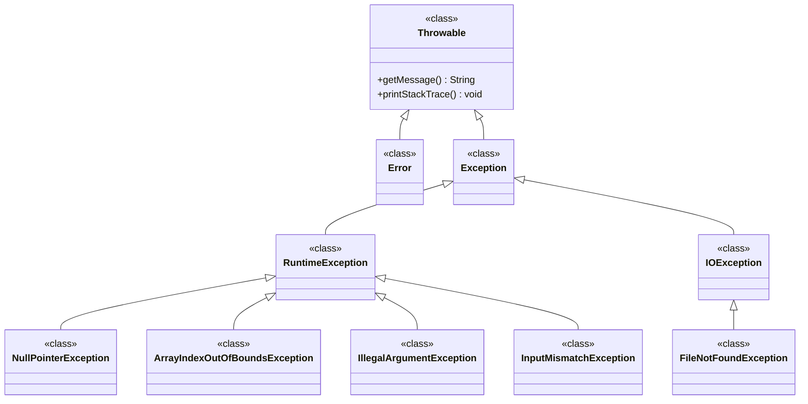

# Types of Exceptions

Java organizes exceptions in a hierarchy. Understanding this hierarchy is crucial for effective exception handling. Let's explore the different types of exceptions and how they're organized.

## The Exception Hierarchy



## Two Main Categories

### 1. **Checked Exceptions** (Must be handled)
- **Inherit from**: `Exception` (but not `RuntimeException`)
- **Rule**: Must be caught or declared in method signature
- **Examples**: `IOException`, `FileNotFoundException`, `SQLException`
- **Purpose**: Expected problems that should be handled

### 2. **Unchecked Exceptions** (Runtime Exceptions)
- **Inherit from**: `RuntimeException`
- **Rule**: Don't need to be caught or declared
- **Examples**: `NullPointerException`, `ArrayIndexOutOfBoundsException`, `IllegalArgumentException`
- **Purpose**: Programming errors that could be avoided

## Checked Exceptions

### Characteristics
- **Compile-time enforcement**: Java compiler requires you to handle them
- **Expected problems**: Things that might reasonably go wrong
- **Must be handled**: Either catch them or declare them with `throws`

### Common Checked Exceptions

#### IOException
```java
// File operations
File file = new File("data.txt");
FileInputStream fis = new FileInputStream(file); // Must handle IOException
```

#### FileNotFoundException
```java
// Specific type of IOException
try {
    Scanner scanner = new Scanner(new File("nonexistent.txt"));
} catch (FileNotFoundException e) {
    System.out.println("File not found!");
}
```

#### SQLException
```java
// Database operations
Connection conn = DriverManager.getConnection(url); // Must handle SQLException
```

## Unchecked Exceptions (Runtime Exceptions)

### Characteristics
- **No compile-time enforcement**: Java compiler doesn't require handling
- **Programming errors**: Usually indicate bugs in the code
- **Optional handling**: You can catch them, but don't have to

### Common Unchecked Exceptions

#### NullPointerException
```java
String name = null;
int length = name.length(); // Throws NullPointerException
```

#### ArrayIndexOutOfBoundsException
```java
int[] numbers = {1, 2, 3};
int value = numbers[5]; // Throws ArrayIndexOutOfBoundsException
```

#### IllegalArgumentException
```java
public void setAge(int age) {
    if (age < 0) {
        throw new IllegalArgumentException("Age cannot be negative");
    }
    this.age = age;
}
```

#### InputMismatchException
```java
Scanner scanner = new Scanner(System.in);
int number = scanner.nextInt(); // Throws InputMismatchException if input is not a number
```

#### NumberFormatException
```java
String text = "abc";
int number = Integer.parseInt(text); // Throws NumberFormatException
```

#### ArithmeticException
```java
int result = 10 / 0; // Throws ArithmeticException
```

## Why This Distinction Matters

### Checked Exceptions
- **Force you to think** about potential problems
- **Make your code more robust** by requiring error handling
- **Document potential failures** in method signatures

```java
// You MUST handle this
public void readFile(String filename) throws FileNotFoundException {
    // Method signature tells callers: "This might fail!"
}
```

### Unchecked Exceptions
- **Don't clutter your code** with unnecessary error handling
- **Indicate programming errors** that should be fixed
- **Allow for cleaner code** when errors are truly unexpected

```java
// You DON'T have to handle this
public void processArray(int[] array, int index) {
    int value = array[index]; // Might throw ArrayIndexOutOfBoundsException
    // But this is a programming error, not an expected failure
}
```

## The `Error` Class

Errors are serious problems that usually indicate system-level issues:

### Common Errors
- **OutOfMemoryError**: Not enough memory
- **StackOverflowError**: Too many method calls
- **NoClassDefFoundError**: Class file missing

### Important Note
**Never catch `Error` or its subclasses!** These indicate serious system problems that your program cannot recover from.

```java
// DON'T DO THIS!
try {
    // Some code
} catch (Error e) {
    // This is wrong - errors should not be caught
}
```

## Summary

| Type | Inheritance | Must Handle? | Purpose | Examples |
|------|-------------|--------------|---------|----------|
| **Checked** | `Exception` (not `RuntimeException`) | Yes | Expected problems | `IOException`, `FileNotFoundException` |
| **Unchecked** | `RuntimeException` | No | Programming errors | `NullPointerException`, `ArrayIndexOutOfBoundsException` |
| **Error** | `Error` | Never | System problems | `OutOfMemoryError`, `StackOverflowError` |

## What's Next?

Now that you understand the exception hierarchy, let's learn how to read and understand the stack traces that exceptions provide - this is crucial for debugging!
