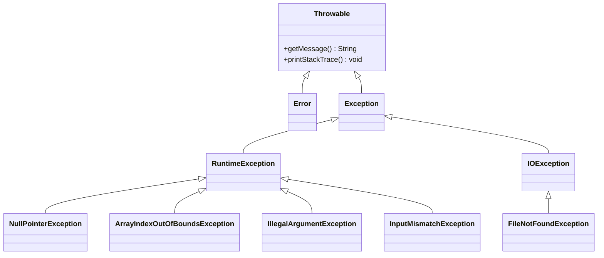

# Types of Exceptions

Java organizes exceptions in a hierarchy, through inheritance. Understanding this hierarchy is important for effective exception handling. Let's explore the different types of exceptions and how they're organized.

## The Exception Hierarchy

These are some of the more common exceptions. Though, there are many more.



Notably, we have the `Exception`, and the `RuntimeException`. They divide the exceptions into two categories, with different rules for handling them. This is important to understand, and explained further below.

## Two Main Categories

### 1. **Checked Exceptions** (Must be handled)
- **Inherit from**: `Exception` (but not `RuntimeException`)
- **Rule**: Must be caught or declared in method signature
- **Examples**: `IOException`, `FileNotFoundException`, `SQLException`
- **Purpose**: Expected problems that should be handled

The compiler will enforce that you handle these exceptions, by checking if you have a catch block for them, or if you have declared them with `throws` in the method signature. See later pages for more details. You cannot run your program, if you have not handled these exceptions.

### 2. **Unchecked Exceptions** (Runtime Exceptions)
- **Inherit from**: `RuntimeException`
- **Rule**: Don't need to be caught or declared
- **Examples**: `NullPointerException`, `ArrayIndexOutOfBoundsException`, `IllegalArgumentException`
- **Purpose**: Programming errors that could be avoided

The compiler will not enforce that you handle these exceptions, but your program may still throw them. You can handle them, but you are not forced to.

_All_ exceptions should be handled. The main difference is _where_ they must be handled.

## Checked Exceptions

Let's try an example. 

You can make your program pause execution for a given time, using the `Thread.sleep(..)` method.

```java
Thread.sleep(1000);
```

This will pause the program for 1 second.


So, let's try and print out numbers from 0 to 10, with a pause of 1 second between each number.

```java
for (int i = 0; i <= 10; i++) {
    System.out.println(i);
    Thread.sleep(1000);
}
```

What happens if you paste this code into IntelliJ? Does it compile? No.

Notice the red squiggly line under the `Thread.sleep(1000);` line. This indicates an error.

When hovering your cursor over the `Thread.sleep(1000);` line, you will see the following error message:

```
Unhandled exception: java.lang.InterruptedException
```

This is a `InterruptedException`. When pausing a program, the pause may be interrupted, and this causes this exception. We are forced to handle this potential problem.

Update your code to catch the exception, though, we don't have to actually do anything with it.

```java
for (int i = 0; i <= 10; i++) {
    System.out.println(i);
    try
    {
        Thread.sleep(1000);
    }
    catch (InterruptedException e)
    {
        // handle exception here
    }
}
```

Now the method call, which may cause an exception, is inside the try-part of a try-catch block. If an exception occurs, the program execution will jump to the catch block, and continue from there.

## Unchecked Exceptions (Runtime Exceptions)

### Characteristics
- **No compile-time enforcement**: Java compiler doesn't require handling
- **Programming errors**: Usually indicate bugs in the code
- **Optional handling**: You can catch them, but don't have to

### Common Unchecked Exceptions

#### NullPointerException
```java
String name = null;
int length = name.length(); // Throws NullPointerException
```

#### ArrayIndexOutOfBoundsException
```java
int[] numbers = {1, 2, 3};
int value = numbers[5]; // Throws ArrayIndexOutOfBoundsException
```

#### InputMismatchException
```java
Scanner scanner = new Scanner(System.in);
int number = scanner.nextInt(); // Throws InputMismatchException if input is not a number
```

#### NumberFormatException
```java
String text = "abc";
int number = Integer.parseInt(text); // Throws NumberFormatException
```

#### ArithmeticException
```java
int result = 10 / 0; // Throws ArithmeticException
```

## Why This Distinction Matters

### Checked Exceptions
- **Force you to think** about potential problems
- **Make your code more robust** by requiring error handling
- **Document potential failures** in method signatures

```java
// You MUST handle this
public void readFile(String filename) throws FileNotFoundException {
    // Method signature tells callers: "This might fail!"
}
```

### Unchecked Exceptions
- **Don't clutter your code** with unnecessary error handling
- **Indicate programming errors** that should be fixed
- **Allow for cleaner code** when errors are truly unexpected

```java
// You DON'T have to handle this
public void processArray(int[] array, int index) {
    int value = array[index]; // Might throw ArrayIndexOutOfBoundsException
    // But this is a programming error, not an expected failure
}
```

## Nullpointer Exception

These are suuuper common, so you should get intimitely familiar with them. 

You may learn more about them, by watching John's video on nullpointer exceptions:

<video src="https://www.youtube.com/watch?v=lm72_HCd17s"></video>