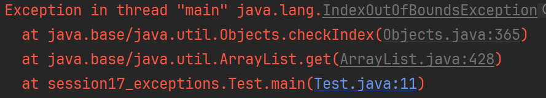

# Exception Stack Trace

When an exception occurs, Java provides a **stack trace** - a detailed report showing exactly what happened and where. Understanding stack traces is essential for debugging your programs, and fixing the problems. You must learn how to read the stack trace, find the message explaining what went wrong, and where the problem originated. This is a very important skill to have.

## What is a Stack Trace?

A stack trace is a list of method calls that led to the exception. It shows the **call stack** - the sequence of method calls from the beginning of your program to the point where the exception occurred.

## Anatomy of a Stack Trace

Let's look at a real example, run the following code in IntelliJ. You will get a null pointer exception.

```java
public class StackTraceDemo {
    public static void main(String[] args) {
        System.out.println("Starting program...");
        methodA();
        System.out.println("Program finished.");
    }
    
    public static void methodA() {
        System.out.println("In methodA");
        methodB();
    }
    
    public static void methodB() {
        System.out.println("In methodB");
        methodC();
    }
    
    public static void methodC() {
        System.out.println("In methodC");
        String name = null;
        int length = name.length(); // This will cause a NullPointerException
    }
}
```

**Run this program and observe the stack trace:**

```javastacktrace
Starting program...
In methodA
In methodB
In methodC
Exception in thread "main" java.lang.NullPointerException: Cannot invoke "String.length()" because "name" is null
	at session17_exceptions.StackTraceDemo.methodC(StackTraceDemo.java:23)
	at session17_exceptions.StackTraceDemo.methodB(StackTraceDemo.java:17)
	at session17_exceptions.StackTraceDemo.methodA(StackTraceDemo.java:12)
	at session17_exceptions.StackTraceDemo.main(StackTraceDemo.java:6)
```


## Reading the Stack Trace

Let's break down each part:

### 1. **Exception Type and Message**

```javastacktrace
Exception in thread "main" java.lang.NullPointerException
```

- **Exception in thread "main"**: The exception occurred in the main thread. You don't know about threads yet, so this information is not important.
- **java.lang.NullPointerException**: The type of exception that occurred. The type indicates what kind of problem occurred.

### 2. **The Call Stack** (Read from bottom to top)

```javastacktrace
    at session17_exceptions.StackTraceDemo.methodC(StackTraceDemo.java:23)  ← WHERE IT HAPPENED
    at session17_exceptions.StackTraceDemo.methodB(StackTraceDemo.java:17)  ← WHO CALLED methodC
    at session17_exceptions.StackTraceDemo.methodA(StackTraceDemo.java:12)  ← WHO CALLED methodB
    at session17_exceptions.StackTraceDemo.main(StackTraceDemo.java:6)      ← WHO CALLED methodA
```

**Reading order**: Start from the **bottom** and work your way up to understand the call sequence.

`main` called `methodA`, which called `methodB`, which called `methodC`. In line 23, inside `methodC`, the `name` variable is `null`, and you tried to call the `length` method on it. This is the problem.

Notice you can click on the line number, and IntelliJ will jump to the code. So, you can easily trace through the code, and follow the execution path.

## Understanding Each Line

Each line in the stack trace follows this format:
```javastacktrace
at ClassName.methodName(FileName.java:lineNumber)
```

- **ClassName**: The class where the method is defined. Notice the name is the _absolute_ name, i.e. including the package names
- **methodName**: The method that was executing
- **FileName.java**: The source file name
- **lineNumber**: The exact line where the exception occurred

## More Complex Example

Let's create a more realistic example with multiple classes. Notice how the three classes below are in different files:

```java
// File: Calculator.java
public class Calculator {
    public static int divide(int a, int b) {
        return a / b; // This will cause ArithmeticException if b is 0
    }
}

// File: MathHelper.java
public class MathHelper {
    public static double calculateAverage(int[] numbers) {
        int sum = 0;
        for (int i = 0; i < numbers.length; i++) {
            sum += numbers[i];
        }
        return Calculator.divide(sum, numbers.length); // Calls Calculator.divide
    }
}

// File: Main.java
public class Main {
    public static void main(String[] args) {
        int[] numbers = {10, 20, 30};
        double average = MathHelper.calculateAverage(numbers);
        System.out.println("Average: " + average);
    }
}
```

Copy the above code into IntelliJ, and run it. Currently, it should work fine.

**What happens if we pass an empty array?** Let's modify the main method:

```java
public static void main(String[] args) {
    int[] numbers = {}; // Empty array!
    double average = MathHelper.calculateAverage(numbers);
    System.out.println("Average: " + average);
}
```

You get an error. Do you know why?

**Stack trace:**

```javastacktrace
Exception in thread "main" java.lang.ArithmeticException: / by zero
	at session17_exceptions.morecomplexexample.Calculator.divide(Calculator.java:6)
	at session17_exceptions.morecomplexexample.MathHelper.calculateAverage(MathHelper.java:10)
	at session17_exceptions.morecomplexexample.Main.main(Main.java:7)
```

<hint title="Hint">

The `divide` method is called, in class `Calculator`, and the `b` parameter is 0, because this is the length of the array. So, the division by zero occurs.

</hint>

## Reading This Stack Trace

1. **Bottom line**: `Main.main(Main.java:7)` - The program started in main method
2. **Middle line**: `MathHelper.calculateAverage(MathHelper.java:10)` - main called calculateAverage
3. **Top line**: `Calculator.divide(Calculator.java:6)` - calculateAverage called divide, and that's where the exception occurred

## Exceptions from _not_ your code

Sometimes, you are using existing code. This happens all the time, for example when you are using an ArrayList, i.e. an existing class in Java.\
And you may try to use this in an inappropriate way, which will cause an exception.\
Now, part of the stack trace will involve _your_ code, and part of the stack trace will involve the _existing_ java code.\
Generally, you can ignore the not-your-code part, and focus on your code.

Take the following example:

```java

```java
public class Main {
    public static void main(String[] args) {
        ArrayList<String> list = new ArrayList<>();
        list.add("Hello");
        list.get(1);
    }
}
```

I get this in the console: 



Notice how some of the lines are blue, and some are grey. The blue is your code, and the grey is the code from the ArrayList class.

## Debugging Tips

### 1. **Start from the Top**
The first line in the stack trace shows where the exception actually occurred.

### 2. **Follow the Call Chain**
Work your way down to understand how you got to that point.

### 3. **Check the Line Numbers**
The line numbers tell you exactly where to look in your code.

### 4. **Look for Your Code**
Focus on lines that mention your classes, not Java library classes.

### 5. **Use IDE Features**
Most IDEs allow you to click on stack trace lines to jump directly to the code.

## Practice Exercise

Create this program and run it to see a stack trace:

```java
public class PracticeStackTrace {
    public static void main(String[] args) {
        System.out.println("Starting...");
        processUserInput("hello");
        System.out.println("Finished.");
    }
    
    public static void processUserInput(String input) {
        System.out.println("Processing: " + input);
        convertToNumber(input);
    }
    
    public static void convertToNumber(String text) {
        System.out.println("Converting: " + text);
        int number = Integer.parseInt(text); 
        System.out.println("Converted to: " + number);
    }
}
```

**Run this and analyze the stack trace. What went wrong and where?**

## What's Next?

Now that you can read stack traces, let's learn how to catch and handle exceptions using try-catch blocks!
