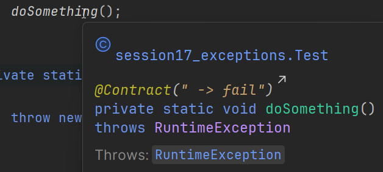

# Throws Keyword

The `throws` keyword is used in _method signatures_ to declare that a method might throw certain types of exceptions. This is especially important for **checked exceptions**, which the Java compiler requires you to either catch or declare.

But it is also important to declare _unchecked exceptions_ with the `throws` keyword. This will let other programmers, who use your code, know that the method might throw an exception, and they should/can handle it.

## Basic Syntax

```java
public void methodName() throws ExceptionType1, ExceptionType2 {
    // Method body
}
```

## Why Use `throws`?

### 1. **Compiler Requirement for Checked Exceptions**
Java requires you to handle checked exceptions. You have two options:
- **Catch** the exception in a try-catch block, we have seen this already
- **Declare** it with `throws` in the method signature

### 2. **Documentation**
The `throws` clause documents what exceptions a method might throw, making your code more readable and maintainable.

### 3. **Method Contracts**
It establishes a contract: "This method might fail in these specific ways." It tells other programmers, who use your code, that the method might throw an exception, and they should/can handle it.

## A simple test

Let's explore what the throws keyword does to our code, and the information about that code.

### First, unchecked exceptions

Consider the following code snippet.

```java
public static void main(String[] args) {
    doSomething();
}

private static void doSomething()
{
    throw new RuntimeException();
}
```

If I mouse over the `doSomething()` call in the `main()` method, I will se this:


We can actually see in the "contract" part, that this may cause an exception. But, if I add a "throws" to the method, we get this:



The method information is much clearer now.

This was for runtime exceptions. Let's see what happens with a checked exception.

### Second, checked exceptions

Here, as you have seen, the compiler will force you to handle the exception with catch. Or, you can declare a throws, and not handle it. That responsibility is now on the caller of the method. Try this:

```java
public static void main(String[] args) {
    doSomething();
}

private static void doSomething() 
{
    Thread.sleep(1000);
} 
```

And observe the compiler error:

```javastacktrace
java: unreported exception java.lang.InterruptedException; must be caught or declared to be thrown
```

Or if you mouse over the sleep method, it tells you that you must handle the exception.

You can surround it with try-catch:

```java
private static void doSomething() 
{
    try
    {
        Thread.sleep(1000);
    }
    catch (InterruptedException e)
    {
        throw new RuntimeException(e);
    }
}
```

Or, you can declare that the methods throws the exception:

```java
private static void doSomething() throws InterruptedException
{
    Thread.sleep(1000);
}
```

Update your code, and observe the compiler error has moved to the main method:


Now, that method call must be wrapped in a try-catch. Or the main method must declare that it throws the exception. So, there is a snow-ball effect with checked exceptions, until you at some point handle it. Or the program crashes.

## Multiple Exceptions

You can declare multiple exceptions in the `throws` clause:

```java
public static void processFile(String filename) 
        throws FileNotFoundException, IOException 
{
    // method body
}
```

## Checked vs Unchecked Exceptions

Checked exceptions must be declared, or try-catch must be used.

### Checked Exceptions (Must be declared)

```java
import java.io.FileNotFoundException;

public class CheckedExceptionExample {
    // FileNotFoundException is checked - MUST be declared
    public static void readFile() throws FileNotFoundException {
        // This method might throw FileNotFoundException
        // The compiler requires us to declare it
    }
    
    public static void main(String[] args) {
        try {
            readFile();
        } catch (FileNotFoundException e) {
            System.out.println("File not found!");
        }
    }
}
```

### Unchecked Exceptions (Optional to declare)

Unchecked exceptions are optional to declare. Nor does the compiler force you to handle it with try-catch.

```java
public class UncheckedExceptionExample {
    // RuntimeException is unchecked - optional to declare
    public static void divide(int a, int b) throws ArithmeticException {
        if (b == 0) {
            throw new ArithmeticException("Division by zero");
        }
        System.out.println("Result: " + (a / b));
    }
    
    public static void main(String[] args) {
        // We can call this without try-catch because ArithmeticException is unchecked
        divide(10, 2);
        
        // But we can still catch it if we want
        try {
            divide(10, 0);
        } catch (ArithmeticException e) {
            System.out.println("Error: " + e.getMessage());
        }
    }
}
```

## Best Practices

### 1. **Only Declare What You Actually Throw**
Don't declare exceptions that your method doesn't actually throw. Obviously.

### 2. **Be Specific**
Declare specific exception types rather than the general `Exception` class.

### 3. **Consider Your Callers**
Think about whether callers should handle the exception or if you should handle it internally.

## Rethrowing

A common practice is to catch a checked exception, and then rethrow it as a custom RuntimeException. This is useful if you want to add more information to the exception, or if you want to change the exception type. We will use this more next semester. For now, just know that it is a common practice.


```java
public void methodA() throws CustomException {
    try {
        methodB();
    } catch (IOException e) {
        throw new CustomException("Failed to process data", e);
    }
}
```

This is useful if you have a longer chain of methods, and the last method throws a checked exception, but you cannot really handle it. You just want to show an error popup message to the user. 

You catch the checked exception, and then rethrow it as a custom RuntimeException. That custom exception can skip over several classes and methods, and just be caught by the initial method. Yeah, it's probably a bit convoluted right now.

Consider this. The user clicks a button in the UI, which triggers a method in the GuiClass. That method calls a method in the Controller class. That method calls a method in the Service class. That method calls a method in the DataManager class. That method tries to read data from a file, and that fails. 


Maybe the DataManager class tries to read data from a file, and that fails. This will be a checked exception.\
But the way to handle this is to have the `GuiClass` show a popup message to the user.\
So, the exception happens one place, but the handling happens far away, somewhere else, in the `GuiClass`.\
We could mark all methods along the way with the `throws` keyword, to push the catch block to the GuiClass. But that would be a lot of code to write.\
Instead, the checked exception is caught in the `DataManager` class, and then rethrown as a custom RuntimeException. This can skip over several classes and methods, and just be caught by the initial method in the GuiClass.

The dotted line indicates the origin of the exception, and where it is caught.

In _very_ simplified form, leaving out details, this is what you might see:

```java{11,41}
public class GuiClass
{
    public void onButtonClick()
    {
        try
        {
            controller.saveChanges();
        }
        catch (CustomException e)
        {
            showPopup("Error: " + e.getMessage());
        }
    }
}

public class Controller
{
    public void saveChanges()
    {
        service.updateOrderInformation();
    }
}

public class Service
{
    public void updateOrderInformation()
    {
        dataManager.save();
    }
}

public class DataManager
{
    public void save()
    {
        try{
            writeDataToFile();
        }
        catch (IOException e)
        {
            throw new CustomException("Failed to save data", e);
        }
    }
}
```