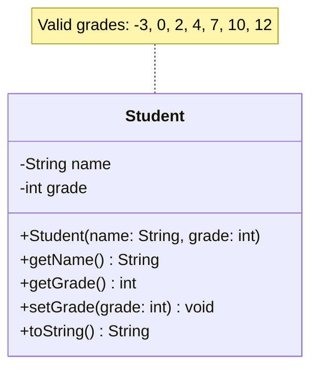
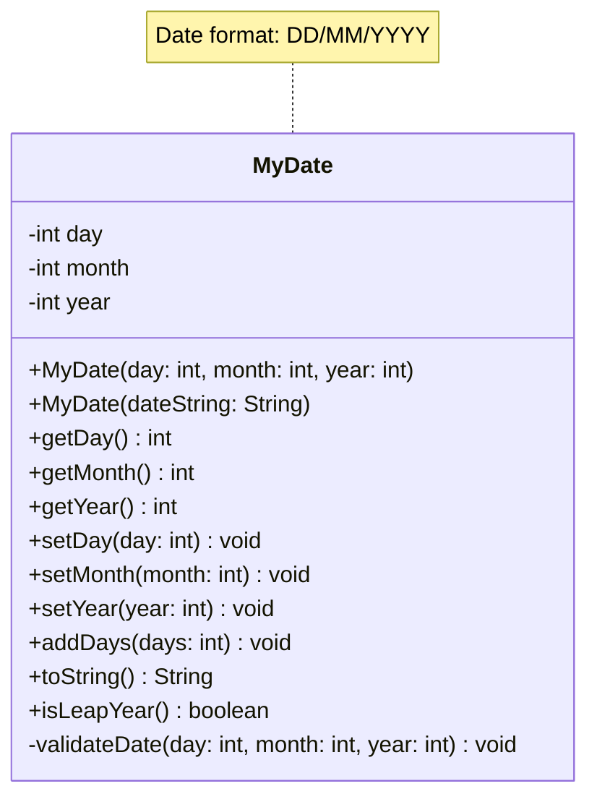
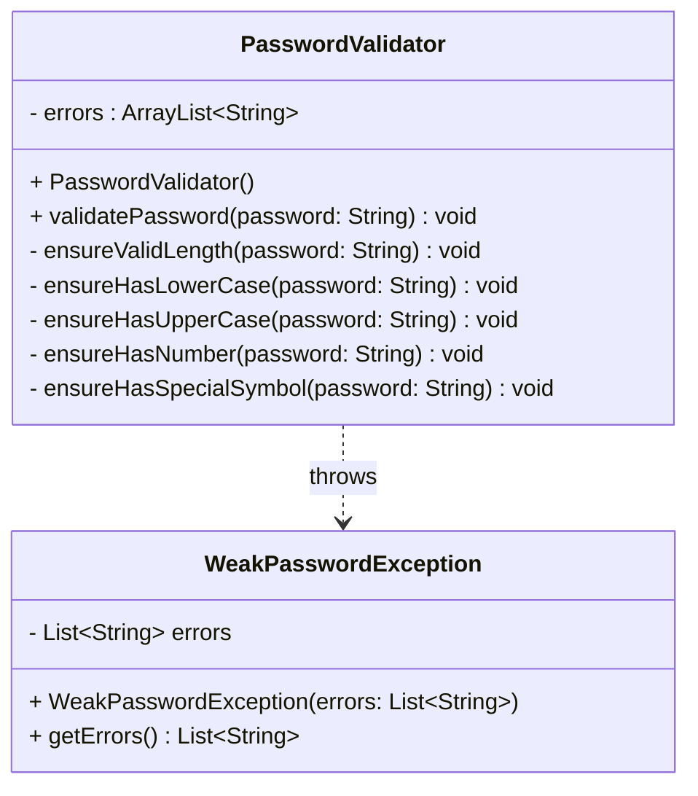

# Exercises

## Exercise 13.1 - Handle error

The following code crashes, when the user inputs `0`.

```java
public class MathTest {
    public static void main(String[] args) {
        Scanner scanner = new Scanner(System.in);
        System.out.println("Enter x: ");
        int x = scanner.nextInt();
        System.out.println("Enter y: ");
        int y = scanner.nextInt();
        System.out.println("x + y = " + (x + y));
        System.out.println("x - y = " + (x - y));
        System.out.println("x / y = " + (x / y));
        System.out.println("x * y = " + (x * y));
    }
}
```

Find where the error is, and handle the exception. Make sure all valid calculations are performed and printed.

## Exercise 13.2 - Student Grade Validation

Create a `Student` class that validates grades according to the Danish 7-point grading scale.

### UML Class Diagram



### Requirements

**a) Implement a runtime exception class called `IllegalGradeException`**

Create a custom exception that extends `RuntimeException` with a meaningful error message.

**b) Implement the `Student` class**

The `Student` class should:
- Have private fields for `name` (String) and `grade` (int)
- Have a constructor that takes name and grade parameters
- Have getter methods for both name and grade
- Have a `setGrade()` method that allows changing the grade
- Have a `toString()` method that returns a formatted string representation
- **Throw `IllegalGradeException`** if an invalid grade is provided in the constructor or `setGrade()` method

Valid grades are: **-3, 0, 2, 4, 7, 10, 12**

**c) Create a test program**

Make a test program that:
- Tests valid grades (all should work)
- Tests invalid grades (should catch `IllegalGradeException`)
- Demonstrates proper exception handling with try-catch blocks

### Example Test Output

```
✓ Student created: John Doe (Grade: 7)
✓ Student created: Jane Smith (Grade: 12)
✓ Student created: Bob Johnson (Grade: 4)
✓ Grade updated: John Doe (Grade: 10)
✓ Caught IllegalGradeException: Invalid grade: 5. Valid grades are: -3, 0, 2, 4, 7, 10, 12
✓ Caught IllegalGradeException: Invalid grade: -1. Valid grades are: -3, 0, 2, 4, 7, 10, 12
```

## Exercise 13.3 - MyDate Class Implementation

Create your own version of a date class called `MyDate` that handles date validation and throws appropriate exceptions for invalid dates.

### UML Class Diagram



### Requirements

**a) Create custom exception classes**

Create the following exception classes:
- `InvalidDayException` - for invalid day values (e.g., day 32, day 0)
- `InvalidMonthException` - for invalid month values (e.g., month 13, month 0)
- `InvalidYearException` - for invalid year values (e.g., negative years)
- `InvalidDateException` - for invalid date combinations (e.g., February 30th, April 31st)

**b) Implement the `MyDate` class**

The `MyDate` class should:
- Store day, month, and year as private integer fields
- Have constructors:
  - `MyDate(int day, int month, int year)` - creates date from individual values
  - `MyDate(String dateString)` - creates date from string in "DD/MM/YYYY" format
- Have getter and setter methods for all fields
- Have an `addDays(int days)` method that adds days to the current date
- Have a `toString()` method that returns date in "DD/MM/YYYY" format
- Have an `isLeapYear()` method that determines if the year is a leap year
- **Throw appropriate exceptions** for invalid dates in constructors and setters

**Date validation rules:**
- Day: 1-31 (varies by month)
- Month: 1-12
- Year: 1-9999
- February: 28 days (29 in leap years)
- April, June, September, November: 30 days
- All other months: 31 days
- Leap years: divisible by 4, except centuries (divisible by 400)

**c) Create a comprehensive test program**

Test the following scenarios:
- Valid dates (should work)
- Invalid days (32, 0, negative)
- Invalid months (13, 0, negative)
- Invalid years (negative, 0)
- Invalid date combinations (Feb 30, Apr 31, etc.)
- String parsing with valid and invalid formats
- Adding days to dates (including month/year rollover)
- Leap year calculations

### Example Test Output

```
✓ Date created: 15/03/2024
✓ Date created from string: 25/12/2023
✓ Date after adding 10 days: 25/03/2024
✓ 2024 is a leap year: true
✓ Caught InvalidDayException: Invalid day: 32. Day must be between 1-31
✓ Caught InvalidMonthException: Invalid month: 13. Month must be between 1-12
✓ Caught InvalidDateException: Invalid date: 30/02/2024. February only has 28/29 days
✓ Caught InvalidDateException: Invalid date: 31/04/2024. April only has 30 days
✓ Caught InvalidDateException: Invalid date string format: 15-03-2024. Expected DD/MM/YYYY
```

## Exercise 13.4 - Password Validator

Create a password validation system that checks password strength and throws appropriate exceptions for weak passwords.

### UML Class Diagram

This is the basic idea, though, you may rework it as you see fit. As long as the behaviour remains the same.



### Requirements

**a) Create a custom exception class called `WeakPasswordException`**

The exception should:
- Extend `RuntimeException`
- Store a list of validation error messages
- Include a constructor that takes a list of error messages
- Have a `getErrors()` method to retrieve the validation errors

**b) Implement the `PasswordValidator` class**

The idea is, you instantiate the `PasswordValidator` class, and then you call the `validatePassword()` method, with your password as an argument.\
This method will then use the other private methods. Whenever an error is detected, a message is added to the `errors` list.\
At the end, if the list is not empty, it will throw a `WeakPasswordException` with the list of errors.

The `PasswordValidator` class should have the following methods:
- `validatePassword(String password)` - main validation method that throws `WeakPasswordException`
- `ensureValidLength(String password)` - checks if password is 8-24 characters
- `ensureHasLowerCase(String password)` - checks if password contains at least one lowercase letter
- `ensureHasUpperCase(String password)` - checks if password contains at least one uppercase letter
- `ensureHasNumber(String password)` - checks if password contains at least one number
- `ensureHasSpecialSymbol(String password)` - checks if password contains at least one allowed special symbol

**Password validation rules:**
- Must be between 8 and 24 characters (inclusive)
- Must contain at least one lowercase letter (a-z)
- Must contain at least one uppercase letter (A-Z)
- Must contain at least one number (0-9)
- Must contain at least one special symbol from: !, @, #, $, %. But no other special symbols.

**c) Create a test program**

It should be a simple console application, where the user can enter a password, and the program will validate it. Over and over again.

Test the following scenarios:

- Valid passwords (should pass validation)
- Too short passwords (< 8 characters)
- Too long passwords (> 24 characters)
- Passwords without lowercase letters
- Passwords without uppercase letters
- Passwords without numbers
- Passwords without special symbols
- Passwords with multiple validation issues
- Null or empty passwords


### Hints

1. Use `Character.isLowerCase()`, `Character.isUpperCase()`, and `Character.isDigit()` methods to check character types
2. Create a string constant for allowed special symbols: `"!@#$%"`
3. Use `String.contains()` or character iteration to check for special symbols
4. Build a list of error messages and throw the exception only if there are validation errors
5. Handle null passwords gracefully
6. Consider edge cases like passwords with only spaces or invalid special characters
7. Make error messages specific and helpful for users
