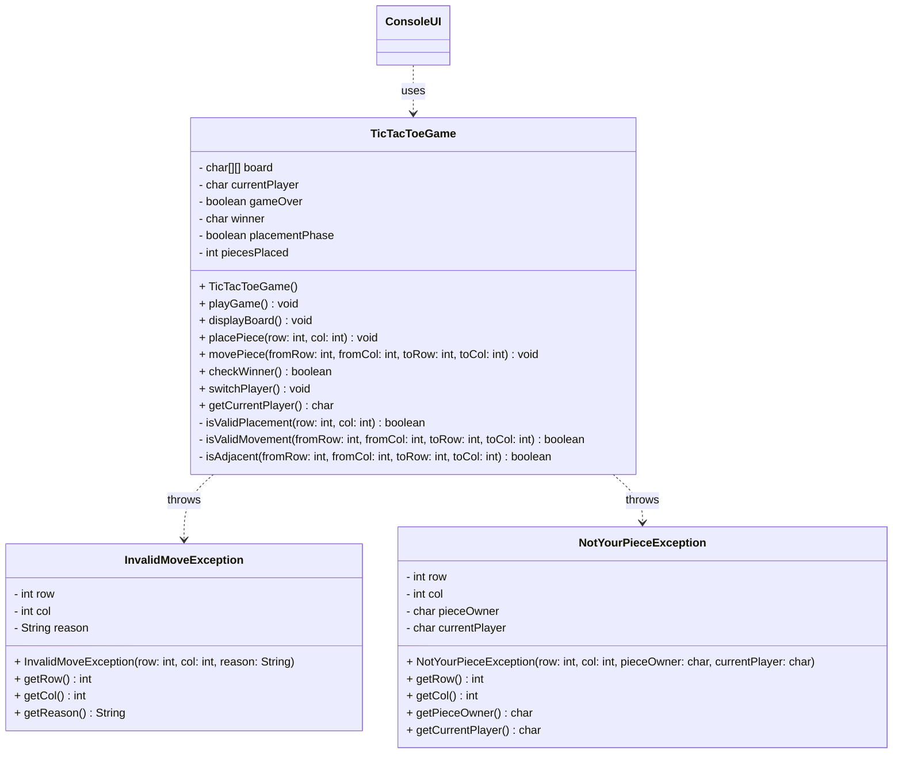

# Exercise - Tic Tac Toe Console Game

Create a complete Tic-Tac-Toe game as a console application with proper exception handling for invalid moves and game states.

## Game Overview

This is a variant of Tic-Tac-Toe where each player has exactly three game pieces. The game has two phases:

**Phase 1 - Placement:** Players take turns placing their three pieces (X and O) on the 3x3 board, one piece per turn.

**Phase 2 - Movement:** Once all six pieces are placed, players take turns moving their existing pieces to adjacent empty positions. Players can only move their own pieces.

The first player to get three of their pieces in a row (horizontally, vertically, or diagonally) wins.

## UML Class Diagram

This is the suggested design for the logic. You may design it differently, if you want.



## Requirements

### a) Create Custom Exception Classes

**InvalidMoveException**
- Extends `RuntimeException`
- Stores row, column, and reason for the invalid move
- Include getter methods for all fields
- Provide meaningful error messages

**NotYourPieceException**
- Extends `RuntimeException`
- Stores row, column, piece owner, and current player
- Include getter methods for all fields
- Thrown when a player tries to move an opponent's piece

### b) Implement the TicTacToeGame Class

The game should have:

**Fields:**
- `char[][] board` - 3x3 grid to represent the game board
- `char currentPlayer` - tracks whose turn it is ('X' or 'O')
- `boolean gameOver` - indicates if the game has ended
- `char winner` - stores the winner ('X', 'O', or ' ' for tie)
- `boolean placementPhase` - indicates if we're in placement phase (true) or movement phase (false)
- `int piecesPlaced` - tracks total number of pieces placed (0-6)

**Methods:**
- `TicTacToeGame()` - constructor that initializes the board
- `playGame()` - main game loop that handles user input and game flow
- `displayBoard()` - prints the current state of the board
- `placePiece(int row, int col)` - places a piece during placement phase
- `movePiece(int fromRow, int fromCol, int toRow, int toCol)` - moves a piece during movement phase
- `checkWinner()` - checks if there's a winner and updates game state
- `switchPlayer()` - alternates between X and O players
- `getCurrentPlayer()` - returns the current player
- `isValidPlacement(int row, int col)` - validates if a placement is legal
- `isValidMovement(int fromRow, int fromCol, int toRow, int toCol)` - validates if a movement is legal
- `isAdjacent(int fromRow, int fromCol, int toRow, int toCol)` - checks if positions are adjacent

### c) Game Rules and Validation

**Placement Phase (first 6 moves):**
- Row and column must be between 0 and 2 (inclusive)
- The position must be empty (not already occupied)
- Each player places exactly 3 pieces

**Movement Phase (after all pieces placed):**
- Players can only move their own pieces
- Pieces can only move to adjacent empty positions (horizontally, vertically, or diagonally adjacent)
- Row and column must be between 0 and 2 (inclusive)

**Exception scenarios:**
- `InvalidMoveException` for:
  - Row or column out of bounds (not 0, 1, or 2)
  - Position already occupied (during placement)
  - Destination already occupied (during movement)
  - Moving to non-adjacent position (during movement)
  - Invalid input format
- `NotYourPieceException` for:
  - Trying to move an opponent's piece

### d) User Interface

Create a console interface that:
- Displays the current board state
- Shows whose turn it is and current phase (placement or movement)
- During placement: prompts for row and column to place piece
- During movement: prompts for source position (row, col) and destination position (row, col)
- Handles invalid input gracefully
- Announces the winner
- Allows playing multiple games

## Example Game Flow

```
Welcome to Tic Tac Toe!

=== PLACEMENT PHASE ===

Current Board:
   |   |   
-----------
   |   |   
-----------
   |   |   

Player X's turn (Placement Phase). Enter row (0-2): 1
Enter column (0-2): 1

Current Board:
   |   |   
-----------
   | X |   
-----------
   |   |   

Player O's turn (Placement Phase). Enter row (0-2): 0
Enter column (0-2): 0

Current Board:
 O |   |   
-----------
   | X |   
-----------
   |   |   

... (continues until all 6 pieces are placed) ...

=== MOVEMENT PHASE ===

Current Board:
 O |   | X
-----------
   | X | O
-----------
 X |   | O

Player X's turn (Movement Phase). Enter piece to move - row (0-2): 0
Enter piece to move - column (0-2): 2
Enter destination - row (0-2): 0
Enter destination - column (0-2): 1

Current Board:
 O | X |   
-----------
   | X | O
-----------
 X |   | O

Player X wins! Congratulations!
```

## Example Exception Handling

```
=== PLACEMENT PHASE ===
Player X's turn (Placement Phase). Enter row (0-2): 5
Enter column (0-2): 2
Error: Invalid move! Row 5 is out of bounds. Please enter values between 0-2.

Player X's turn (Placement Phase). Enter row (0-2): 1
Enter column (0-2): 1
Error: Invalid move! Position (1,1) is already occupied.

=== MOVEMENT PHASE ===
Player X's turn (Movement Phase). Enter piece to move - row (0-2): 0
Enter piece to move - column (0-2): 0
Error: Not your piece! Position (0,0) contains 'O' but you are player 'X'.

Player X's turn (Movement Phase). Enter piece to move - row (0-2): 0
Enter piece to move - column (0-2): 2
Enter destination - row (0-2): 2
Enter destination - column (0-2): 2
Error: Invalid move! Destination (2,2) is not adjacent to source (0,2).

Player X's turn (Movement Phase). Enter piece to move - row (0-2): abc
Error: Invalid input! Please enter a number between 0-2.
```

## Implementation Tips

1. **Input Validation**: Use `Scanner` and handle `InputMismatchException` for non-numeric input
2. **Board Display**: Use a simple grid layout with characters and lines
3. **Win Detection**: Check all rows, columns, and both diagonals
4. **Game Phases**: Track placement phase vs movement phase with boolean flag
5. **Adjacent Movement**: Check if destination is horizontally, vertically, or diagonally adjacent to source
6. **Piece Ownership**: Verify that players can only move their own pieces
7. **Error Handling**: Catch exceptions and provide helpful error messages
8. **User Experience**: Clear prompts indicating current phase and required input

## Bonus Features

Consider adding these optional enhancements:
- **Play Again**: Ask if players want to play another game
- **Player Names**: Allow players to enter their names
- **Computer Player**: Add an AI opponent for single-player mode (maybe place piece randomly, or actually implement some kind of strategy)
- **Move History**: Display the sequence of moves made during the game

