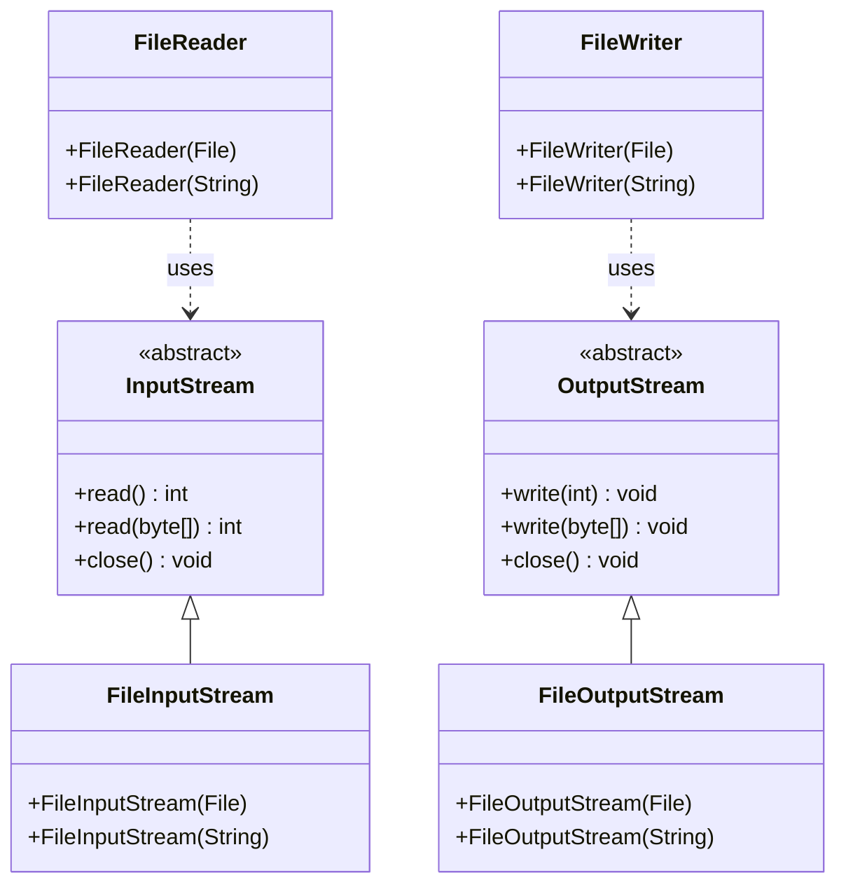

# Streams: The Flow of Data

Streams are Java's way of handling the flow of data to and from files. Think of streams as **pipes** that connect your program to files, allowing data to flow in one direction.

## What are Streams?

A **stream** is an abstraction that represents a flow of data. It's like a water pipe - data flows through it from a source to a destination.

### Real-World Analogy

Imagine streams like **water pipes**:
- **Input Stream** = Water flowing INTO your house
- **Output Stream** = Water flowing OUT of your house
- **Source** = Water reservoir or tank
- **Destination** = Your faucet or drain

## Types of Streams

### **Input Streams** (Reading Data)
Data flows **FROM** a source **TO** your program:

```
File ──→ InputStream ──→ Your Program
```

### **Output Streams** (Writing Data)
Data flows **FROM** your program **TO** a destination:

```
Your Program ──→ OutputStream ──→ File
```

## Stream Hierarchy in Java

Java has a well-organized hierarchy of stream classes:



## Basic Stream Operations

### **Opening a Stream**
```java
// Create an input stream to read from a file
FileInputStream inputStream = new FileInputStream("data.txt");

// Create an output stream to write to a file
FileOutputStream outputStream = new FileOutputStream("output.txt");
```

### **Reading Data**
```java
// Read one byte at a time
int data = inputStream.read();
while (data != -1) {
    System.out.print((char) data);
    data = inputStream.read();
}
```

### **Writing Data**
```java
// Write bytes to the stream
String text = "Hello World!";
byte[] bytes = text.getBytes();
outputStream.write(bytes);
```

### **Closing Streams**
```java
// Always close streams when done
inputStream.close();
outputStream.close();
```

## Stream Characteristics

### **1. Sequential Access**
Streams read/write data in order, like reading a book page by page:

```java
// You can't skip to the middle without reading the beginning
FileInputStream stream = new FileInputStream("largefile.txt");
int firstByte = stream.read();  // Reads byte 1
int secondByte = stream.read(); // Reads byte 2
// Can't directly jump to byte 1000
```

### **2. One-Way Flow**
Streams flow in one direction:
- **Input streams** only read
- **Output streams** only write

### **3. Resource Management**
Streams use system resources and must be closed:

```java
FileInputStream stream = null;
try {
    stream = new FileInputStream("file.txt");
    // Use the stream...
} finally {
    if (stream != null) {
        stream.close(); // Always close!
    }
}
```

## High-Level vs Low-Level Streams

### **Low-Level Streams** (Basic)
- Work with raw bytes
- More control but more work
- Examples: `FileInputStream`, `FileOutputStream`

```java
// Low-level: working with bytes
FileInputStream stream = new FileInputStream("file.txt");
int byte = stream.read(); // Returns int representing a byte
```

### **High-Level Streams** (Convenient)
- Work with characters, objects, or structured data
- Easier to use but less control
- Examples: `BufferedReader`, `PrintWriter`, `ObjectOutputStream`

```java
// High-level: working with text
BufferedReader reader = new BufferedReader(new FileReader("file.txt"));
String line = reader.readLine(); // Returns a complete line as String
```

## Common Stream Patterns

### **1. Copying a File**
```java
FileInputStream input = new FileInputStream("source.txt");
FileOutputStream output = new FileOutputStream("copy.txt");

int data;
while ((data = input.read()) != -1) {
    output.write(data);
}

input.close();
output.close();
```

### **2. Reading Text Line by Line**
```java
BufferedReader reader = new BufferedReader(new FileReader("file.txt"));
String line;
while ((line = reader.readLine()) != null) {
    System.out.println(line);
}
reader.close();
```

### **3. Writing Text**
```java
PrintWriter writer = new PrintWriter(new FileWriter("output.txt"));
writer.println("Hello World!");
writer.println("This is line 2");
writer.close();
```

## Stream Decorators

Java uses the **Decorator Pattern** to add functionality to streams:

```java
// Basic file input stream
FileInputStream fileStream = new FileInputStream("file.txt");

// Add buffering for better performance
BufferedInputStream bufferedStream = new BufferedInputStream(fileStream);

// Add object reading capability
ObjectInputStream objectStream = new ObjectInputStream(bufferedStream);
```

Each layer adds new functionality while maintaining the same interface.

## Why Use Streams?

### **1. Abstraction**
You don't need to worry about the details of how data is stored on disk.

### **2. Flexibility**
The same code can work with files, network connections, or memory.

### **3. Performance**
Streams can be buffered and optimized for efficient data transfer.

### **4. Error Handling**
Streams provide a consistent way to handle I/O errors.

## Common Stream Classes

| Class | Purpose | Data Type |
|-------|---------|-----------|
| `FileInputStream` | Read binary data from files | Bytes |
| `FileOutputStream` | Write binary data to files | Bytes |
| `FileReader` | Read text from files | Characters |
| `FileWriter` | Write text to files | Characters |
| `BufferedReader` | Read text with buffering | Lines/Strings |
| `PrintWriter` | Write formatted text | Strings |
| `ObjectInputStream` | Read Java objects | Objects |
| `ObjectOutputStream` | Write Java objects | Objects |

## What's Next?

Now that you understand streams, let's start working with text files! We'll begin with writing text to files using Java's file I/O classes.
