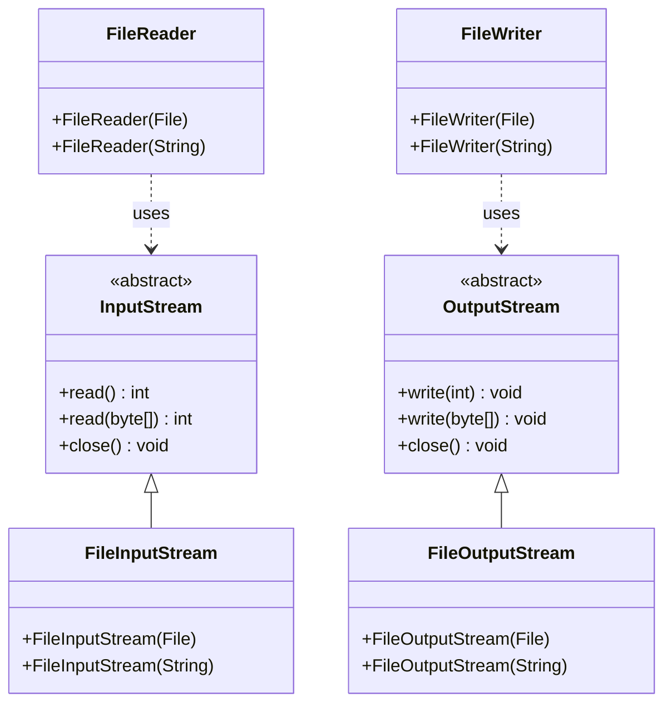

# Streams: The Flow of Data

Streams are Java's way of handling the flow of data to and from files. Think of streams as **pipes** that connect your program to files, allowing data to flow in one direction. It is not all in one go, but rather in chunks.

## What are Streams?

A **stream** is an abstraction that represents a flow of data. It's like a water pipe - data flows through it from a source to a destination.

### Real-World Analogy

Imagine streams like **water pipes**:
- **Input Stream** = Water flowing INTO your house
- **Output Stream** = Water flowing OUT of your house
- **Source** = Water reservoir or tank
- **Destination** = Your faucet or drain

## Types of Streams

### **Input Streams** (Reading Data)
Data flows **FROM** a source **TO** your program:

```
File ──> InputStream ──> Your Program
```

### **Output Streams** (Writing Data)
Data flows **FROM** your program **TO** a destination:

```
Your Program ──> OutputStream ──> File
```

## Stream Hierarchy in Java

Java has a well-organized hierarchy of stream classes, including:




## Stream Characteristics

### **1. Sequential Access**
Streams read/write data in order, like reading a book page by page:

```java
// You can't skip to the middle without reading the beginning
FileInputStream stream = new FileInputStream("largefile.txt");
int firstByte = stream.read();  // Reads byte 1
int secondByte = stream.read(); // Reads byte 2
// Can't directly jump to byte 1000
```

### **2. One-Way Flow**
Streams flow in one direction:
- **Input streams** only read
- **Output streams** only write

## Common Stream Classes

| Class | Purpose | Data Type |
|-------|---------|-----------|
| `FileInputStream` | Read binary data from files | Bytes |
| `FileOutputStream` | Write binary data to files | Bytes |
| `FileReader` | Read text from files | Characters |
| `FileWriter` | Write text to files | Characters |
| `BufferedReader` | Read text with buffering | Lines/Strings |
| `PrintWriter` | Write formatted text | Strings |
| `ObjectInputStream` | Read Java objects | Objects |
| `ObjectOutputStream` | Write Java objects | Objects |

## What's Next?

Now that you understand streams, let's start working with text files! We'll begin with writing text to files using Java's file I/O classes.
