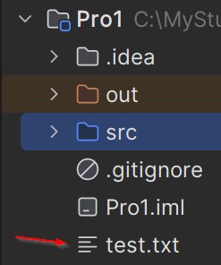

# Exercises - Text File Writer

## Exercise 5.0 - Relative path
First, let's just explore the text writing a little bit. And play with file locations.

Create a new class, and put the following code in it:

```java
public static void main(String[] args) {
    try {
        FileWriter writer = new FileWriter("test.txt");
        writer.write("Hello, World!");
        writer.close();
    } catch (IOException e) {
        System.out.println("Error writing file: " + e.getMessage());
    }
}
```

This should write out "Hello, World!" to the file "test.txt". But where is that file?
Well, if you give it just a name, like above, the location will be relative, to where your program is running.

Mine ends up here:



You can double click it, and verify the content. IntelliJ can open text files just fine.

## Exercise 5.1 - Absolute path

Another approach is to use an absolute path, which is a full path to the file. This is useful if you want to write to a file in a different location.

For example, I can define the file path and name like below, and the file will be created in the Documents folder of my user account.

```java
public static void main(String[] args) {
    try {
        FileWriter writer = new FileWriter("C:\\Users\\YourUsername\\Documents\\test.txt");
        writer.write("Hello, World!");
        writer.close();
    } catch (IOException e) {
        System.out.println("Error writing file: " + e.getMessage());
    }
}
```

Give it a try, remember to update the path to something on your computer.

Why the `\\` escape character? Because the `\` is used as an escape character in Java strings. So, we need to escape it with another `\`. 

If you are on mac or linux, you can use the `/` character instead of `\`.


