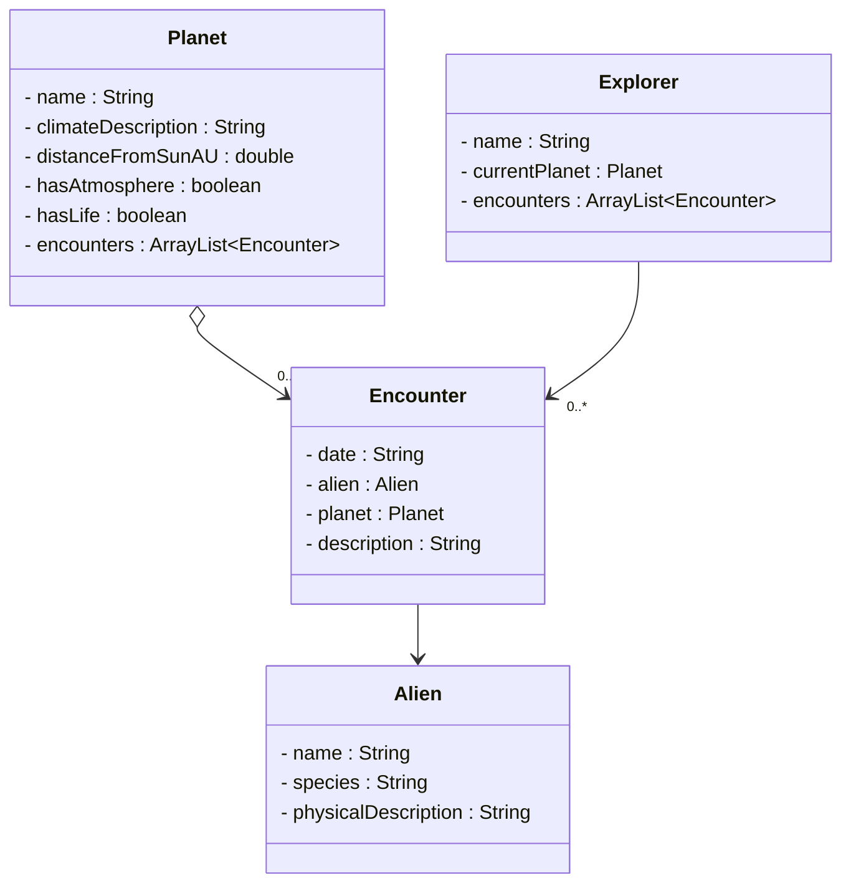

# Exercise - Object Storage System

Create a comprehensive object storage system that can save and load Java objects to/from binary files. This exercise will help you practice object serialization and create a useful data persistence system.

We will create a system to record discoveries of new planets, and encounters with alient species.

This is slightly more involved, so let's start with some structure.

## Package Structure

First, create a package structure like below. At least, the `extraterrestrialexploration` package should be created. Whether it is directly nested under `src`, or nested under another package, is up to you. You could put it in the `session19` package, or something.
Either way, we want this particular application's code grouped under one package.

You may leave out the actual classes for now, but I include them below so you can see the final structure.

Then we divide the application source code into areas of responsibility.
- `model` - The domain classes, representing the real-world objects. These are the objects we mostly have created in the course so far. 
- `persistence` - The classes responsible for saving and loading the data.
- `ui` - The classes responsible for the user interface.

You may create more classes if you need to. Maybe the UI can be structured better, but the below should be just fine.

```
src/
└── extraterrestrialexploration/
    ├── model/
    │   ├── Alien.java
    │   ├── Planet.java
    │   ├── Explorer.java
    │   └── Encounter.java
    ├── persistence/
    │   ├── DataManager.java
    │   └── DataContainer.java
    └── ui/
        ├── RunApplication.java
        └── ConsoleUI.java
```

## Model Classes

We start with the "domain model", i.e. the classes that represent the real-world objects.

Here is the unfinishedUML class diagram for the model classes.



The above diagram shows the data, but not any methods. That is up to you to decide. You may start with the above, and the add methods as needed.

## Persistence Classes

Now, let's create the persistence classes. I have shown two classes:
- `DataManager` - The class responsible for saving and loading the data.
- `DataContainer` - The class responsible for storing the data in a container. This is a wrapper class that contains one or more lists of objects.

Why the DataContainer class? You have seen that we can serialize a list of objects, and write that to a file. But what about two or more lists of objects? We probably need a list for discovered planets, and a list for explorers. Maybe even a list for aliens.\
We cannot separately write each list to the same file.

Instead, we write a single object, containing _all_ data for the application. Is this a good idea? Generally no. But this is where we start. Then on second semester, you get to add an actual database.