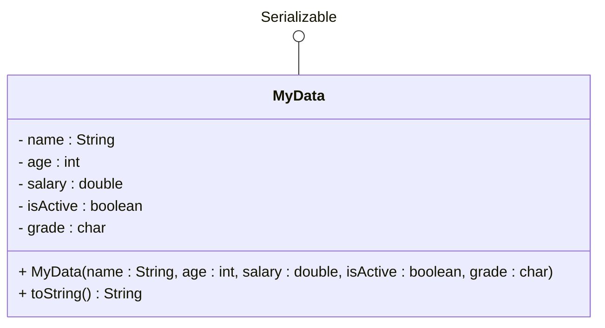

# Binary data exercises

## Setup

Create a new package called `binaryexercises` in your project. All classes for this page should be placed in this package.

## Exercise 16.1: MyData Class

It is simpler to read data from binary file, if we can deserialize it into an object. So, we create a class that represents the data we want to store.

Create a class called `MyData` with the following requirements:

### Requirements

- **Package**: `binaryexercises`
- **Implements**: `Serializable` interface
- **Fields**: Include various simple data types:
  - `String name`
  - `int age`
  - `double salary`
  - `boolean isActive`
  - `char grade`
- **Methods**: 
  - Constructor that takes all parameters
  - Getters and setters for all fields
  - `toString()` method that returns a formatted string

This class doesn't really represent anything, we just need it to practice writing and reading objects to and from a binary file.

### Class Diagram

Getters and setters are left out for brevity.



Notice that `MyData` implements the `Serializable` interface. This is necessary for the object to be serialized.

### Example Output

```
MyData{name='John Doe', age=25, salary=50000.0, isActive=true, grade='A'}
```

## Exercise 16.2: Single Object Serialization

Create a class called `SingleObjectTest` with a main method that:

### Requirements

1. **Create an instance** of `MyData` with sample data
2. **Write the object** to a binary file called `mysingleobject.bin`
3. **Read the object back** from the file
4. **Print both objects** (original and retrieved)
5. **Compare the objects** using `==` and `.equals()`
6. **Discuss the results** in comments


### Expected Output

```
Original: MyData{name='Alice Smith', age=30, salary=75000.0, isActive=true, grade='B'}
Object written to file successfully!
Object read from file successfully!
Retrieved: MyData{name='Alice Smith', age=30, salary=75000.0, isActive=true, grade='B'}
Are they the same object (==): false
```

Now, why are they not the same object? Is it not the same we put into the file and loaded back? No, it is not. The object is serialized, and when it is read back from the file, it is a new object. The deserialization step creates a `new` object, and whenever the `new` operator is used, a new object is created.

This is why `==` returns false, and `.equals()` returns false as well (unless overridden).


## Exercise 16.3: ArrayList Serialization

Create a class called `ArrayListTest` with a main method that:

### Requirements

1. **Create an ArrayList** of `MyData` objects
2. **Add several MyData objects** to the list, at least, like.. maybe 3. Or 7 or so.
3. **Write the entire list** to a binary file called `mydatalist.bin`
4. **Read the list back** from the file
5. **Print the retrieved list**
6. **Compare the original and retrieved lists**


### Expected Output

Depending on how you choose to format the output, it may look like this:

```
Original list:
  MyData{name='John Doe', age=25, salary=50000.0, isActive=true, grade='A'}
  MyData{name='Jane Smith', age=30, salary=60000.0, isActive=false, grade='B'}
  MyData{name='Bob Johnson', age=35, salary=70000.0, isActive=true, grade='C'}
List written to file successfully!
List read from file successfully!
Retrieved list:
  MyData{name='John Doe', age=25, salary=50000.0, isActive=true, grade='A'}
  MyData{name='Jane Smith', age=30, salary=60000.0, isActive=false, grade='B'}
  MyData{name='Bob Johnson', age=35, salary=70000.0, isActive=true, grade='C'}
```

## Exercise 16.4: DataContainer Class

This time, we step up the game. Imagine in a larger application (like your semester project), you will have to save multiple types of objects. We can do this to a single file. But, we cannot write a list of `MyData` objects to a file, and a list of `MyOtherData` objects to that same file. We need to write a _single object_ to the file, that contains both lists.

So, we create a container class, which will contain _all_ data for the application.


### Requirements

1. **Create MyOtherData class** with different field types:
   - `String description`
   - `int quantity`
   - `boolean isAvailable`
   - `double price`

2. **Create DataContainer class** with:
   - `List<MyData> myDataList`
   - `List<MyOtherData> myOtherDataList`
   - Constructor, whatever getters and setters you need, and a `toString()` method


### DataContainer Class

Here is an incomplete implementation of the `DataContainer` class:

```java
package binaryexercises;

import java.io.Serializable;
import java.util.ArrayList;
import java.util.List;

public class DataContainer implements Serializable {
    private List<MyData> myDataList;
    private List<MyOtherData> myOtherDataList;
    
    public DataContainer() {
        this.myDataList = new ArrayList<>();
        this.myOtherDataList = new ArrayList<>();
    }
    
    // methods to add objects to the lists, and to retrieve the lists. 
    // no need to copy stuff
}
```

### Main method

Create a main method that:
- Creates several instances of both data types, i.e. `MyData` and `MyOtherData` objects
- Adds them to a DataContainer
- Writes the DataContainer to a file
- Reads it back and prints the results

## Why Use DataContainer?

In your application, you may eventually need to store multiple types of entities: Person, Reservation, Car, etc. With this binary approach, you cannot write multiple lists to a single file. You need to write a single object to the file, that contains all the lists. That's the DataContainer class. It's a wrapper class that contains one or more lists of objects.

Using this, we then save _all_ data at once, or we read _all_ data at once. For your first semester, this is fine. But, it will not scale well, as this clump of data can become large, which will cause the reading and writing to take longer and longer.