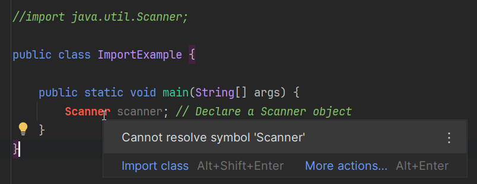
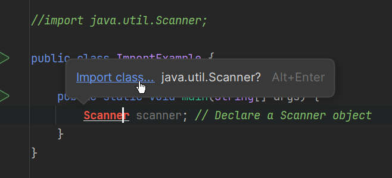

# Importing packages

Picture the following scenario:\
Yyou are working on a project in your garden. You have a garden shed where you keep all your tools. You have _a lot_ of tools.\
You realize that for this project you need a few specific tools, maybe a hammer, and a shovel.

Do you?

A) Get all the tools from the shed?
B) Get only the tools you need?

In Java, there is a huge toolshed, called the Java Standard Library.\
It contains a lot of useful tools, functionality to write to the console, to interact with files, to work with dates, to create GUI applications, to make your program do multiple things simultaneously, to contact and interact with databases, to create web applications, to interact with the internet and other computers, and much more.

But, you don't need all of it.\
You only need a few specific tools for your project.

So, you _import_ only the tools you need.

## Importing Packages

In Java, the tools are organized in packages.\
A package is a collection of related classes, i.e. functionality.

We are going to use the `Scanner` class from the `java.util` package to read input from the console.\
To use the `Scanner` class, we need to import it at the top of our Java file. Notice line 1.

```java
import java.util.Scanner;

public class ImportExample {

    public static void main(String[] args) {
        Scanner scanner; // Declare a Scanner object
    }

}
```

The above code does not do anything yet, but it shows how to import the `Scanner` class.

## Exercise - Remove import

Create a new class, for example the one above. Copy the code in.

There should be no problems, yet.

Now, delete the `import java.util.Scanner;` line. Or just comment it out.

```java
// import java.util.Scanner;

public class ImportExample {

    public static void main(String[] args) {
        Scanner scanner; // Declare a Scanner object
    }
    
}
```

The compiler should now complain that it does not know what `Scanner` is.



If you hover over the `Scanner` keyword, you should see a message that says "Cannot resolve symbol 'Scanner'".

If you click on the `Scanner` keyword, you should see a lightbulb icon appear.\
It will suggest to import the `Scanner` class from the `java.util` package.



You can then click the blue "Import class" link, and IntelliJ will automatically add the import statement for you.

You will also see that you can press <kbd>Alt</kbd>+<kbd>Enter</kbd> to open the quick-fix menu, which will also allow you to import the class.

Play around, remove the import statement, explore the various options IntelliJ gives you to import the class.