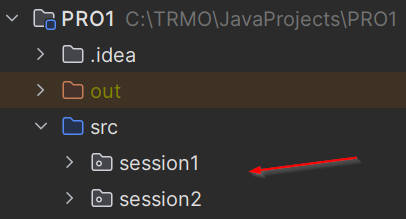

# Introduction

Welcome to the second learning path of the course!

Last time we had plenty of content, but not that many exercises. So, we will shift the focus a bit.

First, you must know about the default values of variables.\
Then we look at how to provide input to your programs.

## Package structure

Is your package structure ready? 

Make sure you have a package for this session: 

