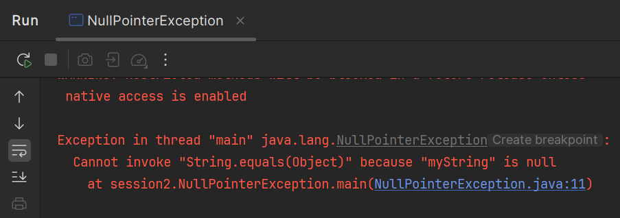

# Reference type default values

In Java, when you declare a reference type variable without assigning it a value, it gets a default value of `null`. This means the variable is not assigned to any object.

If you declare a `String` variable without assigning it a value, it will be `null` by default. For example:

```java
String myString; // Declaration without assignment
System.out.println(myString); // This will print null
```

This means you have a variable (or reference) that does not point to any actual `String` object in memory. It's like having a note that says "I have a String here," but the note doesn't tell you where to find it because you haven't assigned it yet.

Your note says you could have a "Large Jar os weird stuff!", but you currently don't have that jar in your backpack. You just have the note, and it points to nothing (`null`).

### Exercise: Reference Type Default Values

Create a new class, for example, `ReferenceDefaults`, and declare a string variable without assigning it a value.\
Then print these variables to see their default values.

You should just see `null` printed to the console.

### Equals

Remember from last time, you could compare primitive types using `==`.\
For example:

```java
int a = 5;
int b = 5;
System.out.println(a == b); // This will print true
```

But, when comparing strings (or any reference types), you should use the `.equals()` method instead of `==`.\
For example:

```java
String str1 = "Hello";
String str2 = "Hello";
System.out.println(str1.equals(str2)); // This will print true
```

When you compare with `==`, it checks if both variables point to the same object in memory, not if their contents are the same.\
If you want to check if two strings have the same content, you should always use `.equals()`.

In the above, I have two strings, but they are different objects in memory, so `str1 == str2` would return `false`, while `str1.equals(str2)` returns `true` because their contents are the same.

### Exercise - null pointer exception

Now, let's see what happens if you try to use a reference type variable that is `null`.

If I declare a `String` variable, the compiler will not let me use it, until I assign it a value.\
The default is `null`. I can just assign it to `null` explicitly.

Try to run the following code:

```java
String myString = null; // Declaration without assignment
String otherString = "Hello";

System.out.println(myString.equals(otherString)); // This will throw a NullPointerException
```

You should see a lot of red lines in the console. You tried to do something invalid, and your program crashed. This is called a **NullPointerException**. It happens when you try to call a method on a variable that is `null`.

In this case `myString` is `null`, because it is not assigned to any object.\
When you try to call `.equals()` on it, Java doesn't know what to do, because there is no actual `String` object to call the method on.

This is what my console looks like:



We can see the blue text indicating the problem occured in the `main` method, line 11.\
It also says we cannot call the method `equals` on a varialble that is `null`.
