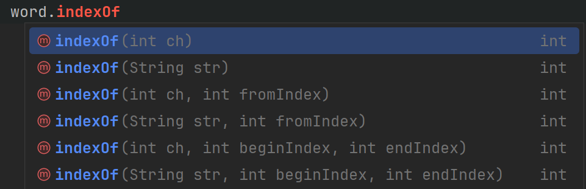

# The `indexOf()` Method in Java


The `indexOf()` method is a built-in function in Java that allows you to find the position (index) of a specific character or substring within a string. If the character or substring is not found, the method returns `-1`.

There are actually several versions of the `indexOf()` method, which can be used in different ways:

### Syntax:
```java
int index = string.indexOf(substring);
int index = string.indexOf(character);
int index = string.indexOf(character, fromIndex);
int index = string.indexOf(substring, fromIndex);
```

- **`substring`**: The substring you want to find.
- **`character`**: The character you want to find.
- **`fromIndex`**: The position in the string to start searching from.

### Example:
```java
String text = "Hello, world!";
int index1 = text.indexOf('o');
int index2 = text.indexOf("world");
int index3 = text.indexOf('o', 5);

System.out.println("Index of 'o': " + index1);
System.out.println("Index of \"world\": " + index2);
System.out.println("Index of 'o' after position 5: " + index3);
```

### Output:
```
Index of 'o': 4
Index of "world": 7
Index of 'o' after position 5: 8
```

# Exercises

### Exercise 1: Find the First Occurrence
Write a program that asks the user to enter a word and a character. Use the `indexOf()` method to find the first occurrence of the character in the word and display its index.

Example Output:
```
Enter a word: 
Programming         // user input
Enter a character: 
g                   // user input
The first occurrence of 'g' is at index: 3
```

<hint title="Solution">

```java
import java.util.Scanner;

public class FindFirstOccurrence {
    public static void main(String[] args) {
        Scanner scanner = new Scanner(System.in);

        System.out.print("Enter a word: ");
        String word = scanner.nextLine();

        System.out.print("Enter a character: ");
        char character = scanner.next().charAt(0);

        int index = word.indexOf(character);
        System.out.println("The first occurrence of '" + character + "' is at index: " + index);

        scanner.close();
    }
}
```

</hint>

### Exercise 2: Find the First Occurrence After a Position
Write a program that asks the user to enter a word, a character, and a starting position. Use the `indexOf()` method to find the first occurrence of the character after the specified position and display its index.

Example Output:
```
Enter a word: Programming
Enter a character: g
Enter the starting position: 4
The first occurrence of 'g' after position 4 is at index: 7
```

Below is a screenshot, which shows several versions of the indexOf() method, find one that suits your needs:




<hint title="Hint 1">
There is a version of the `indexOf()` method that allows you to specify a starting position for the search, and which character to find.
</hint>

<hint title="Hint 2">

The `scanner.nextLine()` method reads the next line. This will give you a `String`, but assuming correct input from the user, that string is a single character.
You must then convert it to a `char` using `charAt(0)`.

</hint>

<hint title="Hint 3">
Use the `indexOf()` method with two arguments: the character to find and the starting position. This will search for the character starting from the specified position.
</hint>

<hint title="Solution">

```java
import java.util.Scanner;

public class FindOccurrenceAfterPosition {
    public static void main(String[] args) {
        Scanner scanner = new Scanner(System.in);

        System.out.print("Enter a word: ");
        String word = scanner.nextLine();

        System.out.print("Enter a character: ");
        String input = scanner.next();
        char character = input.charAt(0);

        System.out.print("Enter the starting position: ");
        int startPosition = scanner.nextInt();

        int index = word.indexOf(character, startPosition);
        System.out.println("The first occurrence of '" + character + "' after position " + startPosition + " is at index: " + index);

        scanner.close();
    }
}
```

</hint>

### Exercise 3: Substring Up to a Letter
Write a program that asks the user to enter a word and a letter.
The program should find the first occurrence of the letter in the word and then extract a substring from the start of the word up to (but not including) that letter.

Example Output:
```
Enter a word: Programming
Enter a letter: g
The substring up to 'g' is: Pro
```


<hint title="Hint 1">
Use the `indexOf()` method to find the position of the letter in the word. If the letter is not found, `indexOf()` will return `-1`.
</hint>

<hint title="Hint 2">
Use the `substring()` method to extract the portion of the word from the start (index 0) up to the index of the letter. Remember, the `substring()` method excludes the character at the end index.
</hint>

<hint title="Solution">

```java
import java.util.Scanner;

public class SubstringUpToLetter {
    public static void main(String[] args) {
        Scanner scanner = new Scanner(System.in);

        System.out.print("Enter a word: ");
        String word = scanner.nextLine();

        System.out.print("Enter a letter: ");
        String input = scanner.next();
        char letter = input.charAt(0);

        int index = word.indexOf(letter);

        String substring = word.substring(0, index);
        System.out.println("The substring up to '" + letter + "' is: " + substring);

        scanner.close();
    }
}
```

</hint>

What happens if you enter a letter that is not present in the word?