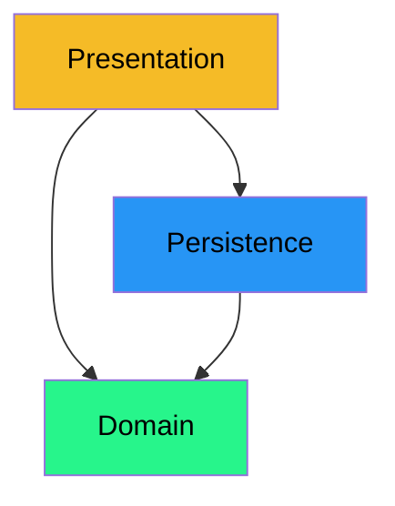
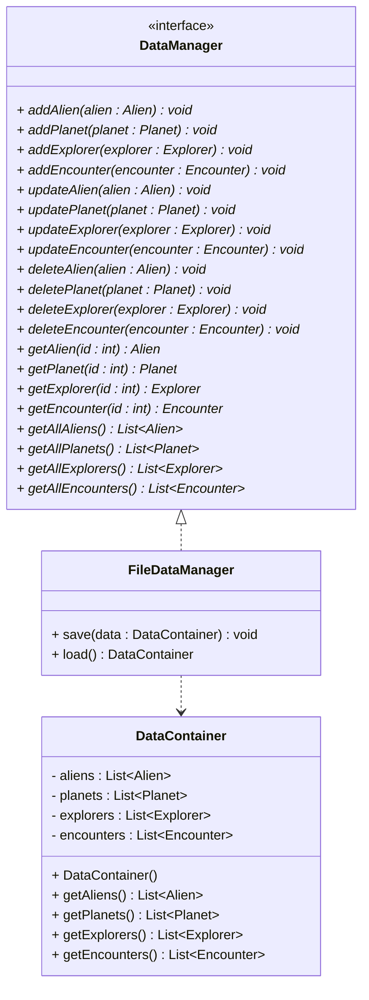

# Persistence layer

Next, we have the persistence layer. This layer is responsible for saving and loading the data to/from a file. Again, the architecture diagram:

We see the Persistence layer depends on the Domain. We have the Domain in place, so this dependency is no problem.

## The classes

The persistence layer will contain at least three classes:

- `FileDataManager` - The concreteclass responsible for saving and loading the data to/from a file.
- `DataManager` - This is an interface representing what the data manager can do.
- `DataContainer` - The class responsible for storing the data in a container. This is a wrapper class that contains one or more lists of objects.

Why do we have the interface?\
This is a common approach, you separate layers with interfaces. This helps with various things, you will learn more about during your studies, such as:

- **Loose coupling** - The layers are not tightly coupled, they can change independently.
- **Polymorphism** - You can change the concrete class without having to change the code that uses the interface.
- **Testability** - You can easily test the persistence layer without having to test the concrete class.

Interfaces create seems in your software, making it easier to test the software from various points.

## Class diagram

The class diagram for the persistence layer should look like this:

Yeah, that's a lot of methods on the interface. **You may not need all of them initially**. You can add them later if you need them.

The point is, the DataManager interface defines what the data manager can do. And generally, what the persistence layer can do, is to perform "CRUD" operations on our model classes. 

## What are CRUD operations?

That is an acronym for Create, Read, Update and Delete. It is a common way to describe the basic operations that can be performed on a data store.

- **C**reate - add a new object to the data store
- **R**ead - read an object from the data store
- **U**pdate - update an object in the data store
- **D**elete - delete an object from the data store

You might name the methods slightly different, as you can see in the interface above. I call it "add" instead of "create". And "get" instead of "read". That's just a matter of preference. But conventionally, the operations are called CRUD.\
You will also notice, there are two methods for reading an object from the data store. One that takes an ID, and returns a single object. And one returns _all_ the instances of a given type.

Let's take the classes one by one. Implement them along the way.