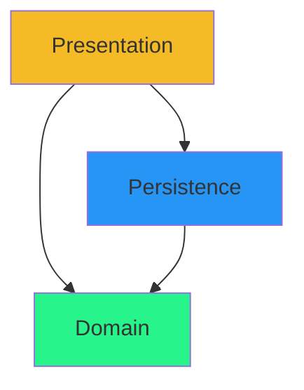

# Persistence layer

Next, we have the persistence layer. This layer is responsible for saving and loading the data to/from a file. Again, the architecture diagram:

We see the Persistence layer depends on the Domain. We have the Domain in place, so this dependency is no problem.

## The classes

The persistence layer will contain at least three classes:

- `FileDataManager` - The concreteclass responsible for saving and loading the data to/from a file.
- `DataManager` - This is an interface representing what the data manager can do.
- `DataContainer` - The class responsible for storing the data in a container. This is a wrapper class that contains one or more lists of objects.

## Class diagram
