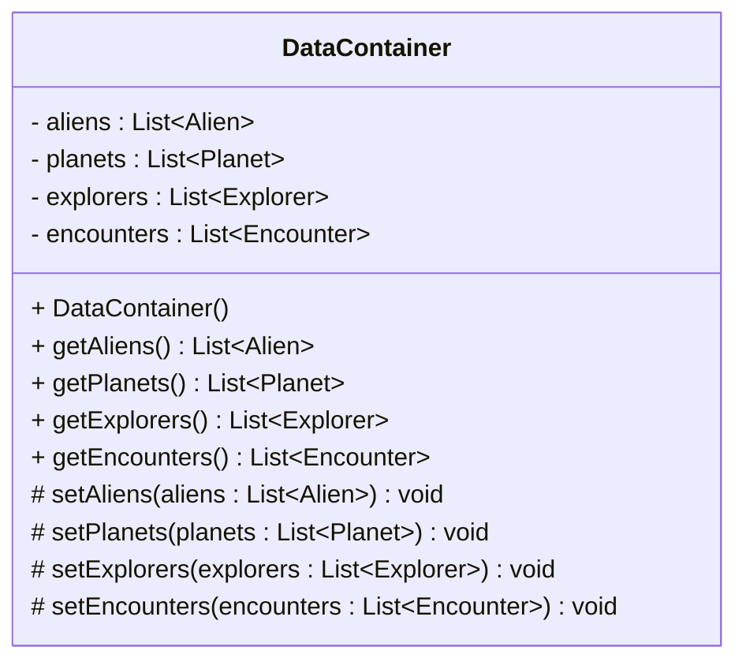

# The DataContainer Class

We start with the DataContainer class. It is pretty straight forward. Here is the UML again:



Create this class in the persistence package.

```
src/
├── presentation/
├── persistence/
│   └── DataContainer.java
└── domain/
    ├── Alien.java
    ├── Encounter.java
    ├── Explorer.java
    └── Planet.java
```

There is nothing about copying anything here, no composition. This class will be read from the file, and you (or the FileDataManager class) can then extract necessary model objects from it. 

You may also sometimes need to just overwrite the existing list. 

If you need other methods, feel free to add them. Maybe methods about adding single objects to the list.

Ensure the lists are initialized as empty lists, either in the constructor, or directly at the field declaration.~~