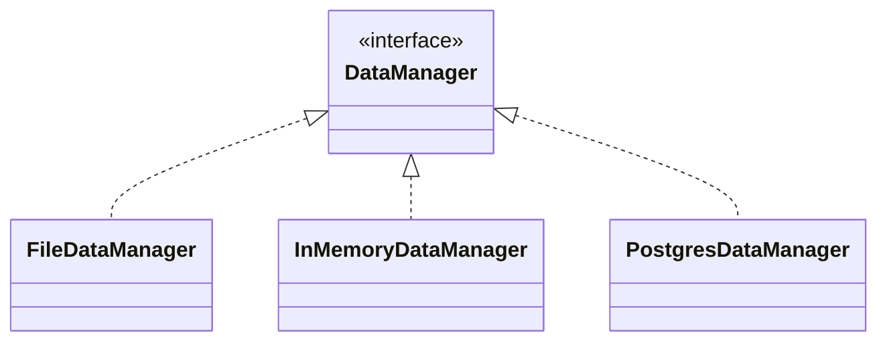

# The FileDataManager class

Here we will start on the FileDataManager class.
But first, why do we have the interface?

## Separating layers with interfaces

Conventionally, the interface is named for _what it does_. This interface manages data, so it is called DataManager. It is a generalization. Then, the _implementation_ of the interface is named for _how it does_, what the interface promises. Since it is a file-based data manager, it is called FileDataManager.\
You might also have an `InMemoryDataManager`, which just keeps the data in a list in memory. That's what we have done most of the time so far.\
Then, you might also have a `PostgresDataManager`, which uses a postgres database, to store the data. That's for next semester. 

When developing applications it can be beneficial to start out with some simple dummy version of the data storage, even just a list. That allows you to focus on implementing and trying out features. Later, you can swap in a more persistent version of the data storage.

For a quick overview of the different possible implementations, here is the UML:



All the implementations promises to manage data, but they do it in different ways.

In this learning path, we will focus on the FileDataManager class.

Let's begin.

## 1. Create the FileDataManager class

This class also belongs in the persistence package, here:

```{6}
src/
├── presentation/
├── persistence/
│   ├── DataContainer.java
│   ├── DataManager.java
│   └── FileDataManager.java
└── domain/
    ├── Alien.java
    ├── Encounter.java
    ├── Explorer.java
    └── Planet.java
```

## 2. Implement the interface

Your FileDataManager class should implement the DataManager interface:

```java
public class FileDataManager implements DataManager {

}
```

This will cause a compiler error, because the interface has abstractmethods that are not implemented. You can use IntelliJ's quick fix feature to automatically add the methods. Then you get empty method bodies, which we can fill in later.

## 3. Making sure there is empty data

First, we need to actually have the data set up, so that stuff doesn't fail, when we try to save or load data.

### 3.1 Define file path

First, add a field variable to the FileDataManager class, which defines the file path. Make this field variable private and final.

```java
private final String filePath = "data.bin";
```

### 3.2 Check if file exists

In the constructor of the FileDataManager class you must:

1) Check if the file exists
2) If it does not exist:
   1) Create a new DataContainer object
   2) Save the DataContainer object to the file
3) If it exists, do nothing

I recommend you add a method to the FileDataManager class, which can take a DataContainer object and save it to the file. This writing data functionality will be use by several methods, so it is a good idea to put it in a separate method.\
In the previous session, you saw how to write an object to a binary file. You can use that code here.

```java
private void saveData(DataContainer data) {
    // TODO: Implement
}
```

This will ensure that there is some initial data, even if there are no entities. It will simplify the rest of the methods, because we do not need to check for the file. 

## 4. Implement the first methods

Let's now start on the methods for the FileDataManager class.

### 4.1 Add a planet

The first method will be about adding a planet to the storage (file). Once this method is in place, you will create a main method to test it. Later.

The signature of the method is something like this:

```java
public void addPlanet(Planet planet) {
    // TODO: Implement
}
```

This method should:

1) Receive a planet object as a parameter
2) Read the DataContainer object from the file (create a readMethod similar to the saveData method above)
3) Figure out the largest id of all the current planets, and add 1 to it, to get the new id for the planet. This is probably the simplest to get the next available id.
4) Set the id of the planet object to the new id
5) Add the planet object to the DataContainer object, either by:
   1) getting the list of planets from the DataContainer object and adding the planet object to it, or
   2) using an `addPlanet()` method of the DataContainer object
6) Save the DataContainer object to the file (use the same `saveData()` method as in the constructor). This will overwrite the content of the existing file, that's intended.

You have to add a try-catch to handle IOException. You then have two options for handling this:
1) Print out the stack trace, and do no further. This is the simpler approach, but not ideal from a user point of view. When adding a GUI, and something fails, they will not see the stack trace, and not know that their intended action failed.
2) Create your own custom Runtime exception, and throw that instead with a message. This exception will eventually be caught in the presentation layer, and you can print out the message to the user. This is the better approach.

### 4.2 Get a planet

Now, let's see if we can retrieve a planet  from the storage. After this method, we will be able to test if the saving and loading actually works.

Find the `getPlanet()` method in the FileDataManager, to fill it out. The method should:

1) Receive an id as a parameter
2) Read the DataContainer object from the file. Again, you have a read method from above, you can reuse here.
3) Get the list of planets from the DataContainer object
4) Find the planet with the given id in the list
5) Return the planet object

The DataContainer object will be lost and collected by the garbage collector, when the method returns. So, we don't have to do anything special with it.

What happens if the planet is not found? You can either return null, or throw an exception. I will let you decide. Returning null is perhaps simpler, but may result in a lot of null checks in the calling code. Throwing an exception is more robust, but may result in more complex code.

