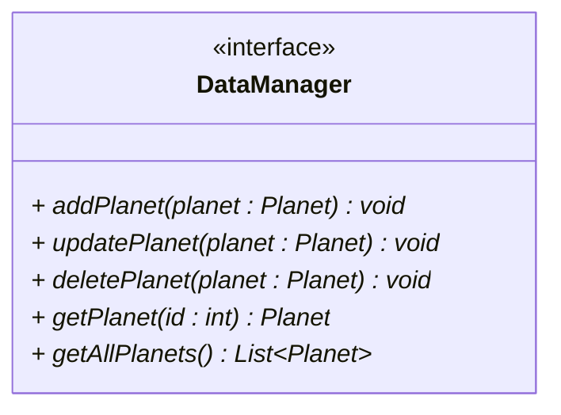

# The other planet methods

Here is the reduced FileDataManager class again:



It is time to implement the remaining three methods: `updatePlanet()`, `deletePlanet()`, and `getAllPlanets()`.

## Delete planet

Find the `deletePlanet()` method in the FileDataManager class, to fill it out. The method should:

1) Receive an id as a parameter
2) Read the DataContainer object from the file. 
3) Find the planet with the given id in the list
4) Remove the planet from the list
5) Save the DataContainer object to the file again

I know you have a getPlanet() method, but you can't use that here to find the planet. That is because the get method will load data, find the planet, and return it. The delete planet method will also load data, so you cannot easily use the returned planet to remove it from the list, as the objects will be different. Is this confusing? Probably. 

## Updating a planet

Find the `updatePlanet()` method in the FileDataManager class, to fill it out. The method should:

1) Receive a planet object as a parameter
2) Call the above delete method to remove the planet from the storage 
3) Call the add method to add the new planet object to the list
    
So, it is not really an update, it is a delete and an add. Or replace. This is a common approach, and simpler than retrieving the existing planet, and updating all the fields. Though, slightly less efficient, as we are loading and saving the data twice.

You may do the "update" by retrieving the existing planet, and updating all the fields. This will just require more code. 

## Getting all planets

Find the `getAllPlanets()` method in the FileDataManager class, to fill it out. The method should:

1) Read the DataContainer object from the file. 
2) Get the list of planets from the DataContainer object
3) Return the list of planets

## Tests

I recommend you create new test classes for the above methods:

```
src/
├── presentation/
├── persistence/
│   ├── DataContainer.java
│   ├── DataManager.java
│   └── FileDataManager.java
├── domain/
│    ├── Alien.java
│    ├── Encounter.java
│    ├── Explorer.java
│    └── Planet.java
└── test/
    ├── TestSaveAndLoadPlanet.java
    ├── TestDeletePlanet.java
    ├── TestUpdatePlanet.java
    └── TestGetAllPlanets.java
```

The test classes should have a main method, which tests the relevant method. Consider how to setup the test data first, e.g. by adding necessary data to the DataContainer object before calling the method you are testing.

Consider how you are verifying the test succeeded:

- Deleting: print out the list, to check that the removed planet is no longer in the list
- Updating: print out the list, to check that the updated planet is in the list. And the data is updated.
  - Or, in a second try block, retrieve the planet again by ID, and verify the data is updated.
- Getting all planets: print out the list, to check that the planets are in the list.

## Why all those main methods?

Yeah, this can tend to explode, if we keep this up. 

The point is to have simple tests, and separation of concerns.

If you have just one test class with one main method, you will either:

- Update this class with new tests as needed, loosing previous tests.
- Keep expanding and have the class test more and more and more. Maybe something fails before you even get to the stuff you are actually testing. It's just easier to keep things focused.

If you create multiple test classes, you can always go back and re-run a previous test, if needed. Maybe you are worring about a new feature potentially having broken something else. You can just re-run the previous test.

We will explore this further next semester, and add a good deal of automation to the testing process as well. That will be great.