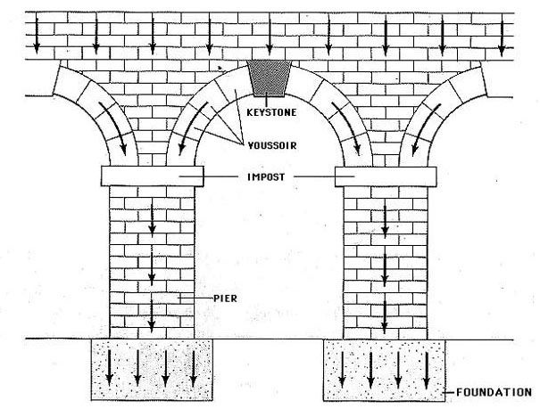

# Application Design

This learning path will cover the basics of application design. The _very_ basics. Then, throughout your education, you will evolve on this design, upgrade it, even perfect it (should you take my elective course).\
On second semester, we will further discuss software design.

But, what even is design?

## Ancient History

So, a long, long time ago, the romans needed to transport water from the snowy mountain tops to the cities below. And they needed to do it quickly, and efficiently. But they didn't have the technology we have today, they didn't have the tools to build a pipeline with pumps and valves and such.

Because they did not have pumps, they could not transport water uphill. How do you move water across these canals, crossing the rivers?
They built a system of aqueducts, which are still standing today. These aqueducts are a kind of bridge, connecting the mountain tops to the cities below.

Because of these aqueducts, the water channel would drop only one meter in height, over a distance of up to [several kilometers](https://www.earthdate.org/episodes/roman-aqueducts#:~:text=Most%20aqueducts%20have%20overall%20slopes,for%20precise%20measurement%20of%20angles.).

But, the aqueducts were not just a simple bridge. They were a complex system of engineering. The romans needed a stable structure so that these aqueducts would last for centuries. See the image above?  They are designed to be able to support the weight of the water, and the weight of the structure above it.\
Instead of stacking blocks on blocks, they would cut the blocks in a more triangle shape, allowing them to build this arched structure. The weight of the stones, and their shape, would direct the forces to help stabilize the structure.

No, the weight pressing down on the arch would stabalize it, and the arch was able to carry the weight of the structure above it.

## Modern times

Even today, you will see these arches in modern buildings. Now, though, they are probably often just for decoration. But still, you may encounter them, and they may even seem to carry a lot of weight.

## What's your point?

What is this guy even rambling about? Well, the point is, these romans had particular problem, which is present in many architectural designs today. And they found a particular solution to it.

A common problem with a specific generalizable solution to it.

This, is what we call design. Many buildings have similar ways to solve the same problems.

## Software design

In software, we have similar problems. 

As our system grows larger and larger, with more and more features, more complex object models for increasingly complex real world scenarios, we again and again and again face similar problems. 

- How do we structure our code, so that it does not become a huge unmanageable mess?
- How do we keep our code clean, readable, and maintainable?
- How do we keep our code efficient, so that it does not become a performance bottleneck?
- How do we keep our code scalable, so that it does not become a performance bottleneck as we add more features?
- How do we keep our code maintainable, so that it does not become a maintenance nightmare? With maintainance I am talking about changes to the code, new features, bug fixes, etc. Keeping the software alive, and running smoothly.
- How do we keep our code reusable, so that we do not have to reinvent the wheel?
- How do we keep our code modular, so that we can easily swap out parts of the system without having to change the whole system?
- How do we keep our code testable, so that we can easily test the system?
- How do we keep our code documentation up to date, so that we can easily understand the system?

All these questions are present in the software we build today. And there are many solutions to them.

## Baby steps

This learning path will cover the basics of application design. The _very_ basics. I will show you how you can structure your software for your first semester project. 

It is about organizing your code into packages, and classes, and methods, and fields, and all that stuff.\
This will help you 

- to keep your code organized
- to make it easier to understand
- to make it easier to figure out where new code belongs
- to make it easier to work as a team, because you can divide the code between several people. We want to avoid everyone touching the same code and causing git merge conflicts

During your studies on further semesters, you will learn about more advanced design approaches.