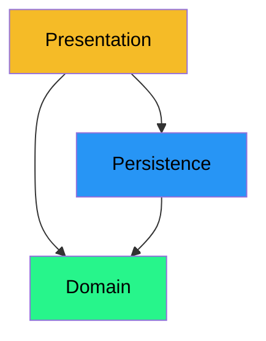

# Layers in software design

Your house (should you have one) is divided into rooms. Most rooms have a specific purpose. When you add new stuff to your house, you will probably add it to a specific room.

You don't have a toilet in your living room, or a stove in your bedroom. There is a place for everything, and everything is in its place.


## Design in software

In software, instead of rooms, we have _layers_. Each layer has a specific purpose. This is a _very_ common approach, even if the layers may look slightly different in different applications.

In this learning path, we will have the following layers:

- Presentation layer
- Persistence layer
- Domain layer

This is a common terminology, but you may encounter other names for these layers.

Layers are some kind of grouping. For you, at this point, think of packages. You would have a package for everything related to your living room, another package for everything related to your kitchen, another package for everything related to your bathroom, etc.

We have packages in our application code, and these packages represent layers. Later, you should use moduls instead, or something simalar. But that is not important for now.

We usually draw a layered architecture as boxes on top of each other, with arrows between them, indicating that the classes from one layer uses the classes from a _lower_ layer. There is a strong convention of the ordering of the layers. Arrows point **downwards**. Don't mess with me!



## What belongs where?

So, we are working with three layers, what goes where?

- **The presentation layer** is responsible for displaying the data to the user. It is the layer that the user interacts with. It is the layer that the user sees and uses.
  - In our applications so far, we have used the console. So, classes writing to the console, and classes reading from the console, would belong to the presentation layer.
  - Later, we will use a graphical user interface (GUI), using JavaFX.
  - Even more later, you will do other things, maybe serve websites.
- **The persistence layer** is responsible for saving and loading the data. It is the layer that deals with the database.
- **The domain layer** is responsible for the business logic. It is the layer that contains the classes that represent the real-world objects.

To show this as a package structure, we would have the following:

```
📁src/
├── 📁presentation/
├── 📁persistence/
└── 📁domain/
```

When you get to your semester project, you can follow a similar approach. Next semester will add more layers, and you will learn about more advanced design approaches.

You should of course add further sub-packages inside each layer, to keep your code organized.