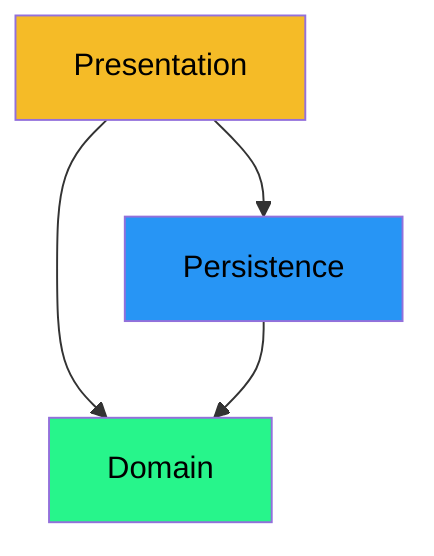
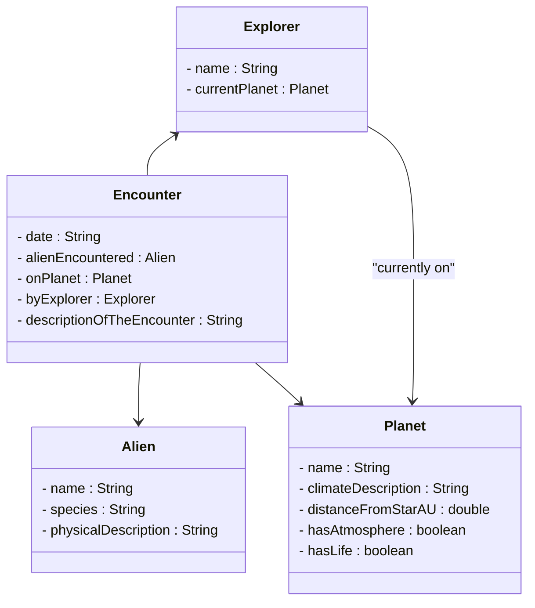

# Domain layer

We start with the domain layer. This is easier because it does not depend on anything. Recall the diagram:



Notice all arrows point to the domain, but no arrows point out of the domain. This is because the domain layer is independent of the other layers. It is the core of the application, and it does not depend on anything else.

## Classes

We need to create the classes that represent the real-world objects. In our case, these are:

- Planet
- Alien
- Explorer
- Encounter

## Entity

What is an entity? 

- An entity is an object that has a unique identity. Even if two objects have the same data, if they have different identities, they are different entities.
- It is an object that can be uniquely identified. This is typically done by an ID, either an integer, or a string of random characters.
- It is an object that has a life cycle. That means the entity changes over time, its data changes.
- It is created, used, and then destroyed. 

In general, most of your model classes are entities. This is the data, your system works with over time. You have a planet object, an alien object, an explorer object, and an encounter object. These are all entities.

## Class diagram

Here is a sort of complete UML class diagram for the domain classes.



The above diagram shows the data, but not any methods. That is up to you to decide. You may start with the above, and then add methods as needed.

### Notes

- For the `date` field, you may also want to use a `LocalDate` object instead.
- You may benefit from adding IDs to all classes. This will help you identify objects later. Such IDs should be unique, immutable, and automatically generated by the system. How do you keep track of the next available ID? There's a challenge.

## Current snapshot

Your current project structure should now look like this:

```console
📁src/
└── 📁extraterrestrialexploration/
    ├── 📁model/
    │   ├── 📄Alien.java
    │   ├── 📄Planet.java
    │   ├── 📄Explorer.java
    │   └── 📄Encounter.java
    ├── 📁persistence/
    └── 📁presentation/
```