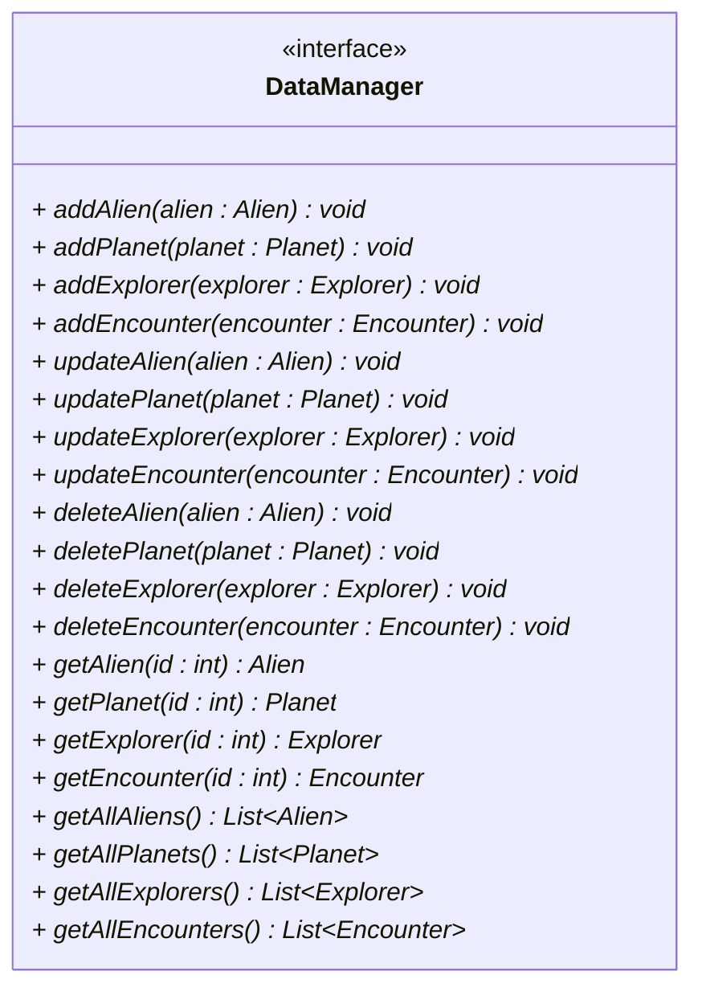
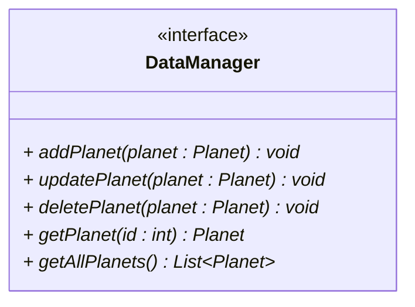

# The DataManager interface

Next, let's do the interface for the DataManager. This is the interface that will be implemented by the FileDataManager class.

Here is the full-scale UML:



Lot's of methods here. 

Consider actually just doing the methods for the `Planet` now, like this: 



The first features will be about managing the planets. Then, as you add more features, you can add the other methods. They will be very similar, so you can mostly duplicate the methods for the `Planet` class, when you need to add the other methods.

If you put _all_ the methods in the interface, your implementing class will just need to implement them all and have empty method bodies. That's just a lot of bloat for now. Therefore, just stick to the planet-related methods for now.

Put the interface in the persistence package:

```{5}
📁src/
├── 📁presentation/
├── 📁persistence/
│   ├── 📄DataContainer.java
│   └── 📄DataManager.java
└── 📁domain/
    ├── 📄Alien.java
    ├── 📄Encounter.java
    ├── 📄Explorer.java
    └── 📄Planet.java
```

Notice the DataContainer class is also in the persistence package. This is because the DataManager class will need to use the DataContainer class to store the data.

Once you have the initial interface in place, we can move on to the implementation of the DataManager interface.