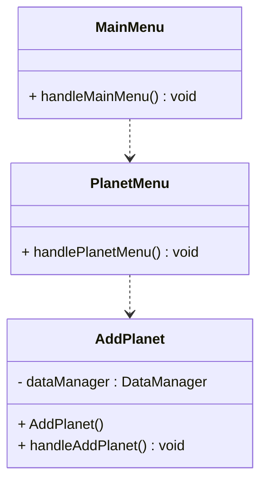

# Add planet

It is time for our first feature. This is very exciting!


## AddPlanet class

We will put this feature in it's own class, called `AddPlanet`. This will be your application structure:

```{6}
📁src/
├── 📁presentation/
│   ├── 📄MainMenu.java
│   ├── 📄RunApplication.java
│   └── 📁planetmanagement/
│       ├── 📄AddPlanet.java
│       └── 📄PlanetMenu.java
├── 📁persistence/
│   ├── 📄DataContainer.java
│   ├── 📄DataManager.java
│   └── 📄FileDataManager.java
├── 📁domain/
│    ├── 📄Alien.java
│    ├── 📄Encounter.java
│    ├── 📄Explorer.java
│    └── 📄Planet.java
└── 📁test/
    └── 📁persistence/
        ├── 📄TestSaveAndLoadPlanet.java
        ├── 📄TestDeletePlanet.java
        ├── 📄TestUpdatePlanet.java
        └── 📄TestGetAllPlanets.java
``` 

And this is the UML of the menues so far:



## Constructor

Add a constructor to the AddPlanet class. There should be no parameters. It should initialize the `dataManager` field to a new `FileDataManager` object.

```java
public AddPlanet() {
    this.dataManager = new FileDataManager();
}
```

Notice that the field variable is of the type `DataManager`, i.e. the interface, not the implementation. 

## handleAddPlanet() method

Add a method called `handleAddPlanet()`. This method should print the relevant messages to guide the user through inputting planet data. 

Consider adding confirmation messages, both before starting, and after completing the input. Here you could print out a message requesting confirmation to add a planet a planet with the input data, like 


```
You are about to add the following planet: 
Planet{
    name='Kepler-442b', 
    climateDescription='Temperate with seasonal variations', 
    distanceFromStarAU=0.409, 
    hasAtmosphere=true, 
    hasLife=true
}

Would you like to add this planet? (y/n)
```

Once done, return to the planet management menu.

This method should of course use the `dataManager` field to add the planet to the data container. Here is part of the code:

```java
public void handleAddPlanet() {
    System.out.println("\n=== Add New Planet ===");
    
    // TODO: Read planet data from user
    Planet planet = new Planet(...);
    // TODO: Print confirmation message
    // TODO: Get user confirmation (y/n)
    if (confirmed) {
        dataManager.addPlanet(planet);
    }
    // TODO: Print success message
}
```

Now, potentially, you get an exception in line 9, when adding the planet, so you should add a try-catch block. How will you handle the exception? At least an error should be printed. Will you go back to the planet management menu? Or will you have the user start over?\
I will let you decide.

## Test

You should now run your program, and verify that you can add a planet. While you cannot verify the content of the file with the binary data, you can at least verify that the program _seems_ to behave as expected. The real test can be done after the next feature: displaying a single planet. That's up next.