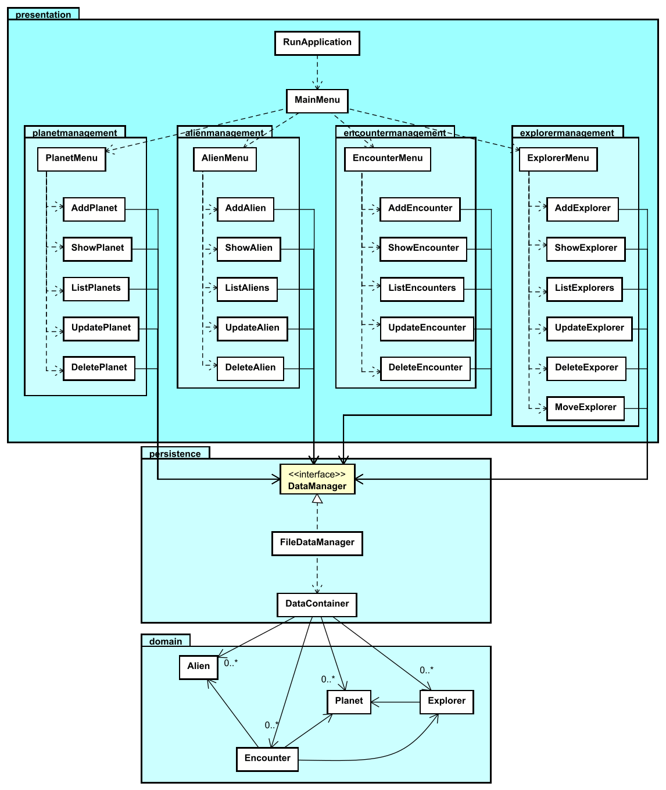

# Next features

I won't cover more features. 

You are still missing a few, related to the planet management menu:

- Updating a planet
- Deleting a planet

You should be able to follow the same _pattern_ as the previous features.

Then you can start on the features related to the other entities.

I recommend doing: Explorer, then Alien, then Encounter. Not necessarily _all_ features for each entity, some are perhaps less interesting. 

I suspect your application structure will then look something like this:

```
📁src/
├── 📁domain/
│   ├── 📄Alien.java
│   ├── 📄Encounter.java
│   ├── 📄Explorer.java
│   └── 📄Planet.java
├── 📁persistence/
│   ├── 📄DataContainer.java
│   ├── 📄DataManager.java
│   └── 📄FileDataManager.java
├── 📁presentation/
│   ├── 📄MainMenu.java
│   ├── 📄RunApplication.java
│   ├── 📁alienmanagement/
│   │   ├── 📄AddAlien.java
│   │   ├── 📄AlienMenu.java
│   │   ├── 📄DeleteAlien.java
│   │   ├── 📄ListAliens.java
│   │   ├── 📄ShowAlien.java
│   │   └── 📄UpdateAlien.java
│   ├── 📁encountermanagement/
│   │   ├──📄AddEncounter.java
│   │   ├──📄EncounterMenu.java
│   │   ├──📄DeleteEncounter.java
│   │   ├──📄ListEncounters.java
│   │   ├──📄ShowEncounter.java
│   │   └──📄UpdateEncounter.java
│   ├── 📁explorermanagement/
│   │   ├── 📄AddExplorer.java
│   │   ├── 📄ExplorerMenu.java
│   │   ├── 📄DeleteExplorer.java
│   │   ├── 📄ListExplorers.java
│   │   ├── 📄MoveExplorer.java
│   │   ├── 📄ShowExplorer.java
│   │   └── 📄UpdateExplorer.java
│   └── 📁planetmanagement/
│       ├── 📄AddPlanet.java
│       ├── 📄DeletePlanet.java
│       ├── 📄ListPlanets.java
│       ├── 📄PlanetMenu.java
│       ├── 📄ShowPlanet.java
│       └── 📄UpdatePlanet.java
└── 📁test/
    └── 📁persistence/
        ├── 📄TestDeletePlanet.java
        ├── 📄TestGetAllPlanets.java
        ├── 📄TestSaveAndLoadPlanet.java
        └── 📄TestUpdatePlanet.java
```

## Class Diagram

I have a class diagram below, though, without any methods or fields.



Now, with this approach, every class has a pretty distinct responsibility. If you ever need to update something in a particular feature, fix a bug, or something, it should be evident which class to look at.

Need to change the prompt for the aliens species, when adding a new alien? Look at the `AddAlien` class.\
Need to change the way explorers are displayed? Look at the `ListExplorers` class.\

And so on. The more focused a class is, the easier it is to understand and maintain.