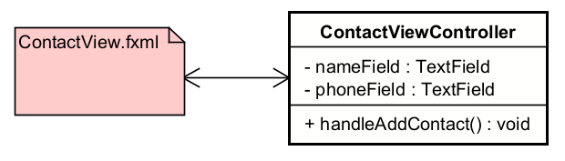

# What is fxml?

So far, you have set up your UI with layout and elements through code. Creating buttons, text fields, labels, etc. and adding them to panes, like VBox, HBox, AnchorPane, etc. Then putting that into a scene, into a stage, and then showing the stage.

While doable, this is tedious. There is a better way.

You can use an fxml file to set up your UI. An fxml file is a XML file that describes your UI. It is a declarative way to describe your UI, rather than imperative, like you have been doing so far.

Let's take the following code. Multiple ui elements are created, and added to a VBox.

```java
TextField textField = new TextField();
Button button = new Button("Add string");
Label dataShowingLabel = new Label();
Button displayDataButton = new Button("Show data");
VBox box = new VBox(textField, button, displayDataButton, dataShowingLabel);
```

We can describe this in an fxml file like this:

```xml
<VBox>
    <TextField />
    <Button text="Add string" />
    <Label />
    <Button text="Show data" />
</VBox>
```

This is much more readable and maintainable.

The tags should be clear, I trust. We have a VBox element, which contains a TextField, a Button, a Label, and another Button.

## The fxml file, and the controller

Going forward, we will use fxml files to set up our UI. The point is that a specific FXML helper class will load the fxml file, and create the UI elements for us.

But what about the behaviour? The actions for the buttons, the events for the text fields, etc.? We will use _controllers_ to handle this.

So, with this approach your views come in two parts: the fxml file, and the controller class. The fxml file describes the UI, and the controller class handles the behaviour.

You have seen somewhat similar approach with html and javascript. The html file describes the UI, and the javascript file handles the behaviour.

And, actually, in both cases, you can style the UI with css. But, I won't go into that here.




## SceneBuilder

So, do you have to manually write out the fxml file? No, you can use a tool to help you. There is a drag-and-drop tool called SceneBuilder, which can help you visually setup a scene, and then produce the fxml file for you.