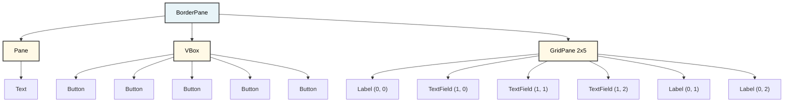

# The scene graph

So, fxml is a xml or html like file that describes your UI. And you may have heard that this kind of approach is a tree-structure. Similar to the DOM of html in the browser.

Consider the below _beautiful_ UI design:

We have several things going on here, layouts using multiple panes, there are buttons, labels, text fields, etc. Bunch of stuff. This can be visualized in various ways.

## Standard tree
The above can be represented as a tree structure like this:

## SceneBuilder tree
First, this was made in the scene builder. The following image is how the UI is represented, as a vertical tree structure:

Pay attention to the order of the elements, and their indentation. The `BorderPane` contains a `Pane`, a `VBox`, and a `GridPane`. Each of these contains various elements.