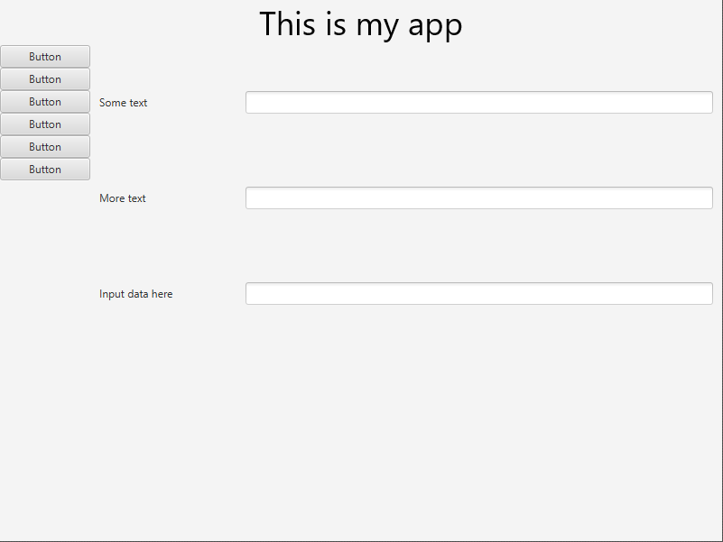
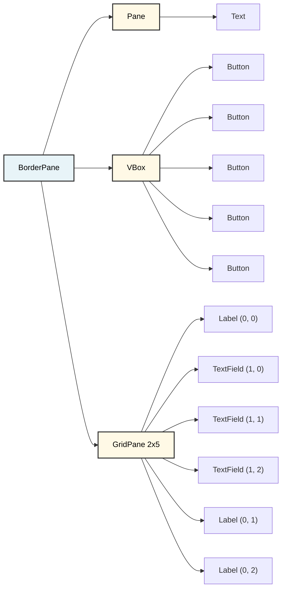
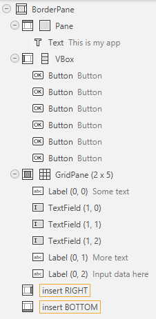

# The scene graph

fxml is an xml- or html-like file that describes your UI. And you may have heard that this kind of approach is a tree-structure. Similar to the DOM of html in the browser.

And just like the DOM in the browser, we can manipulate the tree structure of the JavaFX UI, after the app has started. For each of the Panes, we can add or remove elements, making it possible to change the UI dynamically. We will explore this later.

Consider the below _beautiful_ UI design:



We have several things going on here, layouts using multiple panes, there are buttons, labels, text fields, etc. Bunch of stuff. This can be visualized in various ways.

## Standard tree
The above can be represented as a tree structure like this:



## SceneBuilder tree
The ui design was made in the scene builder. The following image is how the UI is represented, as a vertical tree structure, in SceneBuilder:



Pay attention to the order of the elements, and their indentation, those are relevant for the layout. The `BorderPane` contains a `Pane`, a `VBox`, and a `GridPane`. Each of these contains various elements.

## fxml code

And a (simplified) fxml code for the above is:

```xml
<?xml version="1.0" encoding="UTF-8"?>

<?import javafx.scene.control.*?>
<?import javafx.scene.layout.*?>
<?import javafx.scene.text.*?>

<BorderPane xmlns="http://javafx.com/javafx" xmlns:fx="http://javafx.com/fxml">
    <top>
        <Pane>
            <Text text="This is my app" />
        </Pane>
    </top>
    
    <left>
        <VBox>
            <Button text="Button" />
            <Button text="Button" />
            <Button text="Button" />
            <Button text="Button" />
            <Button text="Button" />
        </VBox>
    </left>
    
    <center>
        <GridPane>
            <Label text="Some text" GridPane.columnIndex="0" GridPane.rowIndex="0" />
            <TextField GridPane.columnIndex="1" GridPane.rowIndex="0" />
            <TextField GridPane.columnIndex="1" GridPane.rowIndex="1" />
            <TextField GridPane.columnIndex="1" GridPane.rowIndex="2" />
            <Label text="More text" GridPane.columnIndex="0" GridPane.rowIndex="1" />
            <Label text="Input data here" GridPane.columnIndex="0" GridPane.rowIndex="2" />
        </GridPane>
    </center>
</BorderPane>
```

Notice how the fxml structure mirrors the tree structure shown above, to no-ones surprise. The `BorderPane` is the root element, wrapping all the others, with `top`, `left`, and `center` regions containing the `Pane`, `VBox`, and `GridPane` respectively. Each child element is nested within its parent, creating the hierarchical tree structure.

The above code is actually reduced quite a lot. fxml tend to include a lot of extra stuff, because you can control so much about the layout. There are so many properties you can set, which results in a lot of attributes on the elements in the fxml file.

The actual code can be seen in the [ExampleUi.fxml](https://github.com/TroelsMortensen/Codelabs2/blob/master/Articles/Session%2022%20-%20JFX%20Continued/Resources/ExampleUi.fxml) file.

## Coding the UI

Of couse, as you have seen previously, the UI can be coded manually. The following code is an attempt to recreate the UI above, matching the fxml file as closely as possible\
You don't really need to study this code in detail, it's just here to show you that you can do it manually if you want to. But you probably don't want to. Unless you're a masochist.

```java
// Create top section
Text text = new Text("This is my app");
text.setFont(new Font(36.0));
text.setLayoutX(287.0);
text.setLayoutY(39.0);

Pane topPane = new Pane(text);
topPane.setPrefHeight(50.0);
topPane.setPrefWidth(800.0);

// Create left section
Button button1 = new Button("Button");
button1.setPrefWidth(100.0);
Button button2 = new Button("Button");
button2.setPrefWidth(100.0);
Button button3 = new Button("Button");
button3.setPrefWidth(100.0);
Button button4 = new Button("Button");
button4.setPrefWidth(100.0);
Button button5 = new Button("Button");
button5.setPrefWidth(100.0);
Button button6 = new Button("Button");
button6.setPrefWidth(100.0);

VBox leftVBox = new VBox(button1, button2, button3, button4, button5, button6);
leftVBox.setPrefWidth(100.0);

// Create center section
Label label1 = new Label("Some text");
TextField textField1 = new TextField();
TextField textField2 = new TextField();
TextField textField3 = new TextField();
Label label2 = new Label("More text");
Label label3 = new Label("Input data here");

GridPane gridPane = new GridPane();
gridPane.add(label1, 0, 0);
gridPane.add(textField1, 1, 0);
gridPane.add(textField2, 1, 1);
gridPane.add(textField3, 1, 2);
gridPane.add(label2, 0, 1);
gridPane.add(label3, 0, 2);

// Set grid constraints
ColumnConstraints col1 = new ColumnConstraints();
col1.setPrefWidth(172.0);
ColumnConstraints col2 = new ColumnConstraints();
col2.setPrefWidth(528.0);
gridPane.getColumnConstraints().addAll(col1, col2);

// Add margins
gridPane.setPadding(new Insets(10.0, 10.0, 10.0, 10.0));

// Assemble BorderPane
BorderPane borderPane = new BorderPane();
borderPane.setPrefHeight(600.0);
borderPane.setPrefWidth(800.0);
borderPane.setTop(topPane);
borderPane.setLeft(leftVBox);
borderPane.setCenter(gridPane);
```

Imagine coding this by hand, having to re-run your application every time you make a change, to verify the result. That will quickly become tedious.

So, the SceneBuilder is a great drag-and-drop tool that allows you to visually create your UI, and then generate the fxml code for you. You'll love it.