# Exercise - Shared data

This exercise, _crudely_, introduces the concept of shared data.\
You will have a view with a list of names, where you can select an element.\
Then you will have a second view, which shows the details of the selected element.

The data will be a list of `Person` objects, located as a _static field variable_ in a `DataManager` class.
This static approach is not ideal, but it's a good enough for now. Next session, we will expore this further.

You will once again need a ViewManager, and a class to start things.

## UI

Below, I have added some very beautiful ascii art, to help you visualize the UI.

### View 1: Person List

```
┌─────────────────────────────────────────┐
│         Person Directory                │
├─────────────────────────────────────────┤
│                                         │
│  Select a person to view details:       │
│                                         │
│  ┌───────────────────────────────────┐  │
│  │ Alice Johnson                     │  │
│  ├───────────────────────────────────┤  │
│  │ Bob Smith                         │  │
│  ├───────────────────────────────────┤  │
│  │ Charlie Brown                     │  │
│  ├───────────────────────────────────┤  │
│  │ Diana Prince                      │  │
│  ├───────────────────────────────────┤  │
│  │ Eric Martinez                     │  │
│  └───────────────────────────────────┘  │
│                                         │
│         ╭─────────────────────╮         │
│         │   View Details      │         │
│         ╰─────────────────────╯         │
│                                         │
└─────────────────────────────────────────┘
```

### View 2: Person Details

```
┌─────────────────────────────────────────┐
│         Person Details                  │
├─────────────────────────────────────────┤
│                                         │
│  Name:                                  │
│  Alice Johnson                          │
│                                         │
│  Age:                                   │
│  28                                     │
│                                         │
│  Email:                                 │
│  alice.johnson@email.com                │
│                                         │
│  Phone:                                 │
│  555-0123                               │
│                                         │
│  Address:                               │
│  123 Main Street, Springfield           │
│                                         │
│         ╭─────────────────────╮         │
│         │   Back to List      │         │
│         ╰─────────────────────╯         │
│                                         │
└─────────────────────────────────────────┘
```

## Person class

```java
public class Person {
    private int id;
    private String name;
    private int age;
    private String email;
    private String phone;
    private String address;
    // constructor, getters, setters, toString
}
```

Instead of auto generating the toString method, it should _only_ return the name of the person.

```java	
@Override
public String toString() {
    return name;
}
```

## DataManager class

Here is a basic `DataManager` class, with a static list of people. Next session we improve the setup a little bit. Using the static approach is not ideal, but it's a good enough for now.

```java
public class DataManager {
    private static List<Person> people = Arrays.asList(
        new Person(1, "Alice", 25, "alice@example.com", "1234567890", "123 Main St, Springfield"),
        new Person(2, "Bob", 30, "bob@example.com", "1234567890", "42 Central St, Springfield"),
        new Person(3, "Charlie", 35, "charlie@example.com", "1234567890", "789 Elm St, Springfield"),
        new Person(4, "Diana", 40, "diana@example.com", "1234567890", "101 Pine St, Springfield"),
        new Person(5, "Eve", 45, "eve@example.com", "1234567890", "321 Oak St, Springfield")
    );
    
    public static List<Person> getPeople() {
        return people;
    }

    public static Person getPersonById(int id) {
        for(Person person : people) {
            if(person.getId() == id) {
                return person;
            }
        }
        throw new IllegalArgumentException("Person with id " + id + " not found");
    }
}
```

## Class diagram

Here is an initial class diagram, to get you started. It is not necessarily complete, but it is a good starting point.

```mermaid
classDiagram

    class RunApp {
        + start(Stage stage) void
    }

    class ViewManager {
        - stage : Stage$
        + setScene(scene : Scene) void$
        + showView(viewName : String) void$
        + showView(viewName : String, argument : String) void$
    }

    class AcceptsStringArgument {
        <<interface>>
        + setArgument(arg : String) void*
    }

    class PersonListController {
        - personListView : ListView~Person~
        + initialize() void
    }
    note for PersonListController "📄 PersonList.fxml"

    class PersonDetailsController {
        - nameLabel : Label
        - ageLabel : Label
        - emailLabel : Label
        - phoneLabel : Label
        - addressLabel : Label
        + handleBackToList() void
    }
    note for PersonDetailsController "📄 PersonDetails.fxml"

    class DataManager {
        - people : List~Person~$
        + getPersonById(int id) Person$
        + getPeople() List~Person~$
    }

    class Person {
        - id : int
        - name : String
        - age : int
        - email : String
        - phone : String
        - address : String
        + Person(int id, String name, int age, String email, String phone, String address)

    }

    _Application_ <|-- RunApp
    RunApp ..> ViewManager
    AcceptsStringArgument <|.. PersonListController
    AcceptsStringArgument <|.. PersonDetailsController
    Initializable ()-- PersonListController
    PersonListController ..> ViewManager
    PersonDetailsController ..> ViewManager
    PersonListController ..> DataManager
    PersonDetailsController ..> DataManager
    DataManager --> "*" Person
```



Further explanation:

- `Application` is the one from the JavaFX library.
- `Initializable` is an interface from JavaFX, that allows the controller to be initialized.
  - Use the method to retrieve the data from the `DataManager`, and add it to the `ListView`.
- `RunApp` is the class that starts the application, it extends Application.
- `ViewManager` is the class that manages the views.
- `AcceptsStringArgument` is an interface that allows the controllers to receive a string argument.
- `PersonListController` is the controller for the person list view. It uses a `ListView` element to show the list of people (You may use whatever UI element you want, but the example uses a `ListView`).
  - You can implement the `Initializable` interface, from JavaFX, to add the data from the `DataManager` to the `ListView`, when the view is shown.
- `PersonDetailsController` is the controller for the person details view.
  - In the setArgument method, you can get the person id from the argument, convert to int, and use the `DataManager` to get the person object.
- `DataManager` is the class that manages the data.
- `Person` is the class that represents a person.

## ListView

The ListView ui element can show a list of items. Here is an example of how to fill in the items, and how to figure out which one is selected.
You should have a ListView element as a field variable in the controller, below that is called `personListView`.\
You may also be inspired by [this example](https://github.com/TroelsMortensen/JavaFxExamples/blob/master/ListViewExample/src/PersonListApp.java).

```java
// Get the list of people from DataManager and add them to the ListView
personListView.getItems().addAll(DataManager.getPeople());

// Get the selected person
Person selectedPerson = personListView.getSelectionModel().getSelectedItem();

// Check if something is selected
if (selectedPerson != null) {
    System.out.println("Selected: " + selectedPerson.getName() + ", and ID: " + selectedPerson.getId());
}
```

The `ListView` will use the `toString` method of the `Person` class to show the name of the person in the list. So, you need to override the `toString` method in the `Person` class, to just return the first name of the person.


