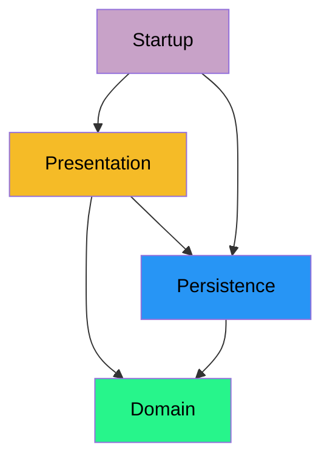

# Two layered architecture

I have talked about layers previously. This is a way to organize your code into logical groups.
The layers are visually stacked on top of each other, with arrows pointing downwards. That means everything in one layer, may know about, or use, classes in the layer below it. But not the other way around.

We will start with a two-layered architecture. This is the simplest approach, and it will be enough for our application. Later, on second semester, more layers will be added.

I already saw a video in the previous session, about the two-layered architecture.

This time, I want to take the structure a little bit further, considering the fxml relocation.

## Two layers

So, to refresh, we consider two layers: presentation and persistence. We also have separate logical groups for the domain and the startup, but these are generally not counted as layers, when we talk about layered architecture. A classic approach is just called "three-layered architecture", with an extra layer in between the presentation and persistence layers. Next semester.

But, currently, we have this architecture diagram:



Notice the arrows. Each arrow points downwards. This is the convention for layered architecture. The arrow means that a class in one layer, or logical group, may know about, or use, classes in the layer below it. But not the other way around.

Presentation knows about Persistence, but not the other way around.\
Persistence knows about Domain, but not the other way around.\
Domain knows about nothing about anything else.\
And Startup knows about everything, because this is where the application starts. It has to instantiate stuff.

## Persistence layer

This is basically the same as the previous session. Nothing has changed. I don't think. 

## Presentation layer

This is now split, sort of, because the fxml files are now in a separate folder, called "resources/fxml". This is the recommended way to store fxml files.

Furthermore, we want to separate the presentation into several parts: the controllers (maybe multiple packages), and the "core", which is sort of the plumbing, making things work together. This "core" includes the ViewManager, the two interfaces: `AcceptsStringArgument`, and `AcceptsObjectArgument`. Later, we will need some more classes, but, not yet.

## Directory structure

Once again, here is an example:

```console
🟦SpaceExplorer/
├── 📁src/
│   └── 📁spaceexplorer/
│       ├── 📄RunApplication.java
│       ├── 📁domain/
│       │   ├── 📄Alien.java
│       │   ├── 📄Encounter.java
│       │   ├── 📄Explorer.java
│       │   └── 📄Planet.java
│       ├── 📁persistence/
│       │   ├── 📄DataContainer.java
│       │   ├── 📄DataManager.java
│       │   └── 📄FileDataManager.java
│       └── 📁presentation/
│           ├── 📁core/
│           │   ├── 📄ViewManager.java
│           │   ├── 📄AcceptsStringArgument.java
│           │   └── 📄AcceptsObjectArgument.java
│           ├── 📁mainmenu/
│           │   └── 📄MainViewController.java
│           └── 📁planetmanagement/
│               ├── 📄AddPlanetController.java
│               ├── 📄ListPlanetsController.java
│               ├── 📄ShowPlanetController.java
│               └── 📄UpdatePlanetController.java
└── 📁resources/
    └── 📁fxml/
        ├── 📄MainView.fxml
        ├── 📄AddPlanet.fxml
        ├── 📄ListPlanets.fxml
        ├── 📄ShowPlanet.fxml
        └── 📄UpdatePlanet.fxml
```

Notice the three top-level packages: domain, persistence, and presentation.\
The `resources` has a folder, called "fxml", which contains the fxml files.\
The `MainView.fxml` will be the main view of the application. It will contain the main menu, and an area for the content. See next page.\
The `core` folder contains the classes that are used to manage the views, and setup controllers, and such. We will explore this further, later.