# Single view application

"Single page application" is a term you may have heard of. It means an application with a single main view, or a single page. Many modern websites are single page applications, unlike what you learn in the WEB1 course. 

In WEB1 you are creating multiple html files, each with a header, a footer, and a main content area, or something like that. Each page is a separate html file.\
This is also how we have been doing so far with JavaFX. Just swapping out one view for another.

In a single page application, you create a single html file, with a header, a footer, and a main content area. The main content area is the view, and it is updated dynamically, without reloading the page. The main content is basically swapped out, as the user navigates through the application, but the header and footer remain the same.

## Holy Grail Layout

I will show a similar approach, using JavaFX. I will use a BorderPane layout, with a menu bar on the left, and a content area on the right. The menu bar will have a button for each view, and the content area will show the view.

Here is a reminder of the BorderPane layout:

```
┌────────────────────────────────────────────┐
│                   TOP                      │
│              (Menu Bar, Title)             │
├──────────┬─────────────────────┬───────────┤
│          │                     │           │
│   LEFT   │       CENTER        │   RIGHT   │
│          │                     │           │
│ (Nav/    │   (Main Content)    │ (Side     │
│  Menu)   │                     │  Panel)   │
│          │                     │           │
│          │                     │           │
│          │                     │           │
├──────────┴─────────────────────┴───────────┤
│                  BOTTOM                    │
│            (Status Bar, Footer)            │
└────────────────────────────────────────────┘
```

The `Left` area is the menu bar, the `Center` area is the main content area. If `TOP` and `BOTTOM` are not used, the `CENTER` area will take up the entire screen.\
You can of course also place the menu bar on the top or right side. 

If you use the top part, you should probably use the menu items from JavaFX. When you open the Scene Builder, it shows an example template, pick the Basic Application template.


Here is the top menu bar:


## Single view application

We will still use the `ViewManager`, as you have seen previously, but instead of swapping out the root on the scene, we will set the view to the center of the BorderPane.

Watch the below video to see how this is done.

<video src="https://youtu.be/8eIY_xsRm2A"></video>

What I have shown in the video is directly applicable to your semester project.\
Even though I keep the data in a list, it should be easy enough to adapt it to write to a binary file, as you have seen in the previous sessions.

## OkayReads Class Diagram Example

Below is a complete class diagram for the OkayReads book management application, demonstrating the layered architecture with BorderPane layout:

```mermaid
classDiagram
    %% Startup Layer
    class RunOkayReads {
        + start(Stage primaryStage) void
        + main(String[] args) void$
    }
    
    %% Presentation Core
    class ViewManager {
        - mainLayout : BorderPane$
        - fxmlDirectoryPath : String$
        + init(Stage primaryStage, String initialView) void$
        + showView(String viewName) void$
        + showView(String viewName, String argument) void$
        + showView(String viewName, Object argument) void$
    }
    
    class AcceptsStringArgument {
        <<interface>>
        + setArgument(String argument)* void
    }
    
    %% Controllers
    class MainViewController {
        + initialize() void
        - handleAddAuthor() void
        - handleAddBook() void
        - handleAddShelf() void
        - handleViewShelves() void
    }
    note for MainViewController "📄 MainView.fxml"
    
    class AddAuthorController {
        - nameField : TextField
        - messageLabel : Label
        - dataManager : DataManager
        + initialize() void
        - handleAddAuthor() void
        - handleCancel() void
    }
    note for AddAuthorController "📄 AddAuthor.fxml"
    
    class AddBookController {
        - isbnField : TextField
        - titleField : TextField
        - yearField : TextField
        - authorComboBox : ComboBox~String~
        - shelfComboBox : ComboBox~String~
        - messageLabel : Label
        - dataManager : DataManager
        + initialize() void
        - loadAuthors() void
        - loadShelves() void
        - handleAddBook() void
        - handleCancel() void
    }
    note for AddBookController "📄 AddBook.fxml"
    
    class AddShelfController {
        - nameField : TextField
        - messageLabel : Label
        - dataManager : DataManager
        + initialize() void
        - handleAddShelf() void
        - handleCancel() void
    }
    note for AddShelfController "📄 AddShelf.fxml"
    
    class SelectShelfController {
        - shelfListView : ListView~String~
        - messageLabel : Label
        - dataManager : DataManager
        + initialize() void
        - loadShelves() void
        - handleViewShelf() void
        - handleBack() void
    }
    note for SelectShelfController "📄 SelectShelf.fxml"
    
    class ViewShelfController {
        - shelfTitleLabel : Label
        - booksTable : TableView~Book~
        - isbnColumn : TableColumn~Book,String~
        - titleColumn : TableColumn~Book,String~
        - authorColumn : TableColumn~Book,String~
        - yearColumn : TableColumn~Book,Integer~
        - dataManager : DataManager
        - shelfName : String
        + initialize() void
        + setArgument(String shelfName) void
        - loadBooks() void
        - handleBack() void
    }
    note for ViewShelfController "📄 ViewShelf.fxml"
    
    %% Persistence Layer
    class DataManager {
        <<interface>>
        + addAuthor(Author author)* void
        + getAllAuthors()* List~Author~
        + addBook(Book book)* void
        + getAllBooks()* List~Book~
        + addShelf(Shelf shelf)* void
        + getAllShelves()* List~Shelf~
        + getShelfByName(String name)* Shelf
    }
    
    class ListDataManager {
        - data : DataContainer$
        + addAuthor(Author author) void
        + getAllAuthors() List~Author~
        + addBook(Book book) void
        + getAllBooks() List~Book~
        + addShelf(Shelf shelf) void
        + getAllShelves() List~Shelf~
        + getShelfByName(String name) Shelf
    }
    
    class DataContainer {
        - authors : List~Author~
        - books : List~Book~
        - shelves : List~Shelf~
        + DataContainer()
        + getAuthors() List~Author~
        + getBooks() List~Book~
        + getShelves() List~Shelf~
    }
    
    %% Domain Layer
    class Author {
        - name : String
        + Author(String name)
        + getName() String
    }
    
    class Book {
        - isbn : String
        - title : String
        - publicationYear : int
        - writtenBy : Author
        + Book(String isbn, String title, int publicationYear, Author writtenBy)
        + getIsbn() String
        + getTitle() String
        + getPublicationYear() int
        + getWrittenBy() Author
        + getAuthorName() String
    }
    
    class Shelf {
        - name : String
        - books : List~Book~
        + Shelf(String name)
        + getName() String
        + getBooks() List~Book~
        + addBook(Book book) void
    }
    
    %% Relationships
    _Application_ <|-- RunOkayReads
    RunOkayReads ..> ViewManager
    
    MainViewController ..> ViewManager
    AddAuthorController ..> ViewManager
    AddBookController ..> ViewManager
    AddShelfController ..> ViewManager
    SelectShelfController ..> ViewManager
    ViewShelfController ..> ViewManager
    
    AcceptsStringArgument <|.. ViewShelfController
    
    AddAuthorController ..> DataManager
    AddBookController ..> DataManager
    AddShelfController ..> DataManager
    SelectShelfController ..> DataManager
    ViewShelfController ..> DataManager
    
    DataManager <|.. ListDataManager
    ListDataManager --> DataContainer 
    
    DataContainer --> "*" Author
    DataContainer --> "*" Book
    DataContainer --> "*" Shelf
    
    Book --> "1" Author : writtenBy
    Shelf --> "*" Book : contains
```



