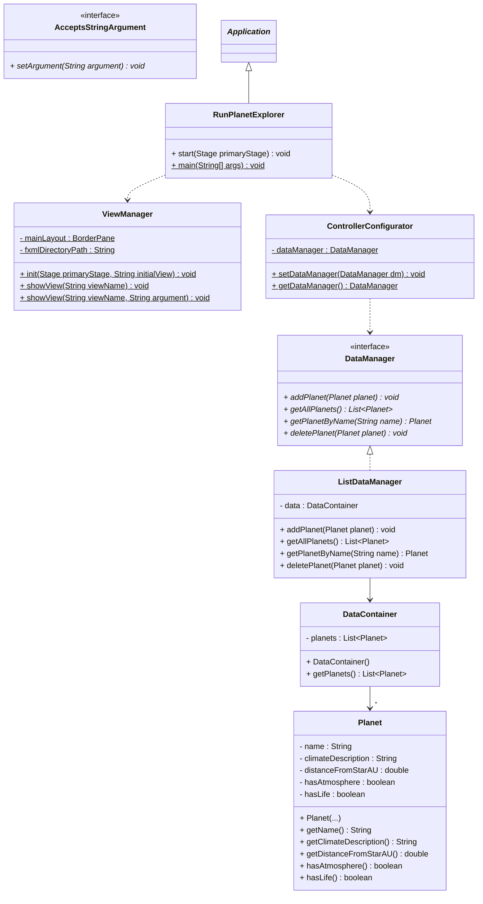
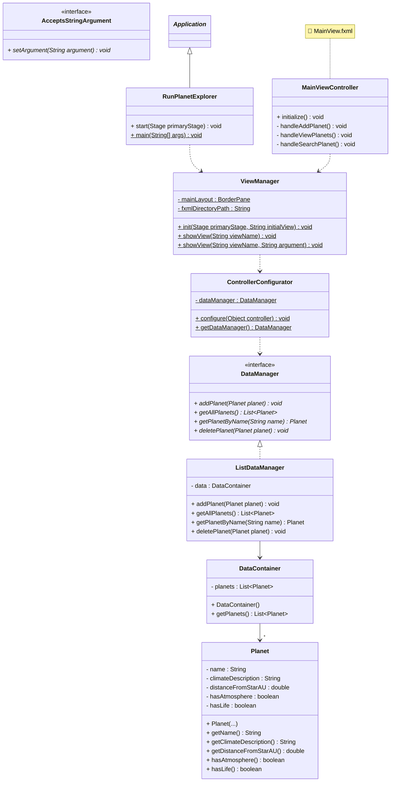

# Exercise

Let's revisit an old classic, the planet exploration application, from the last console UI exercise, about architecture. This time, we will build it with JavaFX.

Again, we will just focus on the features related to the `Planet` entity, but you can add more features if you want.

We will build this incrementally, step by step, to help you understand the architecture.

---

## Exercise 1: Set Up the Package Structure

Create a new JavaFX project called `PlanetExplorer` with the following package structure:

```
📁 PlanetExplorer/
├── 📁 src/
│   └── 📁 planetexplorer/
│       ├── 📄 RunPlanetExplorer.java
│       ├── 📁 domain/
│       ├── 📁 persistence/
│       └── 📁 presentation/
│           ├── 📁 core/
│           └── 📁 controllers/
└── 📁 resources/
    └── 📁 fxml/
```

**Tasks:**
1. Create the folder structure as shown above
2. Create an empty `RunPlanetExplorer.java` class that extends `Application`
3. Add the basic `start()` and `main()` methods, leave them empty for now.
4. Create empty folders for `domain`, `persistence`, and `presentation` packages
5. Create the `resources/fxml/` folder for your FXML files
6. Mark the `resources/` folder as a resource folder in IntelliJ.


## Exercise 2: Create the Planet Entity

In the `domain` package, create a `Planet` class with the following attributes:

- `name` (String) - The name of the planet
- `climateDescription` (String) - Description of the planet's climate
- `distanceFromStarAU` (double) - Distance from star in Astronomical Units (AU)
- `hasAtmosphere` (boolean) - Whether the planet has an atmosphere
- `hasLife` (boolean) - Whether life has been detected on the planet

**Requirements:**
- Create a constructor that takes all five parameters
- Create getters for all attributes

You _may_ add an `id` field, if you want.

## Exercise 3: Create the Data Management Layer

In the `persistence` package, create the data management infrastructure:

### Part A: DataContainer

Create a `DataContainer` class that:
- Has a private list of `Planet` objects
- Initializes the list in the constructor
- Has a getter method `getPlanets()` that returns the list

### Part B: DataManager Interface

Create a `DataManager` interface with the following methods:
- `void addPlanet(Planet planet)`
- `List<Planet> getAllPlanets()`
- `Planet getPlanetByName(String name)`
- `void deletePlanet(Planet planet)`

### Part C: ListDataManager

Create a `ListDataManager` class that implements `DataManager`:
- Has a `DataContainer` field
- Implements all methods from the interface
- Uses the DataContainer to store and retrieve planets


## Exercise 4: Set Up Presentation Core

In the `presentation/core` package, create the classes needed for view management and controller configuration.

**Tasks:**

1. **Create `ViewManager` class** with:
   - A static `BorderPane mainLayout` field. Or you may pick some other top-level component for your layout. You have creative freedom.
   - A static `fxmlDirectoryPath` constant (set to `"/fxml/"`)
   - An `init()` method that loads the main BorderPane view
   - `showView()` methods to switch the center content
   - `showView()` method that takes a string argument, and passes that argument to the controller

2. **Create `AcceptsStringArgument` interface** with:
   - A single method: `void setArgument(String argument)`

3. **Create `ControllerConfigurator` class** with:
   - `configure(Object controller)` method that takes a controller, and sets the DataManager on it.
   - A static `getDataManager()` method

This will allow you to share the DataManager across all controllers without using static fields in the ListDataManager.

### Current System Architecture

Here's a rough sketch of what your system looks like at this point:



---

## Exercise 5: Create Main View with Navigation Menu

Now it's time to create the main user interface using a BorderPane layout with a navigation menu.

### Part A: Design the Layout

Create a `MainView.fxml` file in the `resources/fxml/` folder with... some layout. Perhaps a BorderPane, but that's up to you. You can also put the menu at the top, with menu elements instead of buttons. It's up to you.


For example, with left side menu, and center content:
```
┌────────────────────────────────────────────────────────────┐
│                    PLANET EXPLORER                         │
├─────────────────┬──────────────────────────────────────────┤
│                 │                                          │
│  Navigation     │                                          │
│  ═══════════    │         Welcome to                       │
│                 │      Planet Explorer!                    │
│  Add Planet     │                                          │
│                 │   Select an option from the menu         │
│  View Planets   │        to get started                    │
│                 │                                          │
│  Search Planet  │                                          │
│                 │                                          │
│                 │                                          │
└─────────────────┴──────────────────────────────────────────┘
```

Or with a menu bar at the top, and center content:

```
┌────────────────────────────────────────────────────────────┐
│ [Planet Management]  [Alien Management]  [Explorer]        │
├────────────────────────────────────────────────────────────┤
│                                                            │
│                                                            │
│                       Welcome to                           │
│                    Planet Explorer!                        │
│                                                            │
│               Select an option from the menu               │
│                      to get started                        │
│                                                            │
│                                                            │
│                                                            │
│                                                            │
│                                                            │
└────────────────────────────────────────────────────────────┘
```


### Part B: Set Up the Controllers

1. **Create `MainViewController` class** in `presentation/controllers/`:
   - Add handler methods for each navigation button
   - Each handler should call `ViewManager.showView()` with the appropriate view name

### Part C: Initialize the Application

Update your `RunPlanetExplorer` class:

1. In the `start()` method:
   - Call `ViewManager.init(primaryStage, "MainView")`
   - Set the window title to "Planet Explorer"
   - Set a reasonable window size (e.g., 900x600)

2. Implement the `main()` method to launch the application

**Test your application now!** It should launch and display the main view with the navigation menu or menu bar.

### Current Package Structure

Your project should now have the following structure:

```console
📁 PlanetExplorer/
├── 📁 src/
│   └── 📁 planetexplorer/
│       ├── 📄 RunPlanetExplorer.java
│       ├── 📁 domain/
│       │   └── 📄 Planet.java
│       ├── 📁 persistence/
│       │   ├── 📄 DataContainer.java
│       │   ├── 📄 DataManager.java
│       │   └── 📄 ListDataManager.java
│       └── 📁 presentation/
│           ├── 📁 core/
│           │   ├── 📄 ViewManager.java
│           │   ├── 📄 AcceptsStringArgument.java
│           │   └── 📄 ControllerConfigurator.java
│           └── 📁 controllers/
│               └── 📄 MainViewController.java
└── 📁 resources/
    └── 📁 fxml/
        └── 📄 MainView.fxml
```

### Part D: Create a Home View (Optional but Recommended)

Create a `Home.fxml` file in `resources/fxml/` that shows a welcome message. This will be displayed in the center when no other view is active.

**Home view should contain:**
- A title: "Welcome to Planet Explorer!"
- A subtitle: "Select an option from the menu to get started"
- Center-aligned layout

Update your program, so this view is shown first, when the main view is loaded.

## Progress Check

At this point, you should have:
- ✅ Complete package structure
- ✅ Domain layer (Planet entity)
- ✅ Persistence layer (DataManager, ListDataManager, DataContainer)
- ✅ Presentation core (ViewManager, interfaces, configurator)
- ✅ Main view with navigation menu
- ✅ Application that launches and displays the main interface

### Updated System Architecture

Here's the complete architecture with all components:



---

## Exercise 6: Add Planet Feature

Create the functionality to add a new planet to the system.

### Part A: Design the Add Planet View

Create an `AddPlanet.fxml` file with a form layout. Feel free to be creative here, or seek inspiration from the below example.

```
┌────────────────────────────────────────────────────────────┐
│                      Add New Planet                        │
├────────────────────────────────────────────────────────────┤
│                                                            │
│  Planet Name:                                              │
│  ┌──────────────────────────────────────────────────────┐  │
│  │                                                      │  │
│  └──────────────────────────────────────────────────────┘  │
│                                                            │
│  Climate Description:                                      │
│  ┌──────────────────────────────────────────────────────┐  │
│  │                                                      │  │
│  └──────────────────────────────────────────────────────┘  │
│                                                            │
│  Distance from Star (AU):                                  │
│  ┌──────────────────────────────────────────────────────┐  │
│  │                                                      │  │
│  └──────────────────────────────────────────────────────┘  │
│                                                            │
│  ☐ Has Atmosphere                                          │
│  ☐ Has Life                                                │
│                                                            │
│         ┌──────────┐         ┌──────────┐                  │
│         │   Add    │         │  Cancel  │                  │
│         └──────────┘         └──────────┘                  │
│                                                            │
│  Status: Ready to add planet                               │
│                                                            │
└────────────────────────────────────────────────────────────┘
```

After adding, update the status label accordingly.

The cancel button should return to the Home view.


### Part B: Create AddPlanetController

Create an `AddPlanetController` class in `presentation/controllers/`:

**Requirements:**
- It receives a `DataManager` object as a parameter in its init method.
- Implement `handleAdd()` method that:
  - Validates all input fields
  - Creates a new `Planet` object
  - Shows success/error message in the status label
  - Clears the form after successful addition
- Implement `handleCancel()` method that returns to the Home view
- Add proper error handling for invalid input (e.g., non-numeric distance)

### Part C: Wire Up Navigation

Update your `MainViewController` to call `ViewManager.showView("AddPlanet")` when the "Add Planet" button/menu item is clicked.

**Test:** You should be able to navigate to the Add Planet view, fill in the form, and add planets to the system. You can't view them yet, so verification may be difficult. You could print something to the console, to verify that the planet was added.

---

## Exercise 7: View All Planets Feature

Create the functionality to display all planets. This could be in a table. Or something else, a label, or uneditable text area. It's up to you.

### Part A: Design the View Planets View

Create a `ViewPlanets.fxml` file. It could look like this:

```
┌────────────────────────────────────────────────────────────┐
│                       All Planets                          │
├────────────────────────────────────────────────────────────┤
│                                                            │
│  ┌─────────────────────────────────────────────────┐       │
│  │ Name    │ Climate    │ Distance │ Atmos. │ Life │       │
│  ├─────────┼────────────┼──────────┼────────┼──────┤       │
│  │ Earth   │ Temperate  │ 1.0 AU   │   ✓    │  ✓   │      │
│  ├─────────┼────────────┼──────────┼────────┼──────┤       │
│  │ Mars    │ Cold/Dry   │ 1.52 AU  │   ✓    │  ✗   │      │
│  ├─────────┼────────────┼──────────┼────────┼──────┤       │
│  │ Venus   │ Hot        │ 0.72 AU  │   ✓    │  ✗   │      │
│  └─────────┴────────────┴──────────┴────────┴──────┘       │
│                                                            │
│                    ┌──────────┐                            │
│                    │   Back   │                            │
│                    └──────────┘                            │
│                                                            │
└────────────────────────────────────────────────────────────┘
```

### Part B: Create ViewPlanetsController

Create a `ViewPlanetsController` class in `presentation/controllers/`:

**Requirements:**
- It receives a `DataManager` object as a parameter in its init method.
- In `initialize()` method:
  - Set up all table columns (if you are using a table)
  - Load all planets using `dataManager.getAllPlanets()`
  - Add planets to the table
- Implement `handleBack()` method to return to Home view
- For boolean columns (atmosphere, life), display "Yes"/"No" or "✓"/"✗"

### Part C: Wire Up Navigation

Update your `MainViewController` to call `ViewManager.showView("ViewPlanets")` when the "View Planets" button/menu item is clicked.

**Test:** Add some planets, then navigate to View Planets. You should see all planets displayed in the table.

For easier testing in the future, you could have the ListDataManager add some planets to the list initially, so you have some planets to display.

---

## Exercise 8: View Single Planet Feature

Create the functionality to view detailed information about a single planet.

### Part A: Design the View Planet Details View

I will leave the design up to you. How do you pick which planet you want to further investigate? Do you search? Can you select something from the view above?

## Exercise 9: Delete Planet Feature

Create the functionality to delete planets from the system.

Again, up to you how you want to do this. Figure out how to add a button to the table? A separate view where you can search for a specific planet?

## Final Check

Congratulations! You now have a complete Planet Explorer application with:
- ✅ Layered architecture (Domain, Persistence, Presentation)
- ✅ Add planet functionality
- ✅ View all planets in a table
- ✅ View individual planet details
- ✅ Delete planets with confirmation
- ✅ Clean navigation between views
- ✅ Shared data management across controllers

**Next Steps:**
- Add more features (search, edit planets)
- Add the other entities (Alien, Explorer, Encounter)
- Implement file persistence instead of in-memory storage

Great work! 🪐✨

