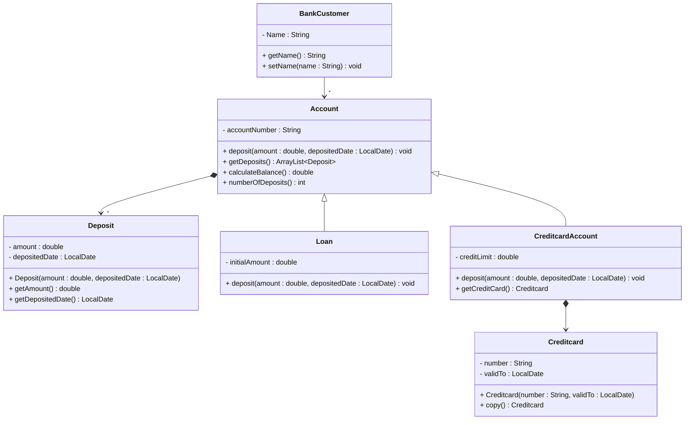

# Exercise 1 - Banking System

Implement the following class diagram in Java:

## Notes:
- A negative deposit is called a withdrawal
- You cannot make withdrawals from a loan
- Use `java.time.LocalDate` for date handling

