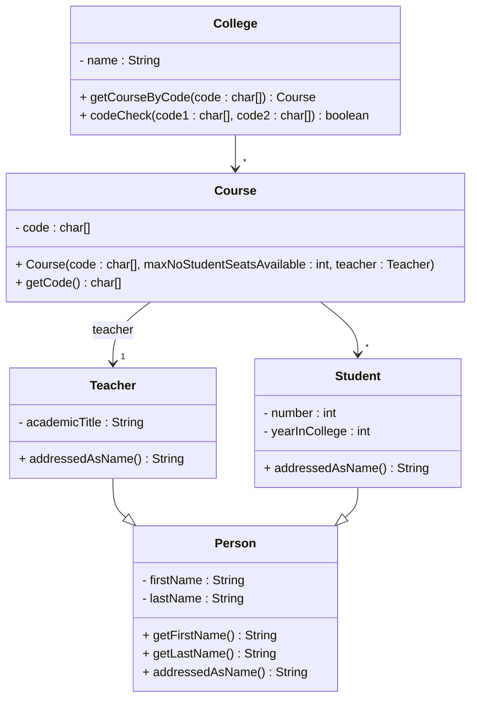

# Exercise 2 - College System

Implement the following class diagram in Java:

## Notes:
- Teachers are addressed with their academic title followed by their last name
- Students are addressed with a title based on their year in college followed by their first and last names:
  - 1st year: Freshman
  - 2nd year: Sophomore
  - 3rd year: Junior
  - 4th year: Senior
- This exercise does not require date handling

