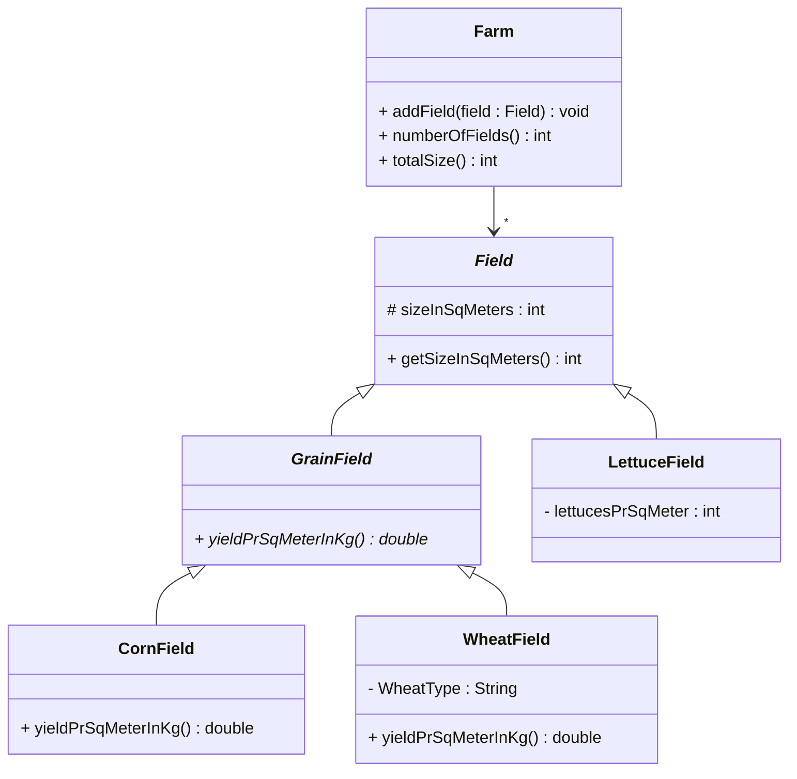

# Exercise 3 - Farm System

Implement the following class diagram in Java:

## Notes:
- A cornfield yields 10 kg pr square meter
- A wheatfield yields depending on the wheat type: common wheat yields 8 kg pr square meter, whereas spelt only yields 7 kg pr square meter
- This exercise does not require date handling

