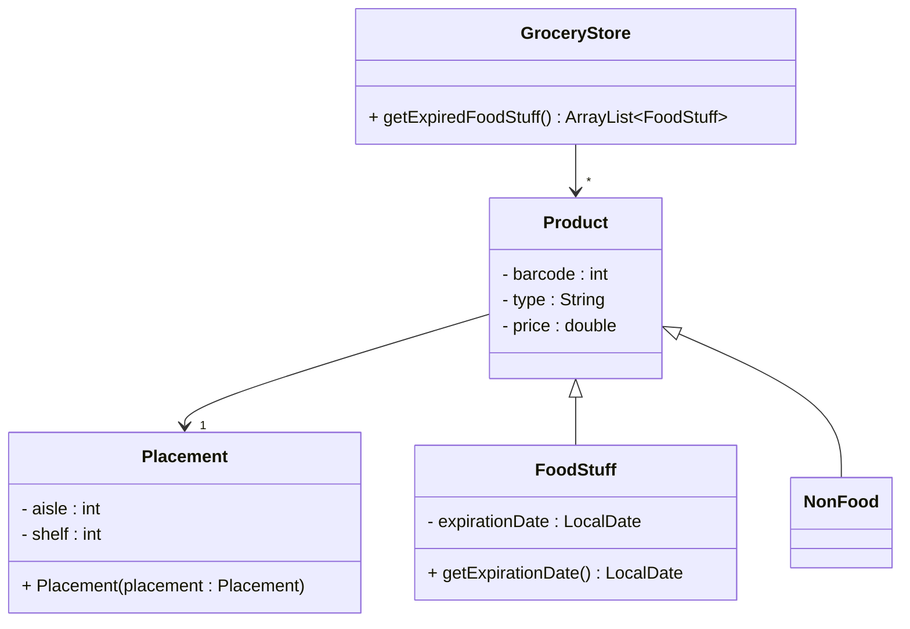

# Exercise 4 - Grocery Store System

Implement the following class diagram in Java:

```mermaid
classDiagram
    class GroceryStore {
        + getExpiredFoodStuff() ArrayList~FoodStuff~
    }
    
    class Product {
        - barcode : int
        - type : String
        - price : double
    }
    
    class Placement {
        - aisle : int
        - shelf : int
        + Placement(placement : Placement)
    }
    
    class FoodStuff {
        - expirationDate : LocalDate
        + getExpirationDate() LocalDate
    }
    
    class NonFood {
    }
    
    GroceryStore --> "*" Product
    Product --> "1" Placement
    Product <|-- FoodStuff
    Product <|-- NonFood
```

## Notes:
- Use `LocalDate.now()` to get the current date
- Use `java.time.LocalDate` for date handling

